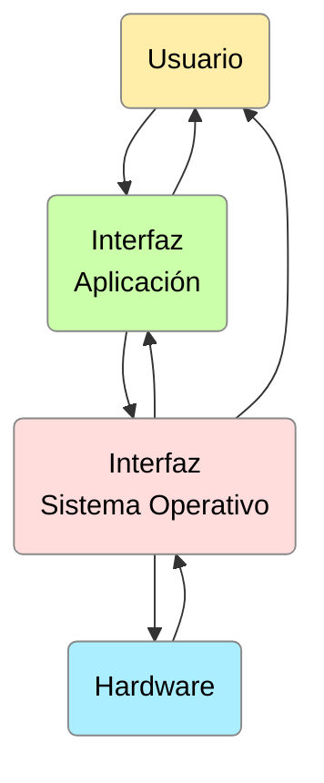
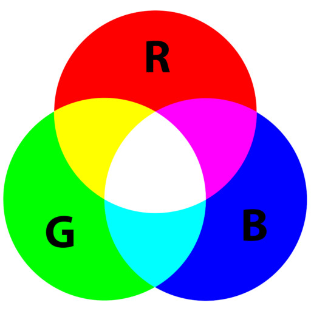

# UD1 Introducción

- [El diseño de una interfaz. El diseño gráfico](#el-diseño-de-una-interfaz-el-diseño-gráfico)
    - [¿Qué busca la interfaz de usuario?](#qué-busca-la-interfaz-de-usuario)
    - [Planteamiento y diseño de una interfaz](#planteamiento-y-diseño-de-una-interfaz)
    - [Elementos de una interfaz gráfica de usuario (GUI)](#elementos-de-una-interfaz-gráfica-de-usuario-gui)
    - [Tipos de interfaces gráficas](#tipos-de-interfaces-gráficas)
- [El color](#el-color)
    - [El sistema RGB](#el-sistema-rgb)
    - [Matiz, saturación y brillo _(HSV)_](#matiz-saturación-y-brillo-hsv)
    - [La importancia de los colores](#la-importancia-de-los-colores)
- [Bibliografía y webgrafía](#bibliografía-y-webgrafía)

## El diseño de una interfaz. El diseño gráfico

El diseño de interfaces busca poner los puntos de contacto entre un usuario y una computadora, es decir, se genera una conexión entre dos máquinas de cualquier tipo y se les da un soporte para generar comunicación entre los distintos estratos. 

Generalmente es la forma en la cual se conectan el hardware con el software, que comprende las aplicaciones, programas y herramientas, su finalidad es que un usuario pueda realizar una acción determinada en la forma que se desea, teniendo eficacia, rendimiento y seguridad en cada proceso, lo que involucra que:

- La acción efectuada sea la que el usuario tiene intenciones de hacer.
- La orden se debe realizar de forma eficaz y precisa.
- La acción debe afectar solamente al componente de Hardware o a la aplicación que se tenía considerada utilizar, esto sin afectar a otros componentes.

Este conjunto de elementos, que se reflejan en la pantalla y que permiten al usuario llevar a cabo acciones bien definidas, se compone de elementos de acción, alternativas de navegación, identificación y contenidos.

Así, podemos definir el diseño gráfico como programar, proyectar y realizar comunicaciones visuales de aplicaciones u otro tipo de herramientas software comunicándose con el hardware donde se ejecuta. A día de hoy, este área de desarrollo tiene a sus propios profesionales, denominados diseñadores gráficos. Sus funciones:

- Función estética
- Función publicitaria
- Función comunicativa

Se distinguen 4 grupos de elementos en el diseño de interfaces:

- Elementos conceptuales
- Elementos visuales
- Elementos de relación
- Elementos prácticos

Por lo tanto, la interfaz será un conjunto de elementos gráficos y un diseño de su distribución que permite una mejor presentación y navegación en la aplicación. Si no existen ambos factores unidos, el resultado final no será óptimo, pudiendo tirar por tierra todo el buen trabajo que lleva en el backend. Ejemplo:

Como se puede apreciar, la figura, las dos imágenes son la misma aplicación. En la izquierda tenemos un mal diseño, ya que los los elementos no aparecen diferenciados, no se puede leer bien el texto, no se aprecian correctamente las imágenes, etc. Mientras que en la imagen de la derecha, la navegación del usuario es mucho más intuitiva, proporcionando un mayor grado de satisfacción al usarla.

### ¿Qué busca la interfaz de usuario?

Para responder a esta pregunta debemos recordar la siguiente figura, la cual muestra la relación que existe entre los diferentes elementos que intervienen en un equipo:

Con ello, podemos entender que la interfaz de usuario busca establecer una relación entre el usuario que utiliza la aplicación y el hardware del equipo mediante el uso del S.O.

Las interfaces de usuario son muchas y variadas, tantas como hardware que debemos utilizar, como por ejemplo la siguiente imagen:

### Planteamiento y diseño de una interfaz

{width=150px align=right}

En la construcción de una aplicación debemos tener en cuenta diferentes fases, desde la definición de los objetivos que persigue nuestro proyecto hasta el diseño visual definitivo, pasando por las especificaciones funcionales. 

Las fases del diseño pueden verse en la siguiente pila:

Los elementos clave que debemos tener en cuenta para crear nuestra aplicación son:

- a. Elementos que van a formar parte de nuestra aplicación
- b. Extensión de la aplicación
- c. patrones de diseño que van a utilizarse para estandarizar el diseño de interfaces
- d. Aspectos técnicos de usabilidad 

### Elementos de una interfaz gráfica de usuario (GUI)

Podemos observar la evolución de las GUI ha llegado a ofrecer a los usuarios unas interfaces con una usabilidad óptima. Para conseguir esto se ha establecido que las interfaces tienen que cumplir una serie de características que, entre otras, serán:

- **Accesible e intuitiva**: una interfaz tiene que ser intuitiva en su uso, tiene que mostrar con claridad las funcionalidades que ofrece y tiene que facilitar llegar de manera sencilla y clara.
- **Aprendizaje y uso fácil:** las interfaces tienen que ser fáciles de usar y también de aprender por parte de los usuarios más noveles.
- **Consistencia**: las interfaces tienen que seguir un mismo diseño y estructura entre ellas y también con otras interfaces de aplicaciones análogas. También tendrán que ser consistente cuando se ejecuten en diferentes entornos.
- Ofrecer el **control** de las interfaces: una interfaz tiene que saber librar su control al usuario que la usará.
- **Anticipación**: se tendrán que prever los posibles errores que pueda cometer un usuario o las necesidades que pueda demostrar y ofrecer soluciones antes de que aparezcan o controlándolos y ofreciendo soluciones.
- **Legibilidad**: tendrán que ser fácilmente interpretables y ofrecer una legibilidad adecuada a los usuarios.
- **Autonomía**: un usuario no tiene que necesitar más información o ayuda que la que una interfaz le ofrece o, la que puede encontrar a partir de las indicaciones que le indicará esta interfaz.
- **Reducir carga de memoria**: para poder usar una interfaz más de una vez no habrá que obligar a los usuarios a recordar la ubicación de las funcionalidades, sino que estas tendrán que ser sencillas de encontrar. Esto hará que no sea indispensable memorizar muchas informaciones para aprender a usar una interfaz determinada.
- **Internacionalización** de la interfaz: tiene que permitir ser entendida y utilizable por usuarios de diferentes culturas e idiomas o bien haciéndola internacional con iconos fácilmente reconocibles o con la posibilidad de seleccionar el idioma con el cual se querrá trabajar.
- **Valores iniciales**: también conocidos como valores por defecto o estándar. Son los valores que en las interfaces que llevan un formulario incorporado aparecerán seleccionados inicialmente. Además, tienen que poder ser descartados de manera sencilla.
- **Ley de _Fitts_**: una interfaz tiene que conseguir optimizar la ley de _Fitts_. Esta ley, en ergonomía, modelará el movimiento humano, haciendo una estimación del tiempo que puede necesitar un ser humano para mover un puntero desde una zona de la pantalla hasta otra teniendo en cuenta variables como los objetivos, la distancia hasta lograrlos y el tamaño que tendrán.

Las interfaces gráficas de usuario disponen de una serie de elementos propios, comunes a muchas de las GUI desarrolladas, que dispondrán de unas características y propiedades. Con estos elementos se facilitará el desarrollo de las GUI de las aplicaciones informáticas, cosa que ofrece la posibilidad de cumplir la mayoría de las características definidas.

Para que el usuario pueda usar estos elementos, tendrá que usar alguno de los dispositivos de entrada/salida que se han ido desarrollando a lo largo de los últimos años. El teclado del ordenador ha sido el dispositivo indispensable, como lo es hoy en día el ratón. Pero hay otros como el touchpad (ratón táctil), la tableta gráfica, el trackball (bola), los joysticks, las pantallas táctiles o los micrófonos. Como dispositivos de salida, además de la pantalla, serán importantes los altavoces o los LED informativos.

Algunos de estos dispositivos serán indispensables para el funcionamiento correcto de algunos de los elementos que ofrecen las GUI. Cada interfaz gráfica usará algunos elementos en función del suyo en torno a trabajo, y no todas tienen los mismos elementos.

Algunos de los elementos de las GUI que se pueden encontrar de manera habitual en muchas interfaces son:

- Ventanas
- Cuadros de diálogo
- Asistentes
- Menús
- Pestañas
- Barras de herramientas
- Iconos
- En torno a trabajo
- Entornos de escritorio
- Controles
- Tipografía

### Tipos de interfaces gráficas

* **Command Line Interfaces (CLI)**
    
    Fueron las primeras interfaces, era solo una línea de comandos y un prompt para mostrar la posición actual o un mensaje, un ejemplo en el caso de los primeros ordenadores MS-DOS. 

    Con una interfaz de líneas de comandos o Command Line Interface (CLI), se tecleaban comandos específicos para establecer la comunicación con la computadora, el resultado se mostraba en formato de texto. 

* **Text User Interface (TUI)**

    En ellas la interacción con el dispositivo también se da por medio del teclado.  Las TUI marcan el paso de las interfaces de líneas de comando a interfaces gráficas de usuario. 

* **Graphical User Interfaces (GUI)**

    Este software se aplica con elementos gráficos de control e imágenes que se toman como referencia de objetos de la realidad. 

    En este sentido, se suele recurrir al ratón y al teclado como dispositivos de control, aunque también ya es muy común que entren pantallas táctiles.Aquí los iconos también se introducen en el mundo digital, al igual que el escritorio o la papelera.

* **Voice User Interface (VUI)**

    La Voice User Interface también permite la interacción con las computadoras por medio del control por voz, un ejemplo es Apple con  Siri, Amazon con Alexa, Microsoft con Cortana o la búsqueda de Google mediante voz.

    De esta forma, se puede acceder a algunas aplicaciones de un modo más efectivo y garantizando una mayor accesibilidad.

* **Natural User Interface (NUI)**

    Con Natural User Interface, la comunicación con el dispositivo se da de forma más intuitiva, puede ser considerada como una evolución de la interfaz gráfica de usuario y de la Voice User Interface. 

    Los diferentes sensores, cámaras y micrófonos permiten una comunicación versátil, la interfaz de usuario interactiva reacciona a los gestos, a los movimientos y al lenguaje, siendo capaz de reconocer rostros y objetos. 

## El color

El ojo humano solo es capaz de percibir los denominados colores aditivos; a través de la combinación de éstos es posible obtener el resto de los colores, estos son:

- Rojo (R - Red) 
- Verde (G - Green)
- Azul (B - Blue)

### El sistema RGB

De la misma forma, un ordenador es capaz de obtener la representación de todos los colores utilizando el sistema RGB, indicando la proporción de cada uno de ellos dentro de dicha combinación, dando lugar a toda la paleta de colores conocida.

Para representar cada color de forma que pueda ser traducido por el ordenador se utilizan 8 bits para codificar cada uno de los colores aditivos, es decir, se establece la proporción de cada color que va a formar parte de los 3. La escala monocromática de un color tendrá 256 (28) valores.

A la hora de representar cada uno de los colores, es posible utilizar tanto el sistema hexadecimal (donde codificamos con 4 bits cada uno de los dígitos de la cifra) como el decimal (de 0 a 255).

El número de combinación de colores se calcula multiplicando el número máximo de grados en la escala monocromática de cada color: 256x256x256, obteniendo 16.777.256 colores.

_Por ejemplo, el color **amarillo** estaría formado por:_

{width=200 align=right}

| Color | Valor decimal | Valor binario | Valor hexadecimal |
| ----- | ------------- | ------------- | ----------------- |
| Rojo  | 255           | 1111 1111     | FF                |
| Verde | 255           | 1111 1111     | FF                |
| Azul  | 0             | 0000 0000     | 00                |

_En hexadecimal quedaría expresado: `#FFFF00`_

### Matiz, saturación y brillo _(HSV)_

Además del grado en la escala monocromática de cada uno de los colores RGB, los colores representan 3 propiedades que permiten distinguirse unos de otros:

{width=200 align=right}

- **Matiz (_Hue_)**. Atributo que permite distinguir un color de otro. Los 3 matices primarios son los colores aditivos, verde, rojo y azul; el resto de los colores se obtiene mezclando estos 3. El matiz permite definir 2 colores como complementarios cuando están uno frente al otro en el círculo cromático.
- **Saturación (_Saturation_)**. Este atributo define la intensidad de un color. Pueden relacionarse con el ancho de banda de luz que estamos visualizando, por tanto, queda condicionado por el nivel de gris presente en un color: cuando mayor sea el nivel de gris, menos saturado será un color, y será menos intenso.
- **Valor o Brillo (_Value_, _Brightness_)**. Atributo que define la cantidad de luz de un color. Representa lo oscuro (si se le añade negro) o claro ( si se le añade blanco) que es un color respecto de su patrón, es decir, respecto del color puro sin modificar el brillo. En una composición de colores en diseño gráfico, cuanto más brillante sea un color, más cerca parece estar.

Estas propiedades nos permiten definir los colores como cromáticos, complementarios o  cercanos, así como definir el contraste de color.

### La importancia de los colores

Cada color evoca una emoción o una acción, por lo tanto, a la hora de diseñar una interfaz es recomendable elegir unos colores acordes.

_Por ejemplo:_

- **Rojo**: Lujuria, Poder, Emoción, Amor, Velocidad, Ira
- **Amarillo**: Competencia, Felicidad, Barato, Baja calidad
- **Verde**: Buen Gusto, Envidia, Ecológico, Salud, Dinero
- **Azul**: Sofisticación, Competencia, Alta calidad, Corporativo, Fiabilidad
- **Rosa**: Autoridad, Sinceridad, Femenino y Coqueto
- **Violeta/Morado**: Calidez, Sofisticación, Poder
- **Naranja**: Robustez, Emoción
- **Marrón**: Dolor
- **Negro**: Felicidad, Sofisticación, Caro, Miedo
- **Blanco**: Pureza

## Bibliografía y webgrafía

- García-Miguel, D; García-Miguel, B; Fernández, A. Diseño de interfaces. Editorial síntesi. 2021
- Disseny d’interficies al IOC.