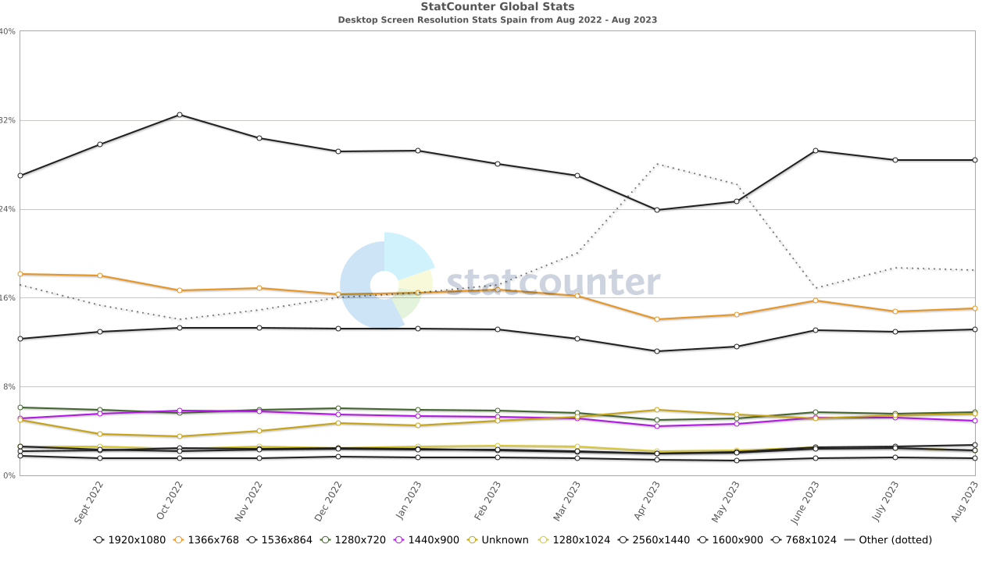

# UD2 - 2.3. Maquetación básica del interfaz de usuario

- [Objetivos](#objetivos)
- [Diseño adaptable o responsivo](#diseño-adaptable-o-responsivo)
- [Disposición de la interfaz de usuario](#disposición-de-la-interfaz-de-usuario)
- [Elementos de maquetación](#elementos-de-maquetación)
    - [Contenedores](#contenedores)
    - [Filas](#filas)
    - [Columnas](#columnas)
    - [Puntos de ruptura (_Breakpoints_)](#puntos-de-ruptura-breakpoints)
- [Modelo de cajas](#modelo-de-cajas)
    - [Partes de una caja](#partes-de-una-caja)
    - [Margen y relleno en Bootstrap](#margen-y-relleno-en-bootstrap)
    - [Bordes en Bootstrap](#bordes-en-bootstrap)
- [Visibilidad (_display_)](#visibilidad-display)
- [Modelo de cajas flexibles (_Flexbox_)](#modelo-de-cajas-flexibles-flexbox)
    - [Dirección de los elementos](#dirección-de-los-elementos)
    - [Justificar la posición de los elementos](#justificar-la-posición-de-los-elementos)
    - [Alineación de elementos](#alineación-de-elementos)
    - [Alineamiento individual de elementos](#alineamiento-individual-de-elementos)
    - [Relleno](#relleno)
    - [Crecimiento y encogimiento (_grow and shrink_)](#crecimiento-y-encogimiento-grow-and-shrink)
    - [Envoltura (_wrap_)](#envoltura-wrap)
    - [Orden de los elementos](#orden-de-los-elementos)
- [Bibliografía](#bibliografía)


<div style="page-break-after: always"></div>

## Objetivos

Maquetar la disposición básica de una interfaz de usuario biblioteca de componentes [Bootstrap](https://getbootstrap.com/). Esta biblioteca ue permite, de forma sencilla, crear una interfaz que se adapte a cualquier pantalla gracias a un diseño flexible.

## Diseño adaptable o responsivo

{ align=right width=150px }

El diseño adaptable es una filosofía de diseño y desarrollo cuyo objetivo es adaptar la apariencia de la interfaz de usuario al dispositivo que se esté utilizando para visitarlas.

Existen multitud de dispositivos como tabletas, teléfonos inteligentes, libros electrónicos, portátiles, PC, etc. Además, aun dentro de cada tipo, cada dispositivo tiene sus características concretas: tamaño de pantalla, resolución, potencia de CPU, sistema operativo o capacidad de memoria entre otras. Esta tecnología pretende que con un único diseño, todo se vea correctamente en cualquier dispositivo.

!!! note "StatCounter"
    En la web _**StatCounter**_ se pueden consultar estadísticas de uso de resoluciones de pantalla de distintos tipos de dispositivos y paises.
    
    La imagen se muestra la evolución de las resoluciones de pantalla de escritorio en España desde agosto de 2022 hasta agosto de 2023.

    

    [https://gs.statcounter.com/screen-resolution-stats/desktop/spain](https://gs.statcounter.com/screen-resolution-stats/desktop/spain)

    _En el ejemplo se puede ver que el 28,4% utiliza la resolución 1920x1080, por lo tanto es buena idea diseñar la interfaz para que se vea correctamente en esta resolución. Sin embargo, el 71,6% restante utiliza otras resoluciones, por lo que es necesario que la interfaz se adapte a cualquier resolución._

## Disposición de la interfaz de usuario

Para conseguir una interfaz adaptativa, utilizaremos un **diseño de rejilla flexible**, que se adapta a diferentes tamaños de pantalla.

Bootstrap utiliza un sistema de rejilla que permite crear diseños flexibles y adaptables a diferentes tamaños de pantalla. Para ello, se divide la pantalla en 12 columnas y se asigna a cada elemento un número de columnas. Por ejemplo, si queremos que un elemento ocupe la mitad de la pantalla, le asignaremos 6 columnas.

Además, gracias a los puntos de ruptura, podemos definir diferentes tamaños de pantalla y asignar a cada elemento un número de columnas diferente para cada tamaño.

## Elementos de maquetación

Bootstrap nos proporciona una serie de elementos de maquetación que nos permiten crear una interfaz de usuario adaptativa.

### Contenedores

Los contenedores son los elementos que se utilizan para crear el diseño de rejilla. Existen dos tipos de contenedores:

- `.container`: Crea un contenedor con un ancho fijo. El ancho del contenedor se adapta a la pantalla en función del punto de ruptura.
- `.container-fluid`: Crea un contenedor con un ancho fluido. El ancho del contenedor se adapta a la pantalla en función del punto de ruptura.

### Filas

Las filas se utilizan para agrupar elementos en una misma línea. Para crear una fila, utilizaremos el elemento `.row`.

### Columnas

Las columnas se utilizan para definir el número de columnas que ocupa un elemento. Para crear una columna, utilizaremos el elemento `.col`.

Ejemplo:

```html
<div class="container">
    <div class="row">
        <div class="col">col</div>
        <div class="col">col</div>
        <div class="col">col</div>
    </div>
</div>
```

<div class="container text-center" style="background: #aaa; color: #000">
    <div class="row m-1 py-1">
        <div class="col m-1" style="background: #ddd;">col</div>
        <div class="col m-1" style="background: #ddd;">col</div>
        <div class="col m-1" style="background: #ddd;">col</div>
    </div>
</div>

_[Ejemplo de disposición de columnas](../examples/ud2_bs_row_col.html)_

### Puntos de ruptura (_Breakpoints_)

A `.col` podemos asignarle el número de columnas que queremos que ocupe en función del tamaño de la pantalla.

Por ejemplo, si queremos que un elemento ocupe la mitad de la pantalla, le asignaremos 6 columnas. Para ello, utilizaremos la clase `.col-2` y `.col-7` que en total ocupan 9 columnas, quedan 3 libres que podemos asignar a una última columna sin especificar su tamaño.

```html
<div class="container">
    <div class="row">
        <div class="col-2">col</div>
        <div class="col-7">col</div>
        <div class="col">col</div>
    </div>
</div>
```

<div class="container text-center" style="background: #aaa; color: #000">
    <div class="row py-1">
        <div class="col-2 m-1" style="background: #ddd;">col-2</div>
        <div class="col-7 m-1" style="background: #ddd;">col-7</div>
        <div class="col m-1" style="background: #ddd;">col</div>
    </div>
</div>

Además, podemos asignar un número de columnas diferente **para cada tamaño de pantalla**. Para ello, utilizaremos la clase `.col-{tamaño}-{número de columnas}`.

En la siguiente tabla se muestran los puntos de ruptura (_Breakpoints_) y los tamaños de pantalla que se corresponden con cada uno de ellos.

| Breakpoint | clase | Dimensiones |
|:---:|:---:|:---:|
| Extra small | None | <576px |
| Small | **sm** | ≥576px |
| Medium | **md** | ≥768px |
| Large | **lg** | ≥992px |
| Extra large | **xl** | ≥1200px |
| Extra extra large | **xxl** | ≥1400px |

Siguiendo con el ejemplo anterior, para que se adapte a pantallas de tamaño medio. Para ello, utilizaremos la clase `.col-md-#`. Cuando se supere el punto de ruptura mínimo **`md`** (≥768px), los elementos se apilarán.

```html
<div class="container">
    <div class="row">
        <div class="col-md-2">col</div>
        <div class="col-md-7">col</div>
        <div class="col">col</div>
    </div>
</div>
```

Renderizado utilizando para pantallas de ancho medio **`md`** (≥768px):

<div class="container-fluid text-center" style="background: #aaa; color: #000">
    <div class="row gap-1 p-1">
        <div class="col-sm-2" style="background: #ddd;">col-sm-2</div>
        <div class="col-sm-7" style="background: #ddd;">col-sm-7</div>
        <div class="col" style="background: #ddd;">col</div>
    </div>
</div>

Ejemplo de rendereado al superar el punto de ruptura mínimo **`md`** (<768px):

<div class="container text-center">
    <div class="row">
        <div class="col text-end">--></div>
        <div class="col-6" style="background: #aaa; color: #000">
            <div class="row p-1 gy-1">
                <div class="col-12" style="background: #ddd;">col-sm-2</div>
                <div class="col-12" style="background: #ddd;">col-sm-7</div>
                <div class="col-12" style="background: #ddd;">col</div>
            </div>
        </div>
        <div class="col text-start"><--</div>
    </div>
</div>

Los puntos de ruptura se pueden combinar para definir diferentes tamaños de pantalla. _Por ejemplo,_ si queremos que un elemento ocupe la mitad de la pantalla en pantallas de tamaño medio, un tercio en pantallas grandes, pero que ocupe toda la pantalla en pantallas de tamaño pequeño, utilizaremos las clases **`col-sm-12 col-md-6 col-lg-4`**.

_[Ejemplo responsivo de disposición de columnas](../examples/ud2_bs_row_col_responsive.html)_

_[Ejemplo básico de maquetación de una interfaz mediante filas y columnas](../examples/ud2_bs_grid/index.html)_

<div style="page-break-after: always"></div>

## Modelo de cajas

El modelo de cajas CSS se aplica a cajas que presentan comportamiento en bloque. El modelo define cómo funcionan juntas las diferentes partes de una caja (margen, borde, relleno y contenido) para crear una caja. Para complicarlo un poco más, hay un modelo de cajas estándar y un modelo de cajas alternativo.

### Partes de una caja

Al hacer una caja de tipo bloque en CSS tenemos los elementos siguientes:

- El **contenido** de la caja: El área donde se muestra el contenido, cuyo tamaño puede cambiarse utilizando propiedades como `width` y `height`.
- El **relleno** de la caja (**padding**): El relleno es espacio en blanco alrededor del contenido; es posible controlar su tamaño usando la propiedad `padding`.
- El **borde** de la caja (**border**): El borde de la caja envuelve el contenido y el de relleno. Es posible controlar su tamaño y estilo utilizando la propiedad `border`.
- El **margen** de la caja ( **margin**): El margen es la capa más externa. Envuelve el contenido, el relleno y el borde como espacio en blanco entre la caja y otros elementos. Es posible controlar su tamaño usando la propiedad `margin`.


En el modelo de cajas estándar, (`box-sizing: content-box;`) que utilizan por defecto todos los navegadores, el ancho y alto de la caja se calculan incluyendo el tamaño del relleno y el borde. Lo que supone algunos problemas a la hora de diseñar una interfaz de usuario.

Bootstrap utiliza el modelo de cajas alternativo (`box-sizing: border-box`), donde el ancho y alto de la caja se calculan incluye los tamaños del borde y el relleno.

### Margen y relleno en Bootstrap

Para añadir margen y relleno a los elementos, se utilizan las clases `.m-{tamaño}` y `.p-{tamaño}` respectivamente, donde `{tamaño}` puede ser:

- **`0`**: Sin margen o relleno (0px).
- **`1`**: 0.25rem (4px)
- **`2`**: 0.5rem (8px)
- **`3`**: 1rem (16px) valor **por defecto**.
- **`4`**: 1.5rem (24px)
- **`5`**: 3rem (48px)
- **`auto`**: Margen o relleno automático.
- **`x`**: Margen o relleno horizontal.
- **`y`**: Margen o relleno vertical.
- **`t`**: (_top_) Margen o relleno superior.
- **`b`**: (_bottom_) Margen o relleno inferior.
- **`s`**: (_start_) Margen o relleno al inicio. Izquierda en lenguajes de escritura de izquierda a derecha LTR (_left-to-right_) y derecha en lenguajes de escritura de derecha a izquierda RTL (_right-to-left_)
- **`e`**: (_end_) Margen o relleno derecho. Derecha en lenguajes de escritura de izquierda a derecha LTR (_left-to-right_) e izquierda en lenguajes de escritura de derecha a izquierda RTL (_right-to-left_)

### Bordes en Bootstrap

Para añadir bordes a los elementos, se utilizan las clases `.border`, `.border-{tamaño}` y `.border-{lado}-{tamaño}` respectivamente, donde `{tamaño}` puede ser:

<div class="d-flex flex-wrap gap-2 text-center mx-5">
    <span class="p-1 bg-light border border-secondary border-0">border-0</span>
    <span class="p-1 bg-light border border-secondary border-1">border-1</span>
    <span class="p-1 bg-light border border-secondary border-2">border-2</span>
    <span class="p-1 bg-light border border-secondary border-3">border-3</span>
    <span class="p-1 bg-light border border-secondary border-4">border-4</span>
    <span class="p-1 bg-light border border-secondary border-5">border-5</span>
</div>

Y `{lado}` puede ser:

<div class="d-flex flex-wrap gap-2 text-center mx-5">
    <span class="p-1 bg-light border-secondary border-4 border-top">border-top</span>
    <span class="p-1 bg-light border-secondary border-4 border-bottom">border-bottom</span>
    <span class="p-1 bg-light border-secondary border-4 border-start">border-start</span>
    <span class="p-1 bg-light border-secondary border-4 border-end">border-end</span>
</div>

También podemos aplicar colores con las siguientes clases:

<div class="d-flex gap-2 text-center mx-5 flex-wrap">
    <span class="p-1 bg-light border border-4 border-primary">border-primary</span>
    <span class="p-1 bg-light border border-4 border-primary-subtle">border-primary-subtle</span>
    <span class="p-1 bg-light border border-4 border-secondary">border-secondary</span>
    <span class="p-1 bg-light border border-4 border-secondary-subtle">border-secondary-subtle</span>
    <span class="p-1 bg-light border border-4 border-success">border-success</span>
    <span class="p-1 bg-light border border-4 border-success-subtle">border-success-subtle</span>
    <span class="p-1 bg-light border border-4 border-danger">border-danger</span>
    <span class="p-1 bg-light border border-4 border-danger-subtle">border-danger-subtle</span>
    <span class="p-1 bg-light border border-4 border-warning">border-warning</span>
    <span class="p-1 bg-light border border-4 border-warning-subtle">border-warning-subtle</span>
    <span class="p-1 bg-light border border-4 border-info">border-info</span>
    <span class="p-1 bg-light border border-4 border-info-subtle">border-info-subtle</span>
    <span class="p-1 bg-light border border-4 border-light">border-light</span>
    <span class="p-1 bg-light border border-4 border-light-subtle">border-light-subtle</span>
    <span class="p-1 bg-light border border-4 border-dark">border-dark</span>
    <span class="p-1 bg-light border border-4 border-dark-subtle">border-dark-subtle</span>
    <span class="p-1 bg-light border border-4 border-black">border-black</span>
    <span class="p-1 bg-light border border-4 border-white">border-white</span>
</div>

Además, podemos aplicar efectos de borde con las siguientes clases:

<div class="d-flex flex-wrap gap-2 text-center mx-5">
    <span class="p-1 bg-light border border-4 border-secondary rounded">rounded</span>
    <span class="p-1 bg-light border border-4 border-secondary rounded-0">rounded-0</span>
    <span class="p-1 bg-light border border-4 border-secondary rounded-1">rounded-1</span>
    <span class="p-1 bg-light border border-4 border-secondary rounded-2">rounded-2</span>
    <span class="p-1 bg-light border border-4 border-secondary rounded-3">rounded-3</span>
    <span class="p-1 bg-light border border-4 border-secondary rounded-4">rounded-4</span>
    <span class="p-1 bg-light border border-4 border-secondary rounded-5">rounded-5</span>
    <span class="p-1 bg-light border border-4 border-secondary rounded-circle">rounded-circle</span>
    <span class="p-1 bg-light border border-4 border-secondary rounded-pill">rounded-pill</span>
    <span class="p-1 bg-light border border-4 border-secondary rounded-top">rounded-top</span>
    <span class="p-1 bg-light border border-4 border-secondary rounded-bottom">rounded-bottom</span>
    <span class="p-1 bg-light border border-4 border-secondary rounded-start">rounded-start</span>
    <span class="p-1 bg-light border border-4 border-secondary rounded-end">rounded-end</span>
</div>

También podemos aplicar opacidad con las siguiente clases:

<div class="d-flex flex-wrap gap-2 text-center mx-5">
    <span class="p-1 bg-light border border-4 border-dark border-opacity-25">border-opacity-25</span>
    <span class="p-1 bg-light border border-4 border-dark border-opacity-50">border-opacity-50</span>
    <span class="p-1 bg-light border border-4 border-dark border-opacity-75">border-opacity-75</span>
    <span class="p-1 bg-light border border-4 border-dark border-opacity-100">border-opacity-100</span>
</div>

<div style="page-break-after: always"></div>

## Visibilidad (_display_)

La propiedad `display` se utiliza para cambiar el comportamiento de visualización de un elemento. Por defecto, los elementos se muestran como elementos en bloque. Sin embargo, existen otros valores que permiten cambiar el comportamiento de visualización de los elementos.

En Bootstrap se utilizan las clases **`.d-{valor}`** y **`.d-{valor}-{tamaño}`** respectivamente, donde **`{valor}`** puede ser:

- **`none`**: El elemento no se muestra, ni ocupa espacio en la vista. _No confundir con `visibility: hidden;` que oculta el elemento pero sigue ocupando espacio vacío en la vista_.
- **`block`**: El elemento ocupa todo el espacio disponible, el siguiente elemento a se situará por debajo. _Los `<h1>` a `<h6>` y `<p>`, entre otros, tienen este comportamiento_.
- **`inline`**: El elemento ocupa el espacio que ocupe el contenido, el siguiente elemento se situa a continuación. _Los elementos `<span>` son un buen ejemplo_.
- **`inline-block`**:  Se comporta como un elemento `inline`, pero permite cambiar el ancho y el alto.
- **`grid`**: El elemento se comporta como un contenedor de cuadrícula.
- **`flex`**: El elemento se comporta como un contenedor flexible. _Ver apartado [Modelo de cajas flexibles (_Flexbox_)](#modelo-de-cajas-flexibles-flexbox)_.

Por ejemplo, para ocultar un elemento en pantallas más pequeñas, pero que se muestre en tamaños medianos o superiores podemos establecer las siguientes clases **`.d-none .d-md-block`**. Por lo general, al ocultar el elemento, se activa una opción para acceder a los elementos en una vista separada, normalmente un menú desplegable. Muy utilizado en diseño _responsive_ para dispositivos móviles.


<div class="container-fluid">
    <div class="row gap-3">
        <div class="col-7 border p-0 m-0">
            <div class="p-0 m-0 d-flex flex-row align-items-stretch">
                <div class="col-4 p-2 align-self-stretch flex-grow-1" style="background: #def;">Este elemento se muestra en pantallas medianas o superiores.</div>
                <div class="col-8 p-2 align-self-stretch flex-grow-1" style="background: #eee;">
                    <p>Contenido principal . . . . . . . . . . . . . . . . . . . . . . . . . . . . . . . . . . . . . . . . . . . . . . . . . . . . . . . . . . . . . . . . . . . . . . . . . . . . . . </p>
                </div>
            </div>
        </div>
        <div class="col-4 border p-0 m-0">
            <p class="m-0 p-2" style="background: #def;">🔻 Menú</p>
            <div class="row p-0 m-0">
                 <div class="col" style="background: #eee;">
                    <p>Contenido principal . . . . . . . . . . . . . . . . . . . . . . . . . . . . . . . . . . . . . . . . . . . . . . . . . . . . .</p>
                </div>
            </div>
        </div>
    </div>
</div>

## Modelo de cajas flexibles (_Flexbox_)

El diseño de Caja Flexible (o _Flexbox_),​ es un modelo de diseño CSS3. La disposición de _flexbox_ permite que los elementos adaptables dentro de un contenedor se organicen automáticamente dependiendo del tamaño de la pantalla o del dispositivo.

Para designar un contenedor como un contenedor flexible, en Bootstrap se utiliza la clase **`.d-flex`** para aplicar la propiedad `display: flex;` y **`.d-inline-flex`** para aplicar la propiedad `display: inline-flex;`.

Ejemplo de contenedor flexible con tres elementos:

```html
<div class="d-flex">
    <p>Item 1</p>
    <p>Item 2</p>
    <p>Item 3</p>
</div>
```

<div class="d-flex border border-secondary border-3 p-2 gap-2">
    <p class="p-2 m-0 bg-light border border-2 border-secondary">Item 1</p>
    <p class="p-2 m-0 bg-light border border-2 border-secondary">Item 2</p>
    <p class="p-2 m-0 bg-light border border-2 border-secondary">Item 3</p>
</div>

Ejemplo de contenedor flexible en línea con tres elementos:

```html
<div class="d-flex-inline">
    <p>Item 1</p>
    <p>Item 2</p>
    <p>Item 3</p>
</div>
```

<div class="d-flex-inline border border-secondary border-3 p-2 gap-2">
    <p class="p-2 m-0 bg-light border border-2 border-secondary">Item 1</p>
    <p class="p-2 m-0 bg-light border border-2 border-secondary">Item 2</p>
    <p class="p-2 m-0 bg-light border border-2 border-secondary">Item 3</p>
</div>

Podemos aplicar puntos de ruptura a los contenedores flexibles para que se adapten a diferentes tamaños de pantalla. Para ello, utilizaremos las clases `.flex-{tamaño}` y `.inline-flex-{tamaño}` respectivamente. Tal como hemos visto en el apartado [Puntos de ruptura (_Breakpoints_)](#puntos-de-ruptura-breakpoints).

### Dirección de los elementos

Por defecto, los elementos se colocan en una fila, de izquierda a derecha. Para cambiar la dirección de los elementos, utilizaremos la clase `.flex-{dirección}` donde `{dirección}` puede ser:

- **`row`**: (_por defecto_) Los elementos se colocan en una fila, de izquierda a derecha.
- **`row-reverse`**: Los elementos se colocan en una fila, de derecha a izquierda.
- **`column`**: Los elementos se colocan en una columna, de arriba a abajo.
- **`column-reverse`**: Los elementos se colocan en una columna, de abajo a arriba.

Ejemplo de contenedor flexible con tres elementos en una fila y en una fila inversa:

```html
<div class="d-flex flex-row">
    <p>Item 1</p>
    <p>Item 2</p>
    <p>Item 3</p>
</div>
<div class="d-flex flex-row-reverse">
    <p>Item 1</p>
    <p>Item 2</p>
    <p>Item 3</p>
</div>
```

<div class="d-flex flex-row mb-3 border border-secondary border-3 p-2 gap-2">
    <p class="p-2 m-0 bg-light border border-2 border-secondary">Item 1</p>
    <p class="p-2 m-0 bg-light border border-2 border-secondary">Item 2</p>
    <p class="p-2 m-0 bg-light border border-2 border-secondary">Item 3</p>
</div>
<div class="d-flex flex-row-reverse border border-secondary border-3 p-2 gap-2">
    <p class="p-2 m-0 bg-light border border-2 border-secondary">Item 1</p>
    <p class="p-2 m-0 bg-light border border-2 border-secondary">Item 2</p>
    <p class="p-2 m-0 bg-light border border-2 border-secondary">Item 3</p>
</div>

Ejemlo de contenedor flexible con tres elementos en una columna y en una columna inversa:

```html
<div class="d-flex flex-column">
    <p>Item 1</p>
    <p>Item 2</p>
    <p>Item 3</p>
</div>
<div class="d-flex flex-column-reverse">
    <p>Item 1</p>
    <p>Item 2</p>
    <p>Item 3</p>
</div>
```

<div class="d-flex flex-column mb-3 border border-secondary border-3 p-2 gap-2">
    <p class="p-2 m-0 bg-light border border-2 border-secondary">Item 1</p>
    <p class="p-2 m-0 bg-light border border-2 border-secondary">Item 2</p>
    <p class="p-2 m-0 bg-light border border-2 border-secondary">Item 3</p>
</div>
<div class="d-flex flex-column-reverse border border-secondary border-3 p-2 gap-2">
    <p class="p-2 m-0 bg-light border border-2 border-secondary">Item 1</p>
    <p class="p-2 m-0 bg-light border border-2 border-secondary">Item 2</p>
    <p class="p-2 m-0 bg-light border border-2 border-secondary">Item 3</p>
</div>

También podemos cambiar la dirección de los elementos en función del tamaño de la pantalla. Para ello, utilizaremos las clases `.flex-{tamaño}-{dirección}`. Tal como hemos visto en el apartado [Puntos de ruptura (_Breakpoints_)](#puntos-de-ruptura-breakpoints).


### Justificar la posición de los elementos

Para justificar la alineación de los elementos, utilizaremos la clase `.justify-content-{alineación}`.

Ejemplo de contenedor flexible con tres elementos justificados a la izquierda, a la derecha, centrados, distribuidos y distribuidos equitativamente:

**`justify-content-start`**:

<div class="d-flex justify-content-start mb-3 border border-secondary border-3 p-2 gap-2">
    <p class="p-2 m-0 bg-light border border-2 border-secondary">Item 1</p>
    <p class="p-2 m-0 bg-light border border-2 border-secondary">Item 2</p>
    <p class="p-2 m-0 bg-light border border-2 border-secondary">Item 3</p>
</div>

**`justify-content-end`**:

<div class="d-flex justify-content-end border border-secondary border-3 p-2 gap-2">
    <p class="p-2 m-0 bg-light border border-2 border-secondary">Item 1</p>
    <p class="p-2 m-0 bg-light border border-2 border-secondary">Item 2</p>
    <p class="p-2 m-0 bg-light border border-2 border-secondary">Item 3</p>
</div>

**`justify-content-center`**:

<div class="d-flex justify-content-center border border-secondary border-3 p-2 gap-2">
    <p class="p-2 m-0 bg-light border border-2 border-secondary">Item 1</p>
    <p class="p-2 m-0 bg-light border border-2 border-secondary">Item 2</p>
    <p class="p-2 m-0 bg-light border border-2 border-secondary">Item 3</p>
</div>

**`justify-content-between`**:

<div class="d-flex justify-content-between border border-secondary border-3 p-2 gap-2">
    <p class="p-2 m-0 bg-light border border-2 border-secondary">Item 1</p>
    <p class="p-2 m-0 bg-light border border-2 border-secondary">Item 2</p>
    <p class="p-2 m-0 bg-light border border-2 border-secondary">Item 3</p>
</div>

**`justify-content-around`**:

<div class="d-flex justify-content-around border border-secondary border-3 p-2 gap-2">
    <p class="p-2 m-0 bg-light border border-2 border-secondary">Item 1</p>
    <p class="p-2 m-0 bg-light border border-2 border-secondary">Item 2</p>
    <p class="p-2 m-0 bg-light border border-2 border-secondary">Item 3</p>
</div>

**`justify-content-evenly`**:

<div class="d-flex justify-content-evenly border border-secondary border-3 p-2 gap-2">
    <p class="p-2 m-0 bg-light border border-2 border-secondary">Item 1</p>
    <p class="p-2 m-0 bg-light border border-2 border-secondary">Item 2</p>
    <p class="p-2 m-0 bg-light border border-2 border-secondary">Item 3</p>
</div>

Podemos cambiar la justificación de los elementos en función del tamaño de la pantalla. Para ello, utilizaremos las clases `.justify-content-{tamaño}-{alineación}`. Tal como hemos visto en el apartado [Puntos de ruptura (_Breakpoints_)](#puntos-de-ruptura-breakpoints).

### Alineación de elementos

Para alinear los elementos, utilizaremos la clase `.align-items-{alineación}`.

Ejemplo de contenedor flexible con tres elementos alineados arriba, abajo, centrados, estirados y en la línea base de la tipografía (se ha cambiado el tamaño del texto de los elementos para que se pueda apreciar mejor la alineación):

- Arriba **`align-items-start`**:

<div class="d-flex align-items-start mb-3 border border-secondary border-3 p-2 gap-2" style="height: 100px;">
    <h1 class="p-1 m-0 bg-light border border-2 border-secondary">Item 1</h1>
    <h5 class="p-1 m-0 bg-light border border-2 border-secondary">Item 2</h5>
    <h3 class="p-1 m-0 bg-light border border-2 border-secondary">Item 3</h3>
</div>

- Abajo **`align-items-end`**:

<div class="d-flex align-items-end mb-3 border border-secondary border-3 p-2 gap-2" style="height: 100px;">
    <h1 class="p-1 m-0 bg-light border border-2 border-secondary">Item 1</h1>
    <h5 class="p-1 m-0 bg-light border border-2 border-secondary">Item 2</h5>
    <h3 class="p-1 m-0 bg-light border border-2 border-secondary">Item 3</h3>
</div>

- Centro **`align-items-center`**:

<div class="d-flex align-items-center mb-3 border border-secondary border-3 p-2 gap-2" style="height: 100px;">
    <h1 class="p-1 m-0 bg-light border border-2 border-secondary">Item 1</h1>
    <h5 class="p-1 m-0 bg-light border border-2 border-secondary">Item 2</h5>
    <h3 class="p-1 m-0 bg-light border border-2 border-secondary">Item 3</h3>
</div>

- Estirado **`align-items-stretch`**:

<div class="d-flex align-items-stretch mb-3 border border-secondary border-3 p-2 gap-2" style="height: 100px;">
    <h1 class="p-1 m-0 bg-light border border-2 border-secondary">Item 1</h1>
    <h5 class="p-1 m-0 bg-light border border-2 border-secondary">Item 2</h5>
    <h3 class="p-1 m-0 bg-light border border-2 border-secondary">Item 3</h3>
</div>

- Línea base del texto **`align-items-baseline`**:

<div class="d-flex align-items-baseline mb-3 border border-secondary border-3 p-2 gap-2" style="height: 100px;">
    <h1 class="p-1 m-0 bg-light border border-2 border-secondary">Item 1</h1>
    <h5 class="p-1 m-0 bg-light border border-2 border-secondary">Item 2</h5>
    <h3 class="p-1 m-0 bg-light border border-2 border-secondary">Item 3</h3>
</div>

Podemos cambiar la alineación de los elementos en función del tamaño de la pantalla. Para ello, utilizaremos las clases `.align-items-{tamaño}-{alineación}`. Tal como hemos visto en el apartado [Puntos de ruptura (_Breakpoints_)](#puntos-de-ruptura-breakpoints).

### Alineamiento individual de elementos

Para alinear individualmente los elementos, utilizaremos la clase `.align-self-{alineación}`.

Ejemplo de contenedor flexible con tres elementos alineados arriba, abajo, centrados, estirados y en la línea base de la tipografía:

- Arriba **`align-self-start`**:

<div class="d-flex mb-3 border border-secondary border-3 p-2 gap-2" style="height: 100px;">
    <h1 class="p-1 m-0 bg-light border border-2 border-secondary align-self-stretch">Item 1</h1>
    <p class="p-1 m-0 bg-light border border-2 border-secondary align-self-start">Item 2 (align-self-start)</p>
    <h3 class="p-1 m-0 bg-light border border-2 border-secondary align-self-stretch">Item 3</h3>
</div>

- Abajo **`align-self-end`**:

<div class="d-flex mb-3 border border-secondary border-3 p-2 gap-2" style="height: 100px;">
    <h1 class="p-1 m-0 bg-light border border-2 border-secondary align-self-stretch">Item 1</h1>
    <p class="p-1 m-0 bg-light border border-2 border-secondary align-self-end">Item 2 (align-self-end)</p>
    <h3 class="p-1 m-0 bg-light border border-2 border-secondary align-self-stretch">Item 3</h3>
</div>

- Centro **`align-self-center`**:

<div class="d-flex mb-3 border border-secondary border-3 p-2 gap-2" style="height: 100px;">
    <h1 class="p-1 m-0 bg-light border border-2 border-secondary align-self-stretch">Item 1</h1>
    <p class="p-1 m-0 bg-light border border-2 border-secondary align-self-center">Item 2 (align-self-center)</p>
    <h3 class="p-1 m-0 bg-light border border-2 border-secondary align-self-stretch">Item 3</h3>
</div>

- Estirado **`align-self-stretch`**:

<div class="d-flex mb-3 border border-secondary border-3 p-2 gap-2" style="height: 100px;">
    <h1 class="p-1 m-0 bg-light border border-2 border-secondary align-self-stretch">Item 1</h1>
    <p class="p-1 m-0 bg-light border border-2 border-secondary align-self-stretch">Item 2 (align-self-stretch)</p>
    <h3 class="p-1 m-0 bg-light border border-2 border-secondary align-self-stretch">Item 3</h3>
</div>

- Línea base del texto **`align-self-baseline`** (_en el ejemplo, los elementos 1 y 4 se encuentran estirados e ignoran la alineación a la línea base del texto_):

<div class="d-flex mb-3 border border-secondary border-3 p-2 gap-2" style="height: 100px;">
    <h1 class="p-1 m-0 bg-light border border-2 border-secondary align-self-stretch">Item 1</h1>
    <p class="p-1 m-0 bg-light border border-2 border-secondary align-self-baseline">Item 2 (align-self-baseline)</p>
    <h6 class="p-1 m-0 bg-light border border-2 border-secondary align-self-baseline">Item 3 (align-self-baseline)</h6>
    <h3 class="p-1 m-0 bg-light border border-2 border-secondary align-self-stretch">Item 4</h3>
</div>

Podemos cambiar la alineación de los elementos en función del tamaño de la pantalla. Para ello, utilizaremos las clases `.align-self-{tamaño}-{alineación}`. Tal como hemos visto en el apartado [Puntos de ruptura (_Breakpoints_)](#puntos-de-ruptura-breakpoints).

### Relleno

La clase **`.flex-fill`** en una serie de elementos hermanos, fuerza a tener tamaños iguales a su contenido mientras ocupa todo el espacio disponible de forma equitativa.

Ejemplo de contenedor flexible con tres elementos con la clase `.flex-fill`, se puede observar que los elementos en los que se ha definido la clase (1 y 3) ocupan todo el espacio disponible de forma equitativa y el elemento 2 solo ocupa el espacio que necesita:


```html
<div class="d-flex">
    <p class="flex-fill">Item 1 (con mayor contenido)</p>
    <p>Item 2</p>
    <p class="flex-fill">Item 3</p>
</div>
```

<div class="d-flex mb-3 border border-secondary border-3 p-2 gap-2" style="height: 100px;">
    <p class="p-1 flex-fill m-0 bg-light border border-2 border-secondary">Item 1 (con mayor contenido)</p>
    <p class="p-1 m-0 bg-light border border-2 border-secondary">Item 2</p>
    <p class="p-1 flex-fill m-0 bg-light border border-2 border-secondary">Item 3</p>
</div>

### Crecimiento y encogimiento (_grow and shrink_)

La clase **`.flex-grow-{número}`** en una serie de elementos hermanos, fuerza a que los elementos crezcan en función del número que se le asigne. Por defecto, todos los elementos tienen un valor de 0, por lo que no crecen. Si se asigna un valor de 1, todos los elementos crecerán por igual. Si se asigna un valor de 2, los elementos crecerán el doble que los elementos con valor 1.

Ejemplo de crecimiento de un elemento con la clase `.flex-grow-1`:

```html
<div class="d-flex">
  <p class="flex-grow-1">Item 1</p>
  <p>Item 2</p>
  <p>Item 3</p>
</div>
```

<div class="d-flex mb-3 border border-secondary border-3 p-2 gap-2" style="height: 100px;">
    <p class="p-1 flex-grow-1 m-0 bg-light border border-2 border-secondary">Item 1 (flex-grow-1)</p>
    <p class="p-1 m-0 bg-light border border-2 border-secondary">Item 2</p>
    <p class="p-1 m-0 bg-light border border-2 border-secondary">Item 3</p>
</div>

La clase **`.flex-shrink-{número}`** en una serie de elementos hermanos, fuerza a que los elementos se encojan en función del número que se le asigne. Por defecto, todos los elementos tienen un valor de 1, por lo que se encogen por igual. Si se asigna un valor de 2, los elementos se encogerán el doble que los elementos con valor 1.

Ejemplo de encogimiento de un elemento con la clase `.flex-shrink-1`. _Para forzar el encogimiento de un elemento, se establece un ancho del 100% (`w-100`) al elemento 2_, se puede observar como el contenido del elemento 1 hace fuerza un salto de línea:

```html
<div class="d-flex">
  <p class="flex-shrink-1">Item 1 (flex-shrink-1)</p>
  <p class="w-100">Item 2</p>
</div>
```

<div class="d-flex mb-3 border border-secondary border-3 p-2 gap-2" style="height: 100px;">
    <p class="p-1 flex-shrink-1 m-0 bg-light border border-2 border-secondary">Item 1 (flex-shrink-1)</p>
    <p class="p-1 m-0 bg-light border border-2 border-secondary w-100">Item 2</p>
</div>

### Envoltura (_wrap_)

La clase **`.flex-wrap`** en un contenedor flexible, fuerza a que los elementos se envuelvan en función del tamaño del contenedor.

Ejemplo **sin aplicar envoltura** de elementos:

```html
<div class="d-flex flex-wrap">
    <p>Item 1</p>
    <p>Item 2</p>
    <p>Item 3</p>
    ...
    <p>Item 10</p>
</div>
```

<div class="container">
    <div class="d-flex mb-3 border border-secondary border-3 p-2 gap-2 w-50 mx-auto">
        <p class="p-1 m-0 bg-light border border-2 border-secondary">Item 1</p>
        <p class="p-1 m-0 bg-light border border-2 border-secondary">Item 2</p>
        <p class="p-1 m-0 bg-light border border-2 border-secondary">Item 3</p>
        <p class="p-1 m-0 bg-light border border-2 border-secondary">Item 4</p>
        <p class="p-1 m-0 bg-light border border-2 border-secondary">Item 5</p>
        <p class="p-1 m-0 bg-light border border-2 border-secondary">Item 6</p>
        <p class="p-1 m-0 bg-light border border-2 border-secondary">Item 7</p>
        <p class="p-1 m-0 bg-light border border-2 border-secondary">Item 8</p>
        <p class="p-1 m-0 bg-light border border-2 border-secondary">Item 9</p>
        <p class="p-1 m-0 bg-light border border-2 border-secondary">Item 10</p>
    </div>
</div>

Ejemplo **aplicando envoltura** de elementos con la clase `.flex-wrap`:

```html
<div class="d-flex flex-wrap">
    <p>Item 1</p>
    <p>Item 2</p>
    <p>Item 3</p>
    ...
    <p>Item 10</p>
</div>
```

<div class="container">
    <div class="d-flex flex-wrap mb-3 border border-secondary border-3 p-2 gap-2 w-50 mx-auto">
        <p class="p-1 m-0 bg-light border border-2 border-secondary">Item 1</p>
        <p class="p-1 m-0 bg-light border border-2 border-secondary">Item 2</p>
        <p class="p-1 m-0 bg-light border border-2 border-secondary">Item 3</p>
        <p class="p-1 m-0 bg-light border border-2 border-secondary">Item 4</p>
        <p class="p-1 m-0 bg-light border border-2 border-secondary">Item 5</p>
        <p class="p-1 m-0 bg-light border border-2 border-secondary">Item 6</p>
        <p class="p-1 m-0 bg-light border border-2 border-secondary">Item 7</p>
        <p class="p-1 m-0 bg-light border border-2 border-secondary">Item 8</p>
        <p class="p-1 m-0 bg-light border border-2 border-secondary">Item 9</p>
        <p class="p-1 m-0 bg-light border border-2 border-secondary">Item 10</p>
    </div>
</div>

### Orden de los elementos

La clase **`.order-{número}`** en un elemento flexible, fuerza a que el elemento se ordene en función del número que se le asigne. Por defecto, todos los elementos tienen un valor de 0, por lo que se ordenan en el orden en el que se encuentran en el código HTML. Si se asigna un valor de 1, el elemento se ordenará en primer lugar. Si se asigna un valor de 2, el elemento se ordenará en segundo lugar, y así sucesivamente.

```html
<div class="d-flex">
  <div class="order-3">Item 1 (3)</div>
  <div class="order-1">Item 2 (1)</div>
  <div class="order-2">Item 3 (2)</div>
</div>
```

<div class="d-flex mb-3 border border-secondary border-3 p-2 gap-2">
    <div class="p-1 m-0 bg-light border border-2 border-secondary order-3">Item 1 (3)</div>
    <div class="p-1 m-0 bg-light border border-2 border-secondary order-1">Item 2 (1)</div>
    <div class="p-1 m-0 bg-light border border-2 border-secondary order-2">Item 3 (2)</div>
</div>

_[Ejemplo básico de maquetación de una interfaz mediante flexbox](../examples/ud2_bs_flex/index.html)_

## Bibliografía

- [Bootstrap 5](https://getbootstrap.com/docs/5.3/)
- [Bootstrap 5 Cheat Sheet](https://bootstrap-cheatsheet.themeselection.com/)
- [MDN - Modelo de cajas](https://developer.mozilla.org/es/docs/Learn/CSS/Building_blocks/The_box_model)