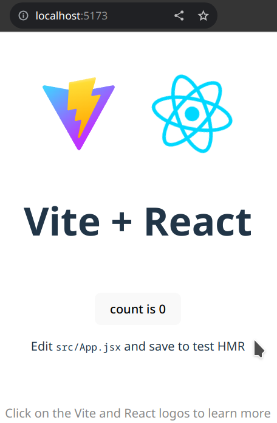

# UD4 - 4.1 Componentes avanzados

## Introducción

En esta unidad veremos como crear componentes personalizados mediante el uso de la **librería** [**_React_**](https://es.react.dev/) y el **empaquetador** [**_Vite_**](https://vitejs.dev/) para utilizarlos en nuestras aplicaciones multiplataforma con _**Electron**_.

Primero nos centraremos en cómo funciona _**React**_, creando un proyecto de ejemplo utilizando _**Vite**_ para ver cómo se estructura un proyecto y crear un componentes sencillos.

## ¿Qué es React?

React es una librería de código abierto creada por _Facebook_. Se utiliza para crear interfaces de usuario (UI) en aplicaciones de una sola página, conocidas como SPA, (_Single Page Applications_).

Utiliza [**_web components_**](https://developer.mozilla.org/en-US/docs/Web/API/Web_components), que es una especificación de la W3C que permite **crear componentes reutilizables** en aplicaciones web. Los componentes son la base de _React_. Un **componente** es una pieza de **código reutilizable** que devuelve elementos de que se pueden renderizar. Son la base de la creación de aplicaciones modernas.

React utiliza **JSX**, que es una extensión de sintaxis de _JavaScript_. JSX permite escribir HTML dentro de JavaScript. Esto permite a los desarrolladores crear componentes utilizando la misma sintaxis que HTML. JSX se compila en JavaScript puro utilizando un compilador como Babel o SWC.

## ¿Qué es vite?

Vite es un _bundler_ que permite crear proyectos react de forma rápida y sencilla. Se basa en el uso de _ESM_ (_ECMAScript Modules_) para cargar los módulos de forma rápida y eficiente. Vite utiliza un servidor de desarrollo que permite recargar el navegador de forma automática cuando se detectan cambios en el código.

## Creación de un proyecto _React_ utilizando _Vite_

Para crear un proyecto react utilizaremos el comando `npm create vite@latest proyecto`.

- Ejecutar el comando para crear un nuevo proyecto:

    ```bash title="Ejecutar en la línea de comandos:" hl_lines="1"
    $ npm create vite@latest react-test-project
    ```

- Seleccionar el framework:

    ```bash hl_lines="4"
    ? Select a framework: › - Use arrow-keys. Return to submit.
        Vanilla
        Vue
    ❯   React
        Preact
        Lit
        Svelte
        Solid
        Qwik
        Others
    ```

- Seleccionar el lenguaje:

    ```bash hl_lines="5"
    ? Select a variant: › - Use arrow-keys. Return to submit.
        TypeScript
        TypeScript + SWC
        JavaScript
    ❯   JavaScript + SWC
    ```

    !!! note ""
        _**SWC**_ es un compilador de _JavaScript_/_TypeScript_ escrito en _Rust_ que se ejecuta mucho más rápido que _Babel_.

- Finalmente se creará el proyecto:

    ```bash hl_lines="3"
    Scaffolding project in ./react-test-project...

    Done. Now run:

    cd react-test-project
    npm install
    npm run dev
    ```

- Instalar dependencias y ejecutar el proyecto:

    ```text hl_lines="1-3 7 14"
    $ cd react-test-project
    $ npm install
    $ npm run dev

      VITE v4.5.0  ready in 208 ms

        ➜  Local:   http://localhost:5174/
        ➜  Network: use --host to expose
        ➜  press h to show help

        Shortcuts
        press r to restart the server
        press u to show server url
        press o to open in browser
        press c to clear console
        press q to quit
    ```

    !!! note "`npm run dev`"
        El servidor de desarrollo se ejecuta, por defecto, en el puerto **`5174`**. Para acceder a la aplicación se utiliza la dirección _**`http://localhost:5174`**_.

        Existen una serie de **atajos de teclado** que permiten realizar acciones de forma rápida.

    Si accedemos a la dirección _**`http://localhost:5174`**_ veremos la siguiente pantalla:

    {width=50%}

## Estructura del proyecto (_scaffolding_)

La estructura del proyecto debe ser similar a la siguiente:

```
├── node_modules/
├── public/
│   └── vite.svg
├── src/
│   ├── assets/
│   │   └── react.svg
│   ├── App.css
│   ├── App.jsx
│   ├── index.css
│   └── main.jsx
├── .eslintrc.cjs
├── .gitignore
├── index.html
├── package-lock.json
├── package.json
├── README.md
└── vite.config.js
```

Podemos observer varios archivos de configuración, como _**`package.json`**_, _**`vite.config.js`**_, además de un **`.gitignore`**.

Dentro de package.json podemos observar los siguientes scripts:

```json title="package.json" linenums="5"
...
  "scripts": {
    "dev": "vite",
    "build": "vite build",
    "lint": "eslint . --ext js,jsx --report-unused-disable-directives --max-warnings 0",
    "preview": "vite preview"
  }
...
```

- **`dev`**: Ejecuta el servidor de desarrollo.
- **`build`**: Genera la aplicación para producción en el directorio `dist/`.
- **`lint`**: Ejecuta el linter para comprobar el código.
- **`preview`**: Genera la aplicación para producción y la ejecuta en un servidor local.

Por otro lado, en **`index.html`** es muy sencillo. En `<body>` sólo hay dos elementos:

- **`<div id="root"></div>`**: Es el elemento donde se renderizará la aplicación.
- **`<script type="module" src="/src/main.jsx"></script>`**: El punto de entrada de la aplicación es `src/main.jsx`.

```html title="index.html" linenums="1" hl_lines="10-11"
<!doctype html>
<html lang="en">
  <head>
    <meta charset="UTF-8" />
    <link rel="icon" type="image/svg+xml" href="/vite.svg" />
    <meta name="viewport" content="width=device-width, initial-scale=1.0" />
    <title>Vite + React</title>
  </head>
  <body>
    <div id="root"></div>
    <script type="module" src="/src/main.jsx"></script>
  </body>
</html>
```

La aplicación _**React**_ se encuentra dentro del directorio **`src/`**, que es donde trabajaremos a partir de ahora. En este directorio se encuentran los siguientes archivos:

- **`main.jsx`**: **Punto de entrada** de la aplicación.
- **`App.jsx`**: **Componente principal** de la aplicación.
- **`App.css`**: Estilos del componente principal.
- **`index.css`**: Estilos de la aplicación (`main.jsx`).
- **`assets/`**: Directorio donde se almacenan los recursos.

## Creación de componentes

Si observamos el contenido de **`App.jsx`** veremos el siguiente código:

```js title="src/App.jsx" linenums="1" hl_lines="1-4 10-31 35"
import { useState } from 'react'
import reactLogo from './assets/react.svg'
import viteLogo from '/vite.svg'
import './App.css'

function App() {
  const [count, setCount] = useState(0)

  return (
    <>
      <div>
        <a href="https://vitejs.dev" target="_blank">
          
        </a>
        <a href="https://react.dev" target="_blank">
          
        </a>
      </div>
      <h1>Vite + React</h1>
      <div className="card">
        <button onClick={() => setCount((count) => count + 1)}>
          count is {count}
        </button>
        <p>
          Edit <code>src/App.jsx</code> and save to test HMR
        </p>
      </div>
      <p className="read-the-docs">
        Click on the Vite and React logos to learn more
      </p>
    </>
  )
}

export default App
```

Contiene una serie de _imports_, una función que contiene un `return` con código `html` y un `export` al final.

Para crear nuestro propio componente, podemos borrar todo el contenido y dejarlo de la siguiente forma:

```js title="src/App.jsx" linenums="1"
import './App.css'

function App() {
  return (
    <>

    </>
  )
}

export default App
```

!!! note ""
    Un componente siempre **debe** devolver un único elemento. Si queremos devolver varios elementos, debemos agruparlos dentro de un elemento padre, por eso se utiliza el marcado **`< >`** y **``< />``**.

Ahora vamos a crear un componente que nos muestre un mensaje de bienvenida. Para ello, modificaremos el archivo **`App.jsx`** con el siguiente contenido:

```js title="src/App.jsx" linenums="1" hl_lines="3-9 14"
import './App.css'

function HolaMundo() {
  return (
    <div className="HolaMundo">
      <h1>Hola desde mi primer componente</h1>
    </div>
  )
}

function App() {
  return (
    <>
      <HolaMundo />
    </>
  )
}

export default App
```

Si comprobamos el resultado en el navegador, podremos ver que se muestra el mensaje. De esta forma tan simple hemos creado el componente que podremos reutilizar en cualquier parte de nuestra aplicación.

Por lo general, los componentes no son tan simples, se utilizan para crear estructuras más complejas, como una tarjeta que muestra información de un usuario, un formulario, listados de productos, etc. Además, se suelen crear en archivos separados. 

Ahora vamos a mover el componente **`HolaMundo`** a un archivo distinto. Para ello, crearemos la carpeta **`src/components`** y dentro crearemos un nuevo archivo **`HolaMundo.jsx`** con el siguiente contenido:

```js title="src/components/HolaMundo.jsx" linenums="1"
export default function HolaMundo() {
  return (
    <div className="HolaMundo">
      <h1>Hola desde mi primer componente</h1>
    </div>
  )
}
```

Y ahora podemos eliminar la funcion HolaMundo del archivo **`App.jsx`** y añadir el import del componente:

```js title="src/App.jsx" linenums="1" hl_lines="2"
import './App.css'
import HolaMundo from './components/HolaMundo'

function App() {
  return (
    <>
      <HolaMundo />
    </>
  )
}

export default App
```

## Props

Los componentes pueden recibir **propiedades** (_props_) que se utilizan para pasar información al componente. Las _props_ son **inmutables**, es decir, no se pueden modificar desde el componente. Para modificarlas, se debe hacer desde el componente padre.

Para pasar _props_ a un componente, se utiliza la sintaxis **`<Componente prop1="valor1" prop2="valor2" />`**, con el formato `atributo="valor"` típico de `html`. Para acceder a las _props_ desde el componente, se utiliza el objeto **`props`**.

Vamos a crear un componente que reciba un nombre y un apellido y los muestre en pantalla. Para ello, crearemos el archivo **`src/components/NombreCompleto.jsx`** con el siguiente contenido:

```js title="src/components/NombreCompleto.jsx" linenums="1"
export default function NombreCompleto(props) {
    return (
        <p>User: <strong>{props.nombre}</strong> {props.apellido}</p>
    )
}

```

Y ahora podemos añadir el componente al archivo **`App.jsx`**:

```js title="src/App.jsx" linenums="1" hl_lines="2-3"
import './App.css'
import HolaMundo from './components/HolaMundo'
import NombreCompleto from './components/NombreCompleto'

function App() {
  return (
    <>
      <HolaMundo />
      <NombreCompleto nombre="María" apellido="López" />
      <NombreCompleto nombre="Juan" apellido="Pérez" />
    </>
  )
}

export default App
```

Si comprobamos el resultado en el navegador, vemos que se muestran los nombres y apellidos que hemos pasado como _props_.

## Ejemplo de integración de Bootstrap

Para integrar _Bootstrap_ en nuestro proyecto, debemos instalar las dependencias necesarias. Para ello, ejecutaremos el comando:

```bash
$ npm install bootstrap bootstrap-icons
```

Y ahora podemos utilizar los componentes de _Bootstrap_ en nuestros componentes. Por ejemplo, vamos a crear un componente que muestre una tarjeta con información de un usuario. Para ello, crearemos el archivo **`src/components/TarjetaUsuario.jsx`** con el siguiente contenido:

```js title="src/components/TarjetaUsuario.jsx"
export default function TarjetaUsuario(props) {
    return (
        <div className="card shadow-sm">
            <div className="card-header text-center">
                <h5 className="card-title">{props.nombre} {props.apellido}</h5>
            </div>
            <div className="card-body">
                <h6 className="card-subtitle mb-2 text-muted"><a href="#" className="card-link"><i class="bi bi-envelope"></i></a> {props.email}</h6>
                <p className="card-text"><a href="#" className="card-link"><i class="bi bi-telephone"></i></a> {props.telefono}</p>
                <div className="text-end">
                <button className="btn btn-outline-secondary btn-sm">Añadir <i class="bi bi-plus-circle"></i></button>
                </div>
            </div>
        </div>
    )
}
```

Y ahora podemos añadir el componente al archivo **`App.jsx`** junto a los imports de _Bootstrap_:

```js title="src/App.jsx" linenums="1"
import 'bootstrap/dist/css/bootstrap.min.css';
import 'bootstrap-icons/font/bootstrap-icons.css';
import 'bootstrap';

import TarjetaUsuario from './components/TarjetaUsuario';

function App() {
  return (
    <>
      <div className="container mt-5 d-flex flex-wrap justify-content-center gap-3">
        <TarjetaUsuario nombre="María" apellido="López" email="invalid@email.moc" telefono="123456789" />
        <TarjetaUsuario nombre="Juan" apellido="Pérez" email="invalid@email.moc" telefono="987654321" />
        <TarjetaUsuario nombre="Pedro" apellido="Martín" email="invalid@email.moc" telefono="123123123" />
        <TarjetaUsuario nombre="Ana" apellido="García" email="invalid@email.moc" telefono="123123132" />
        <TarjetaUsuario nombre="Luis" apellido="González" email="invalid@email.moc" telefono="123123123" />
        <TarjetaUsuario nombre="María" apellido="Rodríguez" email="invalid@email.moc" telefono="123123123" />
        <TarjetaUsuario nombre="Carmen" apellido="Fernández" email="invalid@email.moc" telefono="123123123" />
        <TarjetaUsuario nombre="Antonio" apellido="López" email="invalid@email.moc" telefono="123123123" />
        <TarjetaUsuario nombre="José" apellido="Martínez" email="invalid@email.moc" telefono="123123123" />
      </div>
    </>
  );
}

export default App;
```

Si comprobamos el resultado en el navegador, vemos que se muestran las tarjetas con la información de los usuarios.

La principal diferencia es que se han adaptado los atributos `class` a los atributos `className` de _React_ debido a que los archivos _JSX_ se compilan a _JavaScript_ y `class` es una palabra reservada.


<!-- ## Cómo utilizar librerías de componentes

Más adelante volveremos a entrar en detalle sobre cómo crear componentes personalizados, pero antes vamos a crear nuestros componentes utilizando librerías de componentes ya creados. Para ello, vamos a utilizar la librería [**_MUI_**](https://mui.com/), que es una librería de componentes para _React_ implementada sobre el diseño de componentes [_Material Design_](https://m3.material.io/develop/web) de _Google_.

Para utilizar _MUI_ es necesario instalar la librería y sus dependencias. Para ello, ejecutaremos el comando:

```bash
$ npm install @mui/material @mui/icons-material @emotion/react @emotion/styled
``` -->


