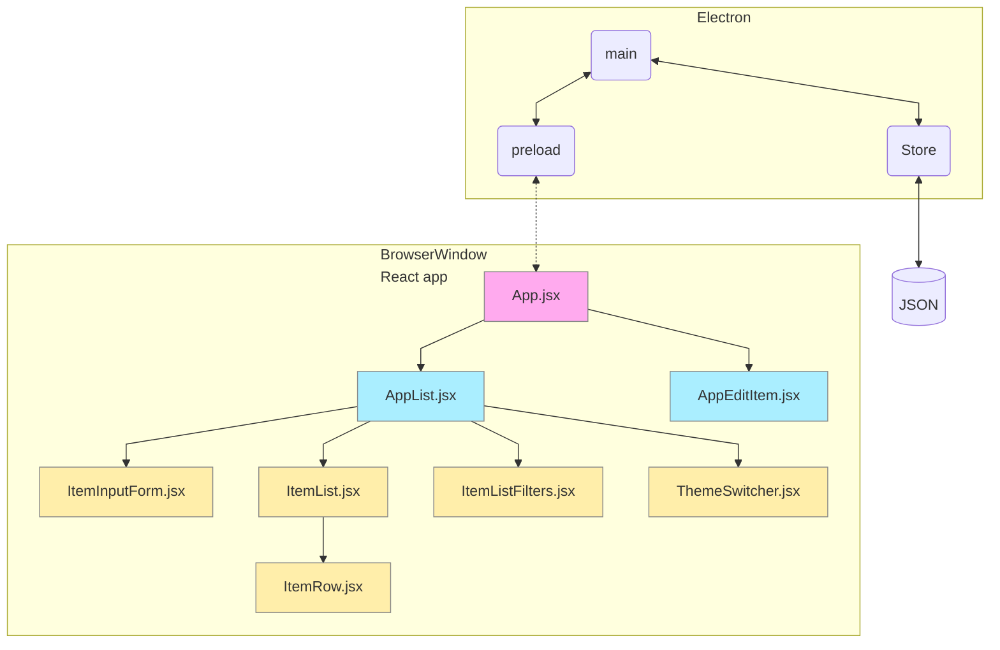
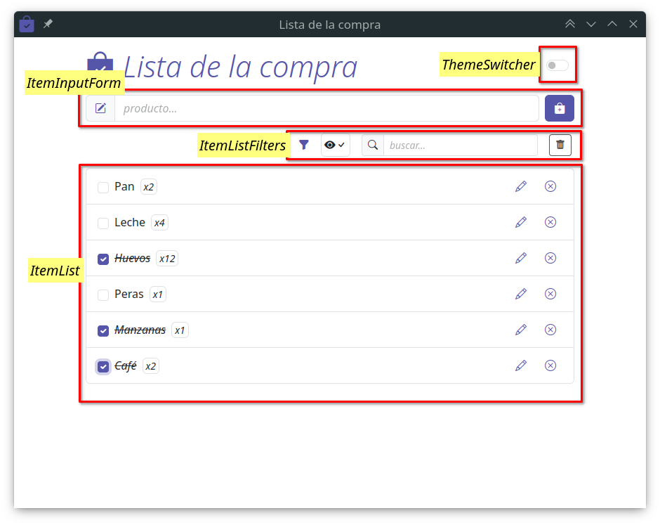

# UD4 - 4.5 Aplicación de ejemplo

## Introducción

Con todo lo que hemos aprendido hasta ahora, vamos a analizar una aplicación de ejemplo que nos permita ver cómo se pueden aplicar los conceptos que hemos visto.

## Aplicación

La aplicación que vamos a ver es una lista de la compra. En ella podemos añadir elementos a la lista, marcarlos como comprados, editarlos y eliminarlos.

La aplicación está desarrollada con _React_ y _Electron_ utilizando el empaquetador _Vite_. Para el almacenamiento de los datos se utiliza la librería `electron-store`, que nos permite guardar los datos en un fichero JSON. Para la gestión de rutas se utiliza `react-router-dom`, lo que facilita la navegación entre componentes sin depender del proceso principal de _Electron_.

## Repositorio

El código fuente de la aplicación se encuentra en el repositorio:

[https://github.com/jsanvil/din23-electron-react-app-grocery-list](https://github.com/jsanvil/din23-electron-react-app-grocery-list)

## Estructura

Diagrama con los principales componentes de la aplicación:



### main/index.js

**Proceso principal** de _Electron_.

Utiliza la librería `electron-store` para almacenar los datos de la aplicación en un fichero `JSON` en el sistema de archivos del usuario.

Contiene los siguientes **eventos**:

- **`store:get-list`**. Lee del fichero JSON y envía los datos al proceso de renderizado.

- **`store:get-item`**. Busca un elemento con un ID determinado y lo envía al proceso de renderizado.

- **`store:add-item`**. Añade un elemento a la lista de la compra y lo almacena en el fichero JSON. Devuelve la lista de la compra actualizada.

- **`store:update-item`**. Edita un elemento de la lista de la compra y lo almacena en el fichero JSON. Devuelve la lista de la compra actualizada.

- **`store:delete-item`**. Elimina un elemento de la lista de la compra y lo almacena en el fichero JSON. Devuelve la lista de la compra actualizada.

- **`store:confirm-item`**. Muestra un diálogo de confirmación al descartar los cambios en un elemento. Con las opciones de guardar, descartar los cambios y cancelar la acción.

### preload/index.js

Encargado de conectar el proceso de renderizado con el proceso principal.

Expone los siguientes métodos en `window.api` que hacen las correspondientes llamadas a `ipcMain` del proceso principal:

- **`getList`**
- **`getItem`**
- **`addItem`**
- **`updateItem`**
- **`deleteItem`**
- **`confirmItem`**

## Componentes React

### App.jsx

Componente de entrada a la aplicación.

Utiliza la librería `react-router-dom` para la navegación entre componentes.

```js
import { HashRouter, Route, Routes } from 'react-router-dom'

import AppList from './AppList'
import AppEditItem from './AppEditItem'

export default function App() {
  return (
    <HashRouter>
      <Routes>
        <Route path="/" element={<AppList />} />
        <Route path="/:itemId" element={<AppEditItem />} />
      </Routes>
    </HashRouter>
  )
}
```

### AppList.jsx

Componente utilizado como **vista principal** para representar la lista de la compra, añadir nuevos elementos y filtrar contenido.

Se definen dos estados:

- **`itemList`** es el estado que contiene la lista de elementos.

    ```js title="itemList"
    const [itemList, setItemList] = useState([])
    ```

- **`filters`** es el estado que contiene los filtros de la lista.

    ```js title="filters"
    const [filters, setFilters] = useState({ name: '', checked: false })
    ```

Al iniciar el componente, se obtiene la lista de elementos del proceso principal y se almacena en el estado `itemList`.

```js title="AppList.jsx - solicitar y recibir la lista de elementos"
  // useEffect se utiliza para sincronizar con un sistema externo
  // En este caso, se utiliza para obtener la lista de desde el proceso principal
  useEffect(() => {
    window.api.getList()
  }, [])

  // Se activa el listener para recibir la lista de elementos
  // cada vez que haya cambios actualizará la lista
  useEffect(() => {
    window.electron.ipcRenderer.on('list-updated', handleUpdateList)
    return () => {
      window.electron.ipcRenderer.removeListener('list-updated', handleUpdateList)
    }
  })

  // Listener para recibir la lista de elementos
  // antes de actualizar el estado, se filtran los elementos
  function handleUpdateList(event, list) {
    const newList = getFilteredList(list)
    setItemList([...newList])
  }

  // Devuelve la lista filtrada con los parámetros del estado filters
  function getFilteredList(list) {
    let filteredList = [...list]
    if (filters.name.length > 0 || filters.checked) {
      filteredList = list.filter((item) => {
        let result = item.name.toUpperCase().includes(filters.name.toUpperCase())
        if (filters.checked) result = result && !item.checked
        return result
      })
    }
    return filteredList
  }
```

Por otro lado se definen los siguientes **manejadores de eventos**:

```js title="AppList.jsx - handlers"
  // Actualiza los filtros y vuelve a pedir la lista
  async function handleFilters(name, checked) {
    const newFilters = {
      name: name,
      checked: checked
    }
    setFilters(newFilters)
    await window.api.getList()
  }

  // Marca un elemento como completado y lo actualiza
  function handleChecked(item) {
    item.checked = !item.checked
    window.api.updateItem(item)
  }

  // Muestra un diálogo de confirmación para borrar un elemento
  async function handleDelete(item) {
    await window.api.deleteItem(item)
  }
```

Vista:

```js title="AppList.jsx - render"
    <div id="app">
      <div id="app-header" className="container d-flex justify-content-between align-items-center">
        <div className="display-5 text-primary">
          <em>
            <i className="bi bi-bag-check-fill"></i> Lista de la compra
          </em>
        </div>

        {/* Componente encargado de cambiar el tema de la aplicación (light/dark) */}
        <ThemeSwitcher />
      </div>

      {/* Componente encargado de añadir nuevos elementos a la lista */}
      <ItemInputForm />

      {/* Componente encargado de mostrar los elementos de la lista */}
      <ItemList
        itemList={itemList}
        filters={filters}
        deleteCallback={handleDelete}
        checkCallback={handleChecked}
      />

      {/* Componente encargado aplicar filtros la lista */}
      <ItemListFilters filterCallback={handleFilters} />
    </div>
```




- `components/ItemInputForm.jsx`

    Formulario simple para añadir nuevos elementos.

    - Importa la clase `Item.class.js` que define las propiedades de un elemento de la lista.
    - Mediante el evento `onSubmit` del formulario se llama a la función `handleAddItem`.
    - La función `handleAddItem` se encarga de crear un nuevo elemento y hacer la llamada al proceso principal para añadirlo a la lista.

```js title="ItemInputForm.jsx" linenums="1" hl_lines="1 3 8 16"
import Item from '../model/Item.class'

function handleAddItem(event) {
    event.preventDefault()
    const name = event.target.itemName.value
    if (!name) return
    const item = new Item(name)
    window.api.addItem(item)
    event.target.reset()
    event.target.itemName.focus()
}

export default function ItemInputForm() {
return (
    <div id="app-item-input" className="container">
    <form action="#" id="itemForm" onSubmit={handleAddItem}>
        <div className="d-flex gap-2 align-items-center">
        <div className="input-group">
            <span className="input-group-text text-primary">
                <i className="bi bi-pencil-square"></i>
            </span>
            <input
                type="text"
                id="itemName"
                name="itemName"
                autoComplete="off"
                className="form-control"
                placeholder="producto..." />
        </div>
        <button id="btnAdd" title="Añadir producto" className="btn btn-primary">
            <i className="bi bi-bag-plus-fill"></i>
        </button>
        </div>
    </form>
    </div>
)
}
```

- `components/ItemListFilters.jsx`

    Permite aplicar filtros a la lista. Filtrar por nombre y mostrar/ocultar completados.

    - Recibe la función `filterCallback` como parámetro que indicará al componente padre que se han aplicado los filtros.
    - La función `handleFilters` se encarga de obtener los valores de los filtros y llamar a la función `filterCallback`.
    - La función `handleClearFilters` se encarga de limpiar los filtros y llamar a la función `handleFilters`.

```js title="ItemListFilters.jsx" linenums="1" hl_lines="2 5 8 25 41 46"
export default function ItemListFilters({ filterCallback }) {
  function handleFilters() {
    const name = document.getElementById('filter-name').value
    const checked = document.getElementById('filter-hide-completed').checked
    filterCallback(name, checked)
  }

  function handleClearFilters() {
    document.getElementById('filter-name').value = ''
    document.getElementById('filter-hide-completed').checked = false
    handleFilters()
  }

  return (
    <div id="app-filters"
      className="container px-3 d-flex flex-row gap-3 align-items-center justify-content-end">
      <span className="text-primary">
        <i className="bi bi-funnel-fill"></i>
      </span>
      <div className="filter-completed border rounded p-1">
        <input type="checkbox"
          className="form-check-input"
          name="checked"
          id="filter-hide-completed"
          onChange={handleFilters} />
        <label htmlFor="filter-hide-completed" className="form-check-label">
          <i className="icon-visible bi-eye-fill"></i>
          <i className="icon-hidden bi-eye-slash"></i>
          <i className="bi bi-check"></i>
        </label>
      </div>
      <div className="filter-search input-group input-group-sm">
        <span className="input-group-text">
          <i className="bi bi-search"></i>
        </span>
        <input type="text"
          id="filter-name"
          name="name"
          className="form-control"
          placeholder="buscar..."
          onChange={handleFilters} />
      </div>
      <button id="filter-clear"
        title="Limpiar filtros"
        className="btn btn-sm btn-outline-secondary"
        onClick={handleClearFilters}>
        <i className="bi bi-trash-fill"></i>
      </button>
    </div>
  )
}
```

- `components/ItemList.jsx`

  Renderiza la lista utilizando iterando sobre los datos recibidos y renderizando un componente `ItemRow` por cada elemento.

  De los parámetros que recibe mediante `props` utiliza `itemList` para representar la lista y el resto los pasa al componente `ItemRow`.
  
!!! note "Pasando eventos a través de varios componentes"
    Esta forma de pasar eventos, no es la más adecuada.
    
    En una aplicación más compleja deberíamos utilizar el componente _`Context`_.
    
    En este caso, se ha optado por esta solución para simplificar el código.

```js title="ItemList.jsx" linenums="1" hl_lines="4-8 13-22"
import ItemRow from './ItemRow'

export default function ItemList({
  itemList,
  filters,
  deleteCallback,
  editCallback,
  checkCallback
}) {
  return (
    <div id="app-list" className="container">
      <ul className="list-group">
        {itemList.map((item) => (
          <ItemRow
            item={item}
            key={item.id}
            filter={filters.name}
            deleteCallback={deleteCallback}
            editCallback={editCallback}
            checkCallback={checkCallback}
          />
        ))}
      </ul>
    </div>
  )
}
```


- `components/ItemRow.jsx`
  
  Renderiza un elemento de la lista. Incluye un _checkbox_ para marcar el elemento como completado, un botón para editarlo y otro para eliminarlo.

  - Recibe el elemento a renderizar, filtros aplicados y los eventos para eliminar, editar y marcar como completado.
  - Utiliza la función `formatFilteredName` para resaltar el texto que coincide con el filtro.
  - Utiliza `useNavigate` para navegar a la vista de edición del elemento.
  - La función `formatFilteredName` se encarga de resaltar el texto que coincide con el filtro.
  - La función `handleChecked` se encarga de modificar la propiedad `checked` del elemento y llamar a la función `checkCallback`.

```js title="ItemRow.jsx" linenums="1" hl_lines="2 14 32 45 52"
import parse from 'html-react-parser'
import { useNavigate } from 'react-router-dom'

// función para resaltar el texto que coincide con el filtro
function formatFilteredName(name, filter) {
  if (!filter) {
    return name
  }
  // se utiliza html-react-parser para convertir el string en un elemento React
  return parse(name.replace(new RegExp(`(${filter})`, 'gi'), '<em>$1</em>'))
}

export default function ItemRow({ item, filter, deleteCallback, checkCallback }) {
  const navigate = useNavigate()

  function handleChecked(event, item) {
    const updatedItem = { ...item }
    updatedItem.checked = !item.checked
    event.target.checked = updatedItem.checked
    checkCallback(item)
  }

  return (
    <li className="list-group-item d-flex justify-content-between align-items-center gap-2">
      {/* checkbox */}
      <input
        id={`item-status-${item.id}`}
        type="checkbox"
        name="completed"
        className="form-check-input"
        defaultChecked={item.checked}
        onClick={() => handleChecked(event, item)}
      />
      {/* nombre */}
      <label htmlFor={`item-status-${item.id}`}>{formatFilteredName(item.name, filter)}</label>
      {/* cantidad */}
      <em className="small border rounded px-1">x{item.quantity}</em>
      {/* espaciador */}
      <div className="flex-grow-1"></div>
      {/* botón editar */}
      <button
        className="btn btn-link edit py-1 px-2"
        title="editar"
        // onClick={() => editCallback(item)}
        onClick={() => navigate(`./${item.id}`)}>
        <i className="bi bi-pencil"></i>
      </button>
      {/* botón eliminar */}
      <button
        className="btn btn-link delete py-1 px-2"
        title="eliminar"
        onClick={() => deleteCallback(item)}>
        <i className="bi bi-x-circle"></i>
      </button>
    </li>
  )
}
```

### AppEditItem.jsx

Componente utilizado como vista para editar un elemento.

Está configurado con la ruta **`/:itemId`** por lo que recibe el ID del elemento a editar en la _url_.

Permite volver a la vista principal mediante un botón. Si se han realizado cambios en el elemento, muestra un diálogo de confirmación.

- Recibe el ID del elemento en la url y se guarda con `useParams`.
- Realiza una petición al proceso principal para obtener el elemento a editar.
- Almacena elemento en el estado `item`.
- Crea un estado con el elemento original para comparar si se han realizado cambios.
- Utiliza `useNavigate` para navegar a la vista principal.
- La función `handleSubmitChanges` se encarga de actualizar el elemento y navegar a la vista principal. Se llama desde el evento `onSubmit` del formulario, que se activa al pulsar el botón _Guardar_ `<button type="submit" ...`.
- La función `handleDelete` se encarga de llamar al proceso principal para mostrar un diálogo de confirmación para borrar el elemento.
- La función `handleDiscard` se encarga de llamar al proceso principal para mostrar un diálogo de confirmación si se han realizado cambios en el elemento. Con las opciones de guardar, descartar los cambios y cancelar la acción.

```js title="AppEditItem.jsx" linenums="1" hl_lines="2 6 10 13 18 24 35 40 69 82 96 104 107 116"
import { useState, useEffect } from 'react'
import { useParams, useNavigate } from 'react-router-dom'

export default function AppEditItem() {
  // item es el estado que contiene el elemento a editar
  const [item, setItem] = useState({})

  // originalItem estado original del elemento
  // usado para comparar si hubo cambios
  const [originalItem, setOriginalItem] = useState({})

  // Obtiene el id del item de la URL
  const { itemId } = useParams()

  const navigate = useNavigate()

  useEffect(() => {
    window.api.getItem(itemId).then((itemFetched) => {
      setItem({ ...itemFetched })
      setOriginalItem({ ...itemFetched })
    })
  }, [])

  function handleSubmitChanges(event) {
    event.preventDefault()
    const name = event.target.itemName.value
    if (!name) return
    const newItem = { ...item, name: name }
    window.api.updateItem(newItem)
    event.target.reset()
    event.target.itemName.focus()
    navigate('/')
  }

  async function handleDelete(item) {
    const confirm = await window.api.deleteItem(item)
    if (confirm) navigate('/')
  }

  async function handleDiscard() {
    const confirm = await window.api.confirmItem(item)
    switch (confirm) {
      case 'discard':
      case 'save':
        navigate('/')
        break
      case 'cancel':
        break
    }
  }

  function setName(name) {
    setItem({ ...item, name: name })
  }

  function setQuantity(quantity) {
    setItem({ ...item, quantity: quantity })
  }

  return (
    <div id="app-item-edit"
      className="container vh-100 d-flex flex-column gap-3 justify-content-center align-items-center">
      <h1 className="text-primary">
        <i className="bi bi-pencil-square"></i> Editar producto
      </h1>
      <form action="#"
        id="itemForm"
        className="container"
        onSubmit={handleSubmitChanges}>
        <div className="d-flex flex-column gap-2 align-items-center">
          <div className="input-group">
            <span className="input-group-text text-primary col-2">
              <i className="bi bi-pencil-square"> Producto:</i>
            </span>
            <input type="text"
              id="itemName"
              name="itemName"
              required
              autoComplete="off"
              className="form-control"
              placeholder="producto..."
              onChange={() => setName(event.target.value)}
              value={item.name ?? ''} />
          </div>
          <div className="input-group">
            <span className="input-group-text text-primary col-2">
              <i className="bi bi-hash"> Cantidad:</i>
            </span>
            <input type="number"
              id="itemQuantity"
              name="itemQuantity"
              autoComplete="off"
              min="1"
              className="form-control"
              placeholder="cantidad..."
              onChange={() => setQuantity(event.target.value)}
              value={item.quantity ?? ''} />
          </div>
          <div className="d-flex gap-2">
            <button type="button"
              id="btnDelete"
              title="Borrar"
              className="btn btn-danger"
              onClick={() => handleDelete(item)}>
              <i className="bi bi-trash"> Borrar</i>
            </button>
            <button type="submit"
                id="btnSave"
                title="Guardar"
                className="btn btn-primary">
              <i className="bi bi-save"> Guardar cambios</i>
            </button>
            <button type="button"
              id="btnDiscard"
              className="btn btn-secondary"
              onClick={() => handleDiscard()}>
              <i className="bi bi-arrow-left"> Volver</i>
            </button>
          </div>
        </div>
      </form>
    </div>
  )
}
```

### ThemeSwitcher.jsx

Componente que permite cambiar el tema de la aplicación (_light/dark_).

Aprovechando que _Bootstrap_ utiliza ofrece la opción para definir el tema de colores, se puede cambiar el tema de la aplicación de forma sencilla modificando el valor del atributo **`data-bs-theme`** en el elemento raíz del documento _html_ (`document.documentElement`).

```js title="ThemeSwitcher.jsx" linenums="1" hl_lines="5 14"
export default function ThemeSwitcher() {
  function handleThemeSwitch(e) {
    const isChecked = e.target.checked
    document.documentElement
        .setAttribute('data-bs-theme', isChecked ? 'dark' : 'light')
  }

  return (
    <div className="form-check form-switch">
      <input
        className="form-check-input"
        type="checkbox"
        role="switch"
        onClick={handleThemeSwitch}
      />
    </div>
  )
}
```

## Bootstrap y Sass

Para dar estilos personalizados a la aplicación se utiliza **_Bootstrap_** y **_Sass_**.

Los estilos personalizados se encuentran en el fichero `src/renderer/src/styles/custom.scss`, donde se han sobrecargado los colores por defecto de _Bootstrap_.

`cumtom.scss` se importa desde el fichero `src/renderer/src/main.jsx`, que es el componente raíz de la aplicación. De esta forma, el resto de componentes lo podrán utilizar sin tenerlo que importar de nuevo.

```js title="src/renderer/src/main.jsx"
import './styles/custom.scss'
```


