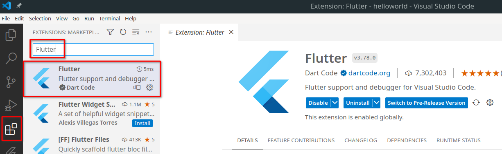
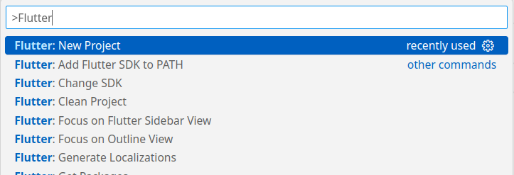
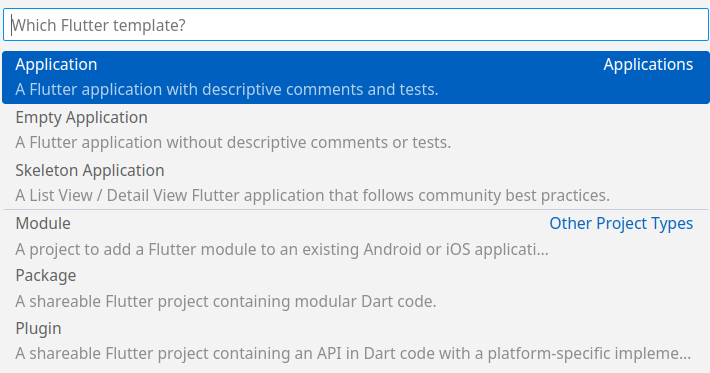
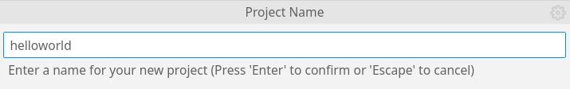
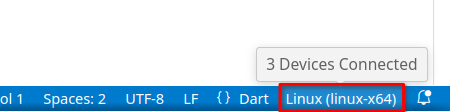
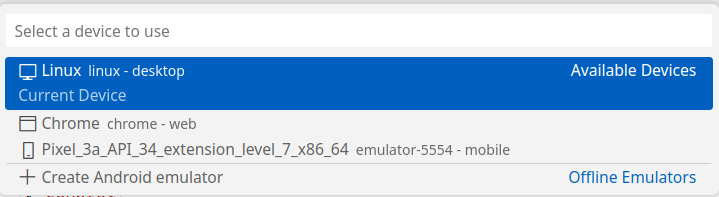
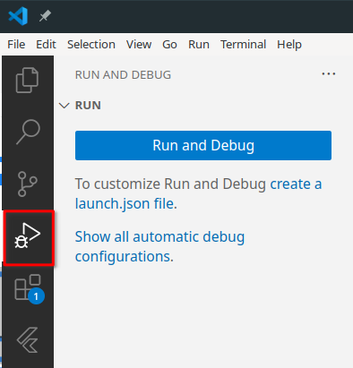
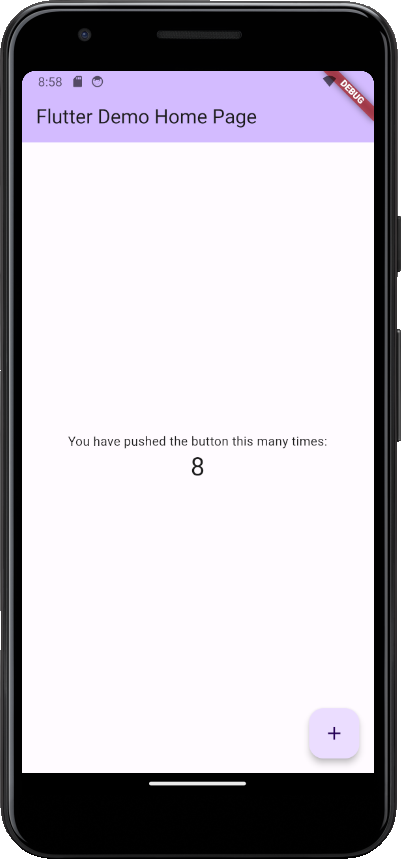
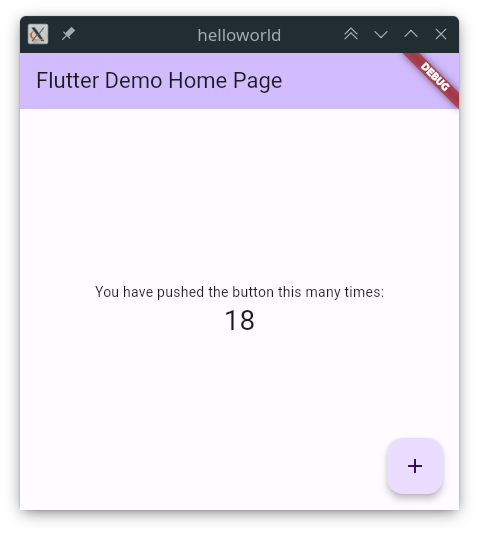
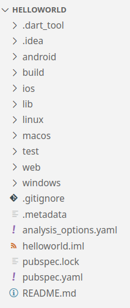

# UD5 - 5.2 Introducción a Flutter

## Introducción

Flutter es un framework de código abierto desarrollado por _Google_ para crear aplicaciones nativas multiplataforma. Permite crear aplicaciones para móviles, web y escritorio desde un único código fuente. Utiliza el lenguaje de programación _Dart_, también desarrollado por _Google_.

_Flutter_ ha ganado popularidad en los últimos años, por su facilidad de uso, aprendizaje y rendimiento. Cada vez más empresas lo utilizan para desarrollar sus aplicaciones, aunque puede que en un futuro próximo _Kotlin Multiplatform_, todavía en fase beta, le haga sombra.

## Dart

Dart es un lenguaje de programación **orientado a objetos**, con **tipado estático** y con una **sintaxis** similar a la de _Java_ o _C#_. Es un lenguaje **compilado**, pero también puede ser interpretado en tiempo de ejecución. Es un lenguaje de programación multiparadigma, ya que soporta programación orientada a objetos, programación imperativa y programación funcional.

Como es similar a _Java_, iremos aprendiendo la sintaxis y características de _Dart_ a medida avancemos en el desarrollo de aplicaciones con _Flutter_.

Existe una herramienta en línea para probar _Dart_ y _Flutter_ sin necesidad de instalar nada: [Dart Pad](https://dartpad.dev/)

Página oficial de _Dart_ con un resumen de la sintaxis básica: [https://dart.dev/language](https://dart.dev/language)

## Instalación del entorno de desarrollo

Seguiremos la guía de instalación oficial de _Flutter_ preparar el entorno de desarrollo: [https://docs.flutter.dev/get-started/install](https://docs.flutter.dev/get-started/install)

1. _System requirements_: Es importante leer los requisitos del sistema para poder instalar _Flutter_.
2. _Get the Flutter SDK_: Descargar e instalar el SDK de _Flutter_ para nuestro sistema operativo.
3. _Update your path_: Añadir la ruta de instalación de _Flutter_ al _PATH_ del sistema.
4. _flutter doctor_: Ejecutar el comando `flutter doctor` para comprobar que tenemos todo lo necesario para desarrollar aplicaciones con _Flutter_.
5. _Android setup_: **Opcionalmente**, podemos instalar el _Android SDK_ y configurar un emulador de _Android_ para poder probar nuestras aplicaciones.

## Configuración del entorno de desarrollo _VS Code_

Para desarrollar aplicaciones con _Flutter_, podemos utilizar cualquier editor de texto o IDE. En este caso, utilizaremos _Visual Studio Code_. Si todavía no lo tenemos instalado, podemos descargarlo desde la página oficial: [https://code.visualstudio.com/](https://code.visualstudio.com/)

Una vez abierto _VS Code_, instalaremos la extensión [_Flutter extension_](https://marketplace.visualstudio.com/items?itemName=Dart-Code.flutter). Esta extensión facilitará el desarrollo así como la ejecución y depuración de aplicaciones.

{ width="500" }

## Crear un proyecto desde _VS Code_

Desde _VS Code_ podemos crear un proyecto de _Flutter_ desde la paleta de comandos (_**`Ctrl`**+**`Shift`**+**`P`**_). Buscamos el comando _**Flutter: New Project**_ y seguimos los pasos para crear el proyecto.

{ width="500" }

Seleccionamos la **plantilla base** que queremos utilizar. En este caso, se ha elegido _**Application**_.

{ width="500" }

Aparecerá una ventana emergente para **seleccionar el directorio** donde se creará el proyecto. **Creará un nuevo directorio** con el nombre del proyecto.

Por último, nos solicitará el **nombre del proyecto**. Este nombre se utilizará para crear el paquete de la aplicación, por lo que debe ser único. En este caso, se ha elegido `helloworld`.

{ width="500" }

Una vez creado el proyecto, para ejecutarlo, primero debemos seleccionar el dispositivo de destino. Esto lo podemos hacer desde la barra inferior de _VS Code_.



Y seleccionamos el dispositivo de destino.

{ width="500" }

> Tiene una opción para crear un dispositivo emulador de _Android_ de forma sencilla.

Para lanzar la aplicación, iremos a _**Run and Debug**_, al pulsar el botón, compilará la aplicación y la lanzará en el dispositivo seleccionado.

{ width="300" }

{ width="200" }

## Crear un proyecto desde la línea de comandos

Alternativamente, podemos crear un proyecto de _Flutter_ desde la línea de comandos, podemos ejecutar `flutter create <nombre_proyecto>`.

Ejemplo de creación de un proyecto base desde la líena de comandos de _Linux_:

```bash hl_lines="1 19-20 26"
$ flutter create helloworld
Creating project helloworld...
Resolving dependencies in helloworld... 
Got dependencies in helloworld.
Wrote 129 files.

All done!
You can find general documentation for Flutter at: https://docs.flutter.dev/
Detailed API documentation is available at: https://api.flutter.dev/
If you prefer video documentation, consider: https://www.youtube.com/c/flutterdev

In order to run your application, type:

  $ cd helloworld
  $ flutter run

Your application code is in helloworld/lib/main.dart.
```

Una vez creado el proyecto, nos indica que debemos entrar en el directorio que se ha creado y ejecutar el comando `flutter run` para ejecutar la aplicación.

Nos solicita que elijamos un dispositivo de destino. En este caso, se elige _Linux_, pero también se puede elegir _Chrome_ para ejecutar la aplicación en el navegador.

```
$ cd helloworld/
$ flutter run
Connected devices:
Linux (desktop) • linux  • linux-x64      • Ubuntu 22.04.3 LTS 5.15.0-52-generic
Chrome (web)    • chrome • web-javascript • Google Chrome 119.0.6045.123
[1]: Linux (linux)
[2]: Chrome (chrome)
Please choose one (or "q" to quit): 1
Launching lib/main.dart on Linux in debug mode...
Building Linux application...                                           

Syncing files to device Linux...                                    79ms

Flutter run key commands.
r Hot reload. 🔥🔥🔥
R Hot restart.
h List all available interactive commands.
d Detach (terminate "flutter run" but leave application running).
c Clear the screen
q Quit (terminate the application on the device).

A Dart VM Service on Linux is available at: http://127.0.0.1:35111/9Neb9ZazZeE=/
The Flutter DevTools debugger and profiler on Linux is available at: http://127.0.0.1:9100?uri=http://127.0.0.1:35111/9Neb9ZazZeE=/
```

Si todo ha ido bien, se abrirá una ventana con la aplicación en ejecución.

{ width="300" }

## Estructura de un proyecto

En el ejemplo anterior, se ha creado un proyecto con la estructura por defecto. Veamos qué directorios y archivos se han creado:

{ width="200" }

Lo primero que puede llamarlos la atención son los directorios con nombre de distintas plataformas: `android`, `ios`, `linux`, `macos`, `web` y `windows`. Estos directorios contienen el código necesario para compilar la aplicación para cada una de las plataformas.

Cada paquete necesita algunos metadatos para poder especificar sus dependencias. Todos estos metadatos van en el pubspec del paquete: un archivo llamado **`pubspec.yaml`** que está escrito en el lenguaje YAML.

El archivo **`pubspec.yaml`** contiene la configuración del proyecto, así como las dependencias que utiliza. Es similar al archivo `package.json` de _Node.js_.

- **`dependencies`**: Dependencias del proyecto. Especifica los paquetes en los que se basa la aplicación. Los paquetes de _Flutter_ se pueden encontrar en [pub.dev](https://pub.dev/).
- **`dev_dependencies`**: Dependencias de desarrollo del proyecto. Se definen los paquetes utilizados exclusivamente en entorno de desarrollo, como por ejemplo _linters_ o _test_.
- **`flutter`**: Configuración específica de _Flutter_. Más información en [https://docs.flutter.dev/tools/pubspec](https://docs.flutter.dev/tools/pubspec).

## Widgets

En _Flutter_, "todo" es un _widget_. Los _widgets_ son los bloques de construcción básicos de la interfaz de usuario, podemos compararlo a los componentes que creamos en la unidad anterior. Cada _widget_ es una clase que hereda de la clase `Widget`.

Referencia a los _widgets_ básicos en _Flutter_: [https://docs.flutter.dev/ui/widgets/basics](https://docs.flutter.dev/ui/widgets/basics)

## Primera aplicación siguiendo el tutorial oficial

La mejor forma de aprender los conceptos básicos de _Flutter_ es siguiendo el tutorial oficial.[https://codelabs.developers.google.com/codelabs/flutter-codelab-first](https://codelabs.developers.google.com/codelabs/flutter-codelab-first)

Está disponible en varios lenguajes, entre ellos el español, está organizado en pasos fáciles de seguir e incluye vídeos explicativos.
