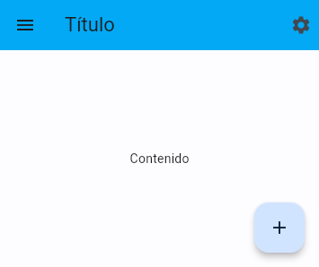
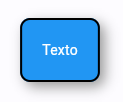
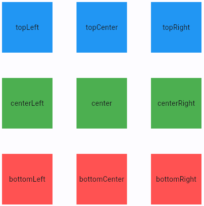
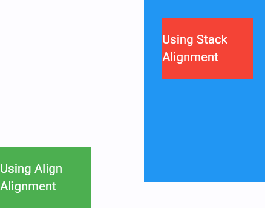
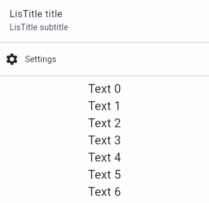
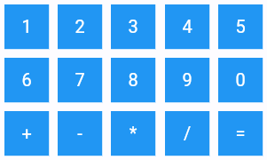
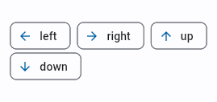

# UD5 - 5.3 Flutter: Widgets y Layout

## Introducción

En flutter existen multitud de widgets que nos permiten crear interfaces de usuario de forma sencilla. Los widgets son objetos que representan una parte de la interfaz de usuario, y que se pueden anidar entre ellos para crear interfaces más complejas.

Veremos los widgets más importantes y cómo se pueden organizar en el layout de la aplicación.

## Tipos de widgets

A la hora de crear maquetar una interfaz de usuario, podemos distinguir tres tipos de widgets:

- **Widgets sin hijos**: Se utilizan para mostrar información en pantalla. _Por ejemplo, un widget que muestra una imagen, un texto, un icono, etc_.
- **Widgets con un hijo**: Se utilizan para organizar el layout de la aplicación. _Por ejemplo, un widget que alinea su hijo a la izquierda, otro que lo centra, etc_.
- **Widgets con varios hijos**: Se utilizan para organizar el layout de la aplicación. _Por ejemplo, un widget que muestra sus hijos en una columna, otro que los muestra en una fila, etc_.

Algunos ejemplos de cada tipo de widget:

- Sin hijos
    - Image
    - Text
    - RichText
    - Icon
- Un hijo
    - Container
    - Padding
    - RaisedButton
    - Align
    - Center
    - Positioned
    - Card
- Varios hijos
    - Column
    - Row
    - Stack
    - Wrap
    - ListView
    - GridView

## Scaffold

El widget `Scaffold` es un tipo de contenedor especial que nos permite crear una pantalla con una estructura típica de una aplicación móvil.

Entre otros, tiene un atributo `appBar` que es donde se coloca la barra de navegación, un atributo `body` que es donde se coloca el contenido de la pantalla, otro atributo `floatingActionButton` que es donde se coloca el botón flotante, `drawer` para colocar el menú lateral, etc.

_Ejemplo:_

```dart hl_lines="2 5 8 12" linenums="1"
Scaffold(
  appBar: AppBar(
    title: Text('Título'),
  ),
  body: Center(
    child: Text('Contenido'),
  ),
  floatingActionButton: FloatingActionButton(
    child: Icon(Icons.add),
    onPressed: () {},
  ),
  drawer: Drawer(
    child: ListView(
      children: <Widget>[
        ListTile(
          title: Text('Opción 1'),
        ),
        ListTile(
          title: Text('Opción 2'),
        ),
      ],
    ),
  ),
);
```



Como puede observarse, el widget `Scaffold` tiene varios atributos que permiten colocar los widgets en diferentes zonas predefinidas de la pantalla.

Se han incluido otros widgets en para dar contenido a la pantalla, pero no son necesarios para que el `Scaffold` funcione.

## Widgets sin hijos

### Text

El widget `Text` se utiliza para mostrar texto en pantalla.

En la mayoría de los casos, bastará con indicar un solo parámetro con el texto a mostrar `Text('Texto de ejemplo')`.

Pero si queremos personalizar el texto, podemos utilizar el atributo `style` para indicar un objeto `TextStyle` con los atributos que queremos personalizar.

_Ejemplo:_

```dart hl_lines="1 3" linenums="1"
Text(
  'Texto de ejemplo',
  style: TextStyle(
    fontSize: 30,
    color: Colors.green,
    fontFamily: 'Times New Roman',
    fontWeight: FontWeight.bold,
    fontStyle: FontStyle.italic,
    decoration: TextDecoration.underline,
    decorationColor: Colors.red,
    decorationStyle: TextDecorationStyle.dashed,
  ),
  textAlign: TextAlign.center,
  textDirection: TextDirection.rtl,
  overflow: TextOverflow.ellipsis,
  maxLines: 1,
  semanticsLabel: 'Texto de ejemplo',
);
```


### Icon

El widget `Icon` se utiliza para mostrar un icono en pantalla.

Para indicar el icono que queremos mostrar, utilizamos el atributo `icon` y le pasamos un objeto `IconData` con el icono que queremos mostrar.

_Ejemplo:_

```dart hl_lines="4-8" linenums="1"
Row(
    mainAxisAlignment: MainAxisAlignment.spaceEvenly,
    children: [
        Icon(
            Icons.home,
            size: 50,
            color: Colors.blue,
        ),
        Icon(
            Icons.add,
            size: 50,
            color: Colors.green,
        ),
        Icon(
            Icons.remove,
            size: 50,
            color: Colors.red,
        ),
    ],
)
```


Se pueden consultar todos los iconos disponibles en la [_Google Fonts: Material Icons_](https://fonts.google.com/icons).

## Widgets con un hijo

### Container

`Container` se utiliza para crear un contenedor que puede tener un hijo y que permite personalizar su estilo, como el color de fondo, el borde, el padding, el margen, etc.

Es el equivalente a un `<div>` en HTML.

_Ejemplo:_

```dart hl_lines="2-4 19" linenums="1"
Container(
  padding: EdgeInsets.all(20),
  margin: EdgeInsets.all(20),
  decoration: BoxDecoration(
    color: Colors.blue,
    borderRadius: BorderRadius.circular(10),
    border: Border.all(
      color: Colors.black,
      width: 2,
    ),
    boxShadow: [
      BoxShadow(
        color: Colors.grey,
        blurRadius: 10,
        offset: Offset(5, 5),
      ),
    ],
  ),
  child: Text('Texto', style: TextStyle(color: Colors.white)),
)
```



Se pueden consultar todos los atributos disponibles en la documentación de [_Container_](https://api.flutter.dev/flutter/widgets/Container-class.html).


### Padding

`Padding` se utiliza para añadir un padding a su hijo.

_Ejemplo:_

```dart linenums="1"
Padding(
  padding: EdgeInsets.all(20),
  child: Text('Texto'),
)
```

Es equivalente a:

```dart linenums="1"
Container(
  padding: EdgeInsets.all(20),
  child: Text('Texto'),
)
```

¿Por qué utilizar `Padding` en lugar de `Container`? Si nuestro único propósito es dar espacio al widget, `Padding` es más eficiente, ya que no crea un contenedor, sino que simplemente añade un padding a su hijo.

### Align

`Align` se utiliza para alinear su hijo dentro de su espacio disponible.

Se pueden alinear los widgets en las siguientes posiciones:

- `Alignment.topLeft`
- `Alignment.topCenter`
- `Alignment.topRight`
- `Alignment.centerLeft`
- `Alignment.center`
- `Alignment.centerRight`
- `Alignment.bottomLeft`
- `Alignment.bottomCenter`
- `Alignment.bottomRight`

_Ejemplo:_

```dart hl_lines="2-4 19" linenums="1"
Stack(
  children: [
    Align(
      alignment: Alignment.topLeft,
      child: Container(
        width: 100,
        height: 100,
        color: Colors.blue,
        child: Center(child: Text('topLeft')),
      ),
    ),
    Align(
      alignment: Alignment.topCenter,
      child: Container(
        width: 100,
        height: 100,
        color: Colors.blue,
        child: Center(child: Text('topCenter')),
      ),
    ),
    Align(
      alignment: Alignment.topRight,
      child: Container(
        width: 100,
        height: 100,
        color: Colors.blue,
        child: Center(child: Text('topRight')),
      ),
    ),
    Align(
      alignment: Alignment.centerLeft,
      child: Container(
        width: 100,
        height: 100,
        color: Colors.green,
        child: Center(child: Text('centerLeft')),
      ),
    ),
    Align(
      alignment: Alignment.center,
      child: Container(
        width: 100,
        height: 100,
        color: Colors.green,
        child: Center(child: Text('topLeft')),
      ),
    ),
    Align(
      alignment: Alignment.centerRight,
      child: Container(
        width: 100,
        height: 100,
        color: Colors.green,
        child: Center(child: Text('topLeft')),
      ),
    ),
    Align(
      alignment: Alignment.bottomLeft,
      child: Container(
        width: 100,
        height: 100,
        color: Colors.redAccent,
        child: Center(child: Text('bottomLeft')),
      ),
    ),
    Align(
      alignment: Alignment.bottomCenter,
      child: Container(
        width: 100,
        height: 100,
        color: Colors.redAccent,
        child: Center(child: Text('bottomCenter')),
      ),
    ),
    Align(
      alignment: Alignment.bottomRight,
      child: Container(
        width: 100,
        height: 100,
        color: Colors.redAccent,
        child: Center(child: Text('bottomRight')),
      ),
    ),
  ],
),
```



### Center

Su único hijo se coloca en el centro del espacio disponible. Es equivalente a `Align(alignment: Alignment.center, child: ...)` pero más eficiente.

_Ejemplo:_

```dart linenums="1"
Stack(
  children: [
    Center(
      child: Container(
        width: 100,
        height: 100,
        color: Colors.blue,
        child: Center(child: Text('center')),
      ),
    ),
  ],
),
```

### Card

`Card` se utiliza para crear una tarjeta con un borde redondeado y una sombra. Es equivalente a `Container` con un `BoxDecoration` con un `borderRadius` y un `boxShadow`.

_Ejemplo:_

```dart linenums="1"
Card(
  child: Container(
    width: 100,
    height: 100,
    color: Colors.blue,
    child: Center(child: Text('center')),
  ),
),
```

## Widgets con varios hijos

### Column

`Column` se utiliza para colocar sus hijos en una columna vertical. Se puede personalizar el espacio entre los hijos con el atributo `mainAxisAlignment`. 

- `MainAxisAlignment.start`
- `MainAxisAlignment.end`
- `MainAxisAlignment.center`
- `MainAxisAlignment.spaceBetween`
- `MainAxisAlignment.spaceAround`
- `MainAxisAlignment.spaceEvenly`

Otro atributo interesante es `crossAxisAlignment`, que se utiliza para alinear los hijos en el eje transversal.

- `CrossAxisAlignment.start`
- `CrossAxisAlignment.end`
- `CrossAxisAlignment.center`
- `CrossAxisAlignment.stretch`
- `CrossAxisAlignment.baseline`

_Ejemplo:_

```dart linenums="1"
Column(
  mainAxisAlignment: MainAxisAlignment.spaceEvenly,
  children: [
    Container(
      width: 100,
      height: 100,
      color: Colors.blue,
      child: Center(child: Text('1')),
    ),
    Container(
      width: 100,
      height: 100,
      color: Colors.green,
      child: Center(child: Text('2')),
    ),
    Container(
      width: 100,
      height: 100,
      color: Colors.redAccent,
      child: Center(child: Text('3')),
    ),
  ],
),
```

### Row

Funciona igual que `Column`, pero en lugar de colocar los hijos en una columna vertical, los coloca en una **fila horizontal**.

### Stack

`Stack` se utiliza para colocar sus hijos en una pila. Se puede personalizar la posición de los hijos con el atributo `alignment`.

Es importante tener en cuenta que los hijos se colocan uno encima de otro, por lo que si no se indica la posición, todos los hijos se colocarán en la misma posición y sólo se verá el último hijo.

Puede utilizarse el widget `Positioned` para indicar la posición absoluta de cada hijo.

_Ejemplo:_

```dart linenums="1"
Stack(
  alignment: Alignment.topRight,
  children: <Widget>[
    Container(
      height: 300,
      width: 200,
      color: Colors.blue,
    ),
    Positioned(
      top: 30,
      right: 20,
      child: Container(
        height: 100,
        width: 150,
        color: Colors.red,
        child: Center(
          child: Text(
            'Stack Alignment',
            style: TextStyle(color: Colors.white, fontSize: 20),
          ),
        ),
      ),
    ),
    Align(
      alignment: Alignment.bottomLeft,
      child: Container(
        height: 100,
        width: 150,
        color: Colors.green,
        child: Align(
          alignment: Alignment.center,
          child: Text(
            'Align Alignment',
            style: TextStyle(color: Colors.white, fontSize: 20),
          ),
        ),
      ),
    ),
  ],
),
```



### List View

`ListView` se utiliza para colocar sus hijos en una lista vertical con scroll. Se puede personalizar el espacio entre los hijos con el atributo `mainAxisAlignment`.

_Ejemplo:_

```dart linenums="1"
ListView(
  children: [
    ListTile(
      title: Text("LisTitle title"),
      subtitle: Text("LisTitle subtitle"),
    ),
    Divider(),
    Padding(
      padding: const EdgeInsets.all(8.0),
      child: Row(
        children: [
          Icon(Icons.settings),
          SizedBox(width: 10),
          Text("Settings"),
        ],
      ),
    ),
    Divider(),
    for (var i = 0; i < 10; i++)
      Align(
        alignment: Alignment.center,
        child: Text(
          "Text $i",
          style: TextStyle(
            fontSize: 20,
          ),
        ),
      ),
  ],
),
```



### Grid View

`GridView` se utiliza para colocar sus hijos en una cuadrícula. Se puede personalizar el espacio entre los hijos con el atributo `mainAxisAlignment` y `crossAxisAlignment`.

_Ejemplo:_

```dart linenums="1"
GridView.count(
  crossAxisCount: 3,
  children: [
    for (var i = 1; i <= 9; i++)
      Container(
        margin: EdgeInsets.all(5),
        color: Colors.blue,
        child: Center(
          child: Text(
            "$i",
            style: TextStyle(
              fontSize: 20,
              color: Colors.white,
            ),
          ),
        ),
      ),
    Container(
      margin: EdgeInsets.all(5),
      color: Colors.blue,
      child: Center(
        child: Text(
          "0",
          style: TextStyle(
            fontSize: 20,
            color: Colors.white,
          ),
        ),
      ),
    ),
    Container(
      margin: EdgeInsets.all(5),
      color: Colors.blue,
      child: Center(
        child: Text(
          "+",
          style: TextStyle(
            fontSize: 20,
            color: Colors.white,
          ),
        ),
      ),
    ),
    Container(
      margin: EdgeInsets.all(5),
      color: Colors.blue,
      child: Center(
        child: Text(
          "-",
          style: TextStyle(
            fontSize: 20,
            color: Colors.white,
          ),
        ),
      ),
    ),
    Container(
      margin: EdgeInsets.all(5),
      color: Colors.blue,
      child: Center(
        child: Text(
          "*",
          style: TextStyle(
            fontSize: 20,
            color: Colors.white,
          ),
        ),
      ),
    ),
    Container(
      margin: EdgeInsets.all(5),
      color: Colors.blue,
      child: Center(
        child: Text(
          "/",
          style: TextStyle(
            fontSize: 20,
            color: Colors.white,
          ),
        ),
      ),
    ),
    Container(
      margin: EdgeInsets.all(5),
      color: Colors.blue,
      child: Center(
        child: Text(
          "=",
          style: TextStyle(
            fontSize: 20,
            color: Colors.white,
          ),
        ),
      ),
    ),
  ],
),
```



### Wrap

`Wrap` se utiliza para colocar sus hijos en una fila horizontal, pero si no caben en la misma línea, los coloca en la siguiente línea.

_Ejemplo:_

```dart linenums="1"
Wrap(
  direction: Axis.horizontal,
  spacing: 8.0, // espacio horizontal
  runSpacing: 4.0, // espacio vertical
  children: [
    Chip(
      avatar: Icon(Icons.arrow_back),
      label: const Text('left'),
    ),
    Chip(
      avatar: Icon(Icons.arrow_forward),
      label: const Text('right'),
    ),
    Chip(
      avatar: Icon(Icons.arrow_upward),
      label: const Text('up'),
    ),
    Chip(
      avatar: Icon(Icons.arrow_downward),
      label: const Text('down'),
    ),
  ],
),
```




## Consultar la documentación

Como se puede observar, existen multitud de widgets que nos permiten crear interfaces de usuario de forma sencilla.

Para consultar la documentación de cada widget, se puede el catálogo de widgets de la documentación de [_Flutter_](https://docs.flutter.dev/ui/widgets).
