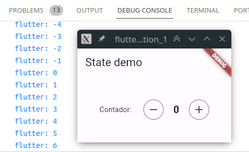
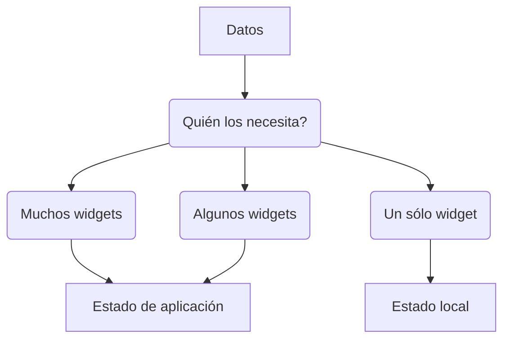

# UD5 - 5.4 Flutter: Gestión de estados

## Introducción

El estado de una aplicación es todo lo que existe en la memoria cuando la aplicación se está ejecutando. Esto incluye los _assets_ de la aplicación, todas las variables de la interfaz de usuario, el estado de la animación, las texturas, las fuentes, etc. Si bien esta definición de estado más amplia posible es válida, no es muy útil para diseñar una aplicación.

Una definición más útil de estado es "**cualquier dato que necesite para reconstruir su interfaz de usuario en cualquier momento**". El estado que administramos se puede separar en dos tipos conceptuales: estado **local** y estado de **aplicación**.

## Estado local

El estado local (a veces llamado estado de UI o estado efímero) es el estado que puede contener un widget. Lo veremos con un ejemplo de un _widget_ con un contador que se puede incrementar y decrementar.

Primero haremos una implementación sin estado (Stateless), es decir, sin guardar el estado del contador. En este caso, cada vez que se modifique el contador, no se reflejará en el widget, aunque sí se guarda el valor del contador.

```dart linenums="1"
import 'package:flutter/material.dart';

void main() async {
  runApp(MainApp());
}

class MainApp extends StatelessWidget {
  @override
  Widget build(BuildContext context) {
    return MaterialApp(home: MainWidget());
  }
}

class MainWidget extends StatelessWidget {
  @override
  Widget build(BuildContext context) {
    return Scaffold(
      appBar: AppBar(title: Text('State demo')),
      body: Center(
        child: Column(
          mainAxisAlignment: MainAxisAlignment.center,
          children: [
            StatelessCounterWidget(),
          ],
        ),
      ),
    );
  }
}

/// EJEMPLO DE WIDGET SIN ESTADO
class StatelessCounterWidget extends StatelessWidget {
  int _counter = 0;

  // métodos para incrementar y decrementar el contador
  void _incrementCounter() {
    _counter++;
    print('$_counter');
  }

  void _decrementCounter() {
    _counter--;
    print('$_counter');
  }

  @override
  Widget build(BuildContext context) {
    return Center(
      child: Row(
        mainAxisAlignment: MainAxisAlignment.center,
        children: <Widget>[
          Text('Contador: '),
          SizedBox(width: 20),
          IconButton.outlined(
            // al pulsar el botón se ejecuta el método correspondiente
            onPressed: _decrementCounter,
            icon: Icon(Icons.remove),
          ),
          SizedBox(width: 10),
          Container(
            width: 30,
            alignment: Alignment.center,
            child: Text('$_counter',
                style: TextStyle(
                  fontSize: 20,
                  fontWeight: FontWeight.bold,
                )),
          ),
          SizedBox(width: 10),
          IconButton.outlined(
            onPressed: _incrementCounter,
            icon: Icon(Icons.add),
          ),
        ],
      ),
    );
  }
}
```
Si lo ejecutamos, veremos que el contador no se actualiza, aunque sí se muestra el valor del contador en la consola.



Ahora haremos una implementación con estado (Stateful), es decir, guardando el estado del contador. En este caso, cada vez que se modifique el contador, se volverá a construir el widget y se verá reflejado en el widget.

```dart linenums="1"
import 'package:flutter/material.dart';

void main() async {
  runApp(MainApp());
}

class MainApp extends StatelessWidget {
  @override
  Widget build(BuildContext context) {
    return MaterialApp(home: MainWidget());
  }
}

class MainWidget extends StatelessWidget {
  @override
  Widget build(BuildContext context) {
    return Scaffold(
      appBar: AppBar(title: Text('State demo')),
      body: Center(
        child: Column(
          mainAxisAlignment: MainAxisAlignment.center,
          children: [
            CounterWidget(
              label: 'Contador 1',
              min: 0,
              max: 10,
              step: 1,
              initialValue: 5,
            ),
            SizedBox(height: 20),
            CounterWidget(
              label: 'Contador 2',
              min: -10,
              max: 5,
              step: 2,
              initialValue: 0,
            ),
          ],
        ),
      ),
    );
  }
}

/// Widget que muestra un contador con botones para incrementar y decrementar
/// el valor del contador.
///
/// Las propiedades label, min, max, step e initialValue son opcionales.
///
/// - label: texto que se muestra a la izquierda del contador
/// - min: valor mínimo del contador
/// - max: valor máximo del contador
/// - step: incremento/decremento del contador
/// - initialValue: valor inicial del contador
///
/// Si no se especifica un valor para min, max, step o initialValue se usará
/// el valor por defecto.
///
/// Si no se especifica un valor para label no se mostrará ningún texto.
class CounterWidget extends StatefulWidget {
  // propiedades opcionales
  final String? label;
  final int? min;
  final int? max;
  final int? step;
  final int? initialValue;

  CounterWidget(
      {Key? key, this.label, this.min, this.max, this.step, this.initialValue})
      : super(key: key);

  @override
  State<StatefulWidget> createState() => _CounterWidgetState();
}

class _CounterWidgetState extends State<CounterWidget> {
  // el estado se guardará en la variable _counter
  int _counter = 0;

  // inicializa el estado con el valor inicial
  @override
  initState() {
    super.initState();
    setState(() {
      _counter = initialValue;
    });
  }

  // getters para acceder a las propiedades del widget
  String? get label => widget.label ?? '';
  int? get min => widget.min;
  int? get max => widget.max;
  int get step => widget.step ?? 1;
  int get initialValue => widget.initialValue ?? 0;

  // métodos para incrementar y decrementar el contador
  void _incrementCounter() {
    setState(() {
      _counter += step;
      if (max != null && _counter > max!) _counter = max!;
    });
  }

  void _decrementCounter() {
    setState(() {
      _counter -= step;
      if (min != null && _counter < min!) _counter = min!;
    });
  }

  @override
  Widget build(BuildContext context) {
    return Center(
      child: Row(
        mainAxisAlignment: MainAxisAlignment.center,
        children: <Widget>[
          if (label!.isNotEmpty)
            Text(
              label!,
              style: TextStyle(fontSize: 18),
            ),
          SizedBox(width: 20),
          IconButton.outlined(
            // al pulsar el botón se ejecuta el método correspondiente
            onPressed: _decrementCounter,
            icon: Icon(Icons.remove),
          ),
          SizedBox(width: 10),
          Container(
            width: 30,
            alignment: Alignment.center,
            child: Text('$_counter',
                style: TextStyle(
                  fontSize: 20,
                  fontWeight: FontWeight.bold,
                  // cambiamos el color del texto en función del valor del contador
                  color: (_counter < 0) ? Colors.red : Colors.green,
                )),
          ),
          SizedBox(width: 10),
          IconButton.outlined(
            onPressed: _incrementCounter,
            icon: Icon(Icons.add),
          ),
        ],
      ),
    );
  }
}
```

## Estado de aplicación

El estado que podemos compartir en diferentes partes de su aplicación y que se conserva entre sesiones de usuario es lo que llamamos estado de la aplicación (a veces también llamado estado compartido). Ejemplos de estado de la aplicación:

- Preferencias del usuario
- Información de inicio de sesión
- Notificaciones en una aplicación
- El carrito de compras en una aplicación de comercio electrónico 
- etc.

Administrar el estado de la aplicación existen multiples opciones. Depende de la complejidad y requisitos de la aplicación, la experiencia previa de su equipo y muchos otros aspectos.

Se puede usar `State` y `setState()` para administrar todo el estado de tu aplicación. De hecho, en muchos ejemplos sencillos de Flutter hace esto (incluida la aplicación inicial cada creación de Flutter).

Por otro lado, en el contexto de su aplicación en particular, la pestaña seleccionada en una barra de navegación inferior se decide que no sea un estado local. Para cambiarlo desde fuera de la clase, conservarlo entre sesiones, etc. En ese caso, la variable `_index` se incluiría en el estado de la aplicación.

No existe una regla universal clara para distinguir si una variable particular es local o es un estado de aplicación. A veces, se tendrá que refactorizar uno en otro. Por ejemplo, comenzará con un estado claramente local, pero a medida que la aplicación crezca en funciones, es posible que deba trasladar al estado de aplicación.

Por esa razón, podríamos tener en cuenta el siguiente diagrama:



### Aplicación de gestión de estado sencilla

Se utiliza el patrón de diseño _provider_ para gestionar el estado de la aplicación. El patrón _provider_ es un patrón de diseño de software utilizado principalmente para el estado de gestión de aplicaciones. En lugar de pasar el estado a través de los widgets, se puede acceder al estado directamente desde cualquier widget.

El _**ChangeNotifier**_ es una clase que permite que se puedan notificar cambios a otros _widgets_. De la misma manera que `setState` hace que un _widget_ con estado se reconstruya, `ChangeNotifier` tiene un método llamado `notifyListeners` que permite que el cambio afecte a otros widgets que estén observando.

En este ejemplo, se muestra una aplicación de gestión de estado sencilla. La aplicación tiene dos pantallas:

<!-- ref: https://www.freecodecamp.org/news/manage-state-in-flutter-apps/ -->

- Una pantalla de inicial con un texto y un acceso a la configuración.
- Una pantalla de configuración con un switch para activar/desactivar el modo oscuro.

El estado de la aplicación es el modo oscuro, que se puede activar/desactivar desde la pantalla de configuración. El estado de la aplicación se comparte entre las dos pantallas.

```dart linenums="1"
import 'package:flutter/material.dart';
import 'package:provider/provider.dart';

void main() {
  runApp(const MyApp());
}

class MyApp extends StatelessWidget {
  const MyApp({Key? key}) : super(key: key);

  @override
  Widget build(BuildContext context) {
    return ChangeNotifierProvider(
        create: (context) => SettingsScreenNotifier(),
        builder: (context, provider) {
          return Consumer<SettingsScreenNotifier>(
            builder: (context, notifier, child) {
              return MaterialApp(
                debugShowCheckedModeBanner: false,
                title: 'State Example',
                theme: ThemeData(
                  primarySwatch: Colors.blue,
                ),
                darkTheme: ThemeData.dark(),
                themeMode: notifier.isDarkModeEnabled
                    ? ThemeMode.dark
                    : ThemeMode.light,
                home: const MyHomePage(title: 'State Example'),
              );
            },
          );
        });
  }
}

class MyHomePage extends StatefulWidget {
  const MyHomePage({Key? key, required this.title}) : super(key: key);
  final String title;

  @override
  State<MyHomePage> createState() => _MyHomePageState();
}

class _MyHomePageState extends State<MyHomePage> {
  @override
  Widget build(BuildContext context) {
    return Scaffold(
      appBar: AppBar(
        actions: [
          IconButton(
            icon: const Icon(
              Icons.settings,
            ),
            onPressed: () {
              Navigator.push(
                context,
                MaterialPageRoute(builder: (context) => const SettingsScreen()),
              );
            },
          )
        ],
      ),
      body: Center(
        child: Column(
          mainAxisAlignment: MainAxisAlignment.center,
          children: <Widget>[
            Text(
              'State Example',
              style: Theme.of(context).textTheme.headlineMedium,
            ),
          ],
        ),
      ),
    );
  }
}

class SettingsScreen extends StatelessWidget {
  const SettingsScreen({Key? key}) : super(key: key);

  @override
  Widget build(BuildContext context) {
    return Scaffold(
        appBar: AppBar(
          title: const Text("Settings"),
        ),
        body: Column(mainAxisAlignment: MainAxisAlignment.start, children: [
          Consumer<SettingsScreenNotifier>(builder: (context, notifier, child) {
            return SwitchListTile(
                title: const Text('Dark Mode'),
                value: notifier.isDarkModeEnabled,
                secondary:
                    const Icon(Icons.dark_mode, color: Color(0xFF642ef3)),
                onChanged: (bool value) {
                  notifier.toggleApplicationTheme(value);
                });
          })
        ]));
  }
}

class SettingsScreenNotifier extends ChangeNotifier {
  bool _isDarkModeEnabled = false;

  get isDarkModeEnabled => _isDarkModeEnabled;

  void toggleApplicationTheme(bool darkModeEnabled) {
    _isDarkModeEnabled = darkModeEnabled;
    notifyListeners();
  }
}
```

- La clase `SettingsScreenNotifier` extiende de `ChangeNotifier`.
- Declaramos una propiedad privado llamada `_isDarkModeEnabled`.
- Exponemos un método para cambiar el valor de la propiedad, `toggleApplicationTheme(bool darkModeEnabled)`.
- Dentro del método `toggleApplicationTheme`, la última línea es la llamada a `notifyListeners()`. Esto garantiza que cada vez que se llame a ese método, se actualizarán todos los _widgets_ que estén observando el cambio.

Necesitamos una forma de exponer el estado en nuestro `SettingsScreenNotifier` a nuestra aplicación. Dado que en este ejemplo específico, nuestra aplicación principal utilizará este estado (ya que afecta el tema global de la aplicación), debemos colocarlo en la parte superior de nuestra aplicación.

Podemos hacer esto usando `ChangeNotifierProvider`. Este es un widget que proporciona una instancia de nuestro `ChangeNotifier` a cualquier _widget_ descendiente y proviene del paquete del _**provider**_. Este es un paquete que incluye muchas funciones en torno a `InheritedWidget`.

Para añadir el paquete a la aplicación, se añade la siguiente línea en el fichero `pubspec.yaml`:

```yaml hl_lines="5"
dependencies:
  flutter:
    sdk: flutter

  provider: ^6.1.1
```

En el método `build` de `MyApp`, se añade el `ChangeNotifierProvider`:

```dart linenums="1" hl_lines="3 6"
@override
Widget build(BuildContext context) {
  return ChangeNotifierProvider(
      create: (context) => SettingsScreenNotifier(),
      builder: (context, provider) {
        return Consumer<SettingsScreenNotifier>(
          builder: (context, notifier, child) {
            return MaterialApp(
              debugShowCheckedModeBanner: false,
              title: 'State Example',
              theme: ThemeData(
                primarySwatch: Colors.blue,
              ),
              darkTheme: ThemeData.dark(),
              themeMode: notifier.isDarkModeEnabled
                  ? ThemeMode.dark
                  : ThemeMode.light,
              home: const MyHomePage(title: 'State Example'),
            );
          },
        );
      });
}
```

### Aplicación simple de gestión de tareas

En este ejemplo, se vuelve a utilizar el patrón de diseño _provider_ para gestionar el estado de la aplicación. En este caso, se muestra una aplicación de gestión de tareas.

- Muestra un listado de tareas.
- Un botón para añadir una nueva tarea. Que abre un diálogo para introducir el nombre de la tarea.
- Al pulsar sobre el checkbox de una tarea, se marca como completada.
- Al hacer una pulsación larga sobre una tarea, se borra.

```dart linenums="1"
import 'package:flutter/material.dart';
import 'package:provider/provider.dart';

void main() {
  runApp(const MyApp());
}

class MyApp extends StatelessWidget {
  const MyApp({Key? key}) : super(key: key);

  @override
  Widget build(BuildContext context) {
    return const MaterialApp(
      home: TodosPage(),
      debugShowCheckedModeBanner: false,
    );
  }
}

class TodosPage extends StatelessWidget {
  const TodosPage({Key? key}) : super(key: key);

  @override
  Widget build(BuildContext context) {
    return ChangeNotifierProvider(
      create: (_) => TodosNotifier(),
      builder: (context, provider) {
        return Consumer<TodosNotifier>(builder: (context, notifier, child) {
          return Scaffold(
            appBar: AppBar(
              title: const Text('Tareas'),
            ),
            body: ListView.builder(
              itemCount: notifier.todos.length,
              itemBuilder: (context, index) {
                final todo = notifier.todos[index];
                return ListTile(
                  title: Text(todo.title),
                  trailing: Checkbox(
                    value: todo.completed,
                    onChanged: (value) {
                      notifier.toggle(todo.id);
                    },
                  ),
                  onLongPress: () {
                    notifier.remove(todo.id);
                  },
                );
              },
            ),
            floatingActionButton: FloatingActionButton(
              onPressed: () {
                showDialog(
                  context: context,
                  builder: (BuildContext context) {
                    return NewTodoDialog(notifier: notifier);
                  },
                );
              },
              child: const Icon(Icons.add),
            ),
          );
        });
      },
    );
  }
}

class NewTodoDialog extends StatefulWidget {
  const NewTodoDialog({Key? key, required this.notifier}) : super(key: key);

  final TodosNotifier notifier;

  @override
  State<NewTodoDialog> createState() => _NewTodoDialogState();
}

class _NewTodoDialogState extends State<NewTodoDialog> {
  get notifier => widget.notifier;

  final _textEditingController = TextEditingController();

  @override
  Widget build(BuildContext context) {
    return AlertDialog(
      title: const Text('Crear tarea'),
      content: TextField(
        controller: _textEditingController,
        decoration: const InputDecoration(hintText: "nueva tarea..."),
      ),
      actions: <Widget>[
        TextButton(
          child: const Text('Cancelar'),
          onPressed: () {
            Navigator.of(context).pop();
          },
        ),
        TextButton(
          child: const Text('Crear'),
          onPressed: () {
            notifier?.add(
              Todo(
                id: DateTime.now().toString(),
                title: _textEditingController.text,
              ),
            );
            Navigator.pop(context);
          },
        ),
      ],
    );
  }
}

class TodosNotifier extends ChangeNotifier {
  List<Todo> todos = [];

  void add(Todo todo) {
    todos.add(todo);
    notifyListeners();
  }

  void remove(String todoId) {
    todos.removeWhere((todo) => todo.id == todoId);
    notifyListeners();
  }

  void toggle(String todoId) {
    final todo = todos.firstWhere((todo) => todo.id == todoId);
    todo.completed = !todo.completed;
    notifyListeners();
  }
}

class Todo {
  Todo({
    required this.id,
    required this.title,
    this.completed = false,
  });

  final String id;
  final String title;
  bool completed;
}
```
