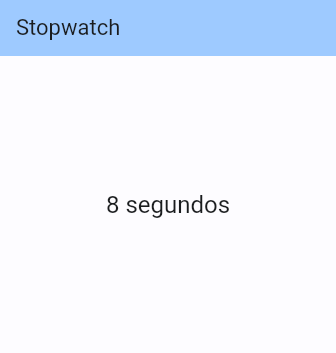
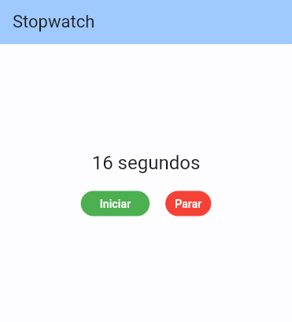
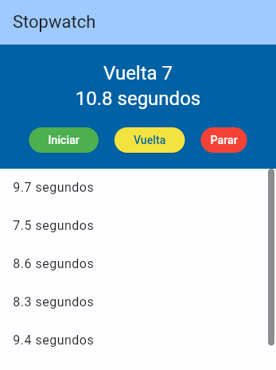
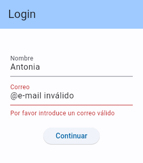
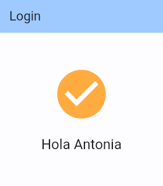
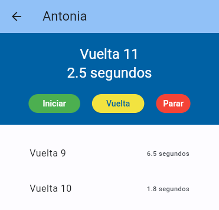
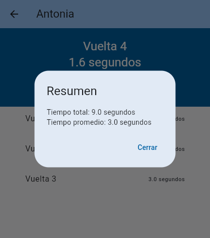
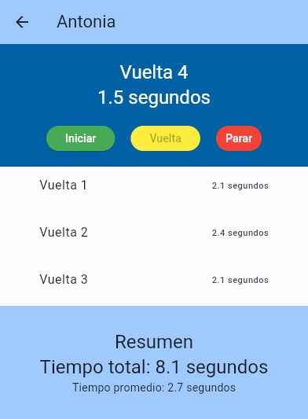

# UD5 - 5.5 Flutter: Navegación e interactividad

## Introducción

Hasta ahora hemos visto como crear interfaces mediante widgets y como gestionar estados. En este apartado veremos como navegar entre pantallas y como hacer que los widgets sean interactivos.

Para ello se utilizará un ejemplo de una aplicación de cronómetro, que guardará los tiempos y un histórico de las vueltas.

## Crear un contador básico

El primer paso es crear una nueva aplicación que muestre un contador de segundos. Para ello se crea un nuevo proyecto con el nombre `stopwatch` y se modifica el fichero `lib/main.dart` para que tenga el siguiente contenido:

```dart title="lib/main.dart"  linenums="1"
import 'package:flutter/material.dart';
import 'stopwatch.dart';

void main() {
  runApp(const StopwatchApp());
}

class StopwatchApp extends StatelessWidget {
  const StopwatchApp({super.key});

  @override
  Widget build(BuildContext context) {
    return MaterialApp(
      title: 'Stopwatch',
      theme: ThemeData(
        colorScheme: ColorScheme.fromSeed(seedColor: Colors.blue),
      ),
      debugShowCheckedModeBanner: false,
      home: const StopWatch(),
    );
  }
}
```

Para dar una estructura modular al proyecto, se crea un nuevo fichero `lib/stopwatch.dart` con el siguiente contenido:

```dart title="lib/stopwatch.dart" linenums="1"
import 'package:flutter/material.dart';
import 'dart:async'; // para poder usar la clase Timer

class StopWatch extends StatefulWidget {
  const StopWatch({super.key});

  @override
  State<StopWatch> createState() => _StopWatchState();
}

class _StopWatchState extends State<StopWatch> {
  int seconds = 0;
  late Timer timer;

  @override
  void initState() {
    super.initState();
    timer = Timer.periodic(const Duration(seconds: 1), _onTick);
  }

  void _onTick(Timer timer) {
    setState(() {
      seconds++;
    });
  }

  String _secondsText() => seconds == 1 ? 'segundo' : 'segundos';

  @override
  void dispose() {
    timer.cancel();
    super.dispose();
  }

  @override
  Widget build(BuildContext context) {
    return Scaffold(
      appBar: AppBar(
        backgroundColor: Theme.of(context).colorScheme.inversePrimary,
        title: const Text('Stopwatch'),
      ),
      body: Center(
        child: Text('$seconds ${_secondsText()}',
            style: Theme.of(context).textTheme.headlineSmall),
      ),
    );
  }
}
```

El resultado será una vista donde se muestra el número de segundos que han pasado desde que se inició la aplicación.



## Interactuando con botones

Vamos a añadir dos botones para poder iniciar y parar el cronómetro. Para ello se modifica `_StopWatchState` para que tenga el siguiente contenido:

```dart title="lib/stopwatch.dart" linenums="1" hl_lines="16-20 29-35 37-42 59-85"
import 'package:flutter/material.dart';
import 'dart:async';

class StopWatch extends StatefulWidget {
  const StopWatch({super.key});

  @override
  State<StopWatch> createState() => _StopWatchState();
}

class _StopWatchState extends State<StopWatch> {
  int seconds = 0;
  late Timer timer;
  bool isRunning = false;

  // Ya no es necesario iniciar el timer en el initState
  // @override
  // void initState() {
  //   super.initState();
  //   timer = Timer.periodic(const Duration(seconds: 1), _onTick);
  // }

  void _onTick(Timer timer) {
    setState(() {
      seconds++;
    });
  }

  void _startTimer() {
    timer = Timer.periodic(const Duration(seconds: 1), _onTick);
    setState(() {
      seconds = 0;
      isRunning = true;
    });
  }

  void _stopTimer() {
    timer.cancel();
    setState(() {
      isRunning = false;
    });
  }

  String _secondsText() => seconds == 1 ? 'segundo' : 'segundos';

  @override
  void dispose() {
    timer.cancel();
    super.dispose();
  }

  @override
  Widget build(BuildContext context) {
    return Scaffold(
      appBar: AppBar(
        backgroundColor: Theme.of(context).colorScheme.inversePrimary,
        title: const Text('Stopwatch'),
      ),
      body: Column(mainAxisAlignment: MainAxisAlignment.center, children: [
        Text('$seconds ${_secondsText()}',
            style: Theme.of(context).textTheme.headlineSmall),
        const SizedBox(height: 20),
        Row(
          mainAxisAlignment: MainAxisAlignment.center,
          children: [
            ElevatedButton(
              style: ButtonStyle(
                backgroundColor: MaterialStateProperty.all<Color>(Colors.green),
                foregroundColor: MaterialStateProperty.all<Color>(Colors.white),
              ),
              onPressed: isRunning ? null : _startTimer,
              child: const Text('Iniciar'),
            ),
            const SizedBox(width: 20),
            TextButton(
              style: ButtonStyle(
                backgroundColor: MaterialStateProperty.all<Color>(Colors.red),
                foregroundColor: MaterialStateProperty.all<Color>(Colors.white),
              ),
              onPressed: isRunning ? _stopTimer : null,
              child: const Text('Parar'),
            ),
          ],
        )
      ]),
    );
  }
}
```

Ahora ya se puede controlar el cronómetro con los botones.



## Añadir scroll

Es raro una aplicación que no tenga algún tipo de desplazamiento, especialmente vertical. En nuestra aplicación añadiremos un listado de tiempos que se añadirán a una lista con desplazamiento mediante un `ListView`.

Como el widget está creciendo, vamos a refactorizarlo en varios métodos para se sea más fácil de mantener.

```dart title="lib/stopwatch.dart" linenums="1" hl_lines="13 17 22 27 30 44-50 53-54 73-74 80-84 92-96 87 109 103 123-129"
import 'package:flutter/material.dart';
import 'dart:async';

class StopWatch extends StatefulWidget {
  const StopWatch({super.key});

  @override
  State<StopWatch> createState() => _StopWatchState();
}

class _StopWatchState extends State<StopWatch> {
  // se cambia de 'seconds' a 'milliseconds'
  int milliseconds = 0;
  late Timer timer;
  bool isRunning = false;
  // define la lista que guarda las vueltas
  final laps = <int>[];

  void _onTick(Timer timer) {
    setState(() {
      // se incrementa en 100 milisegundos (0.1 segundos)
      milliseconds += 100;
    });
  }

  void _startTimer() {
    timer = Timer.periodic(const Duration(milliseconds: 100), _onTick);
    setState(() {
      // al iniciar, se limpia la lista de vueltas
      laps.clear();
      milliseconds = 0;
      isRunning = true;
    });
  }

  void _stopTimer() {
    timer.cancel();
    setState(() {
      isRunning = false;
    });
  }

  // se agrega el método para guardar la vuelta
  void _lap() {
    setState(() {
      // agrega la vuelta a la lista
      laps.add(milliseconds);
      milliseconds = 0;
    });
  }

  String _secondsText(int milliseconds) {
    final seconds = milliseconds / 1000;
    return '$seconds segundos';
  }

  @override
  void dispose() {
    timer.cancel();
    super.dispose();
  }

  @override
  Widget build(BuildContext context) {
    return Scaffold(
        appBar: AppBar(
          backgroundColor: Theme.of(context).colorScheme.inversePrimary,
          title: const Text('Stopwatch'),
        ),
        // se cambia el cuerpo de la aplicación
        body: Column(
          children: [
            _buildCounter(context),
            Expanded(child: _buildLapDisplay()),
          ],
        ));
  }

  // método para construir la lista de vueltas
  Widget _buildLapDisplay() {
    return ListView(children: [
      for (final lap in laps) ListTile(title: Text(_secondsText(lap))),
    ]);
  }

  // método para construir el contador
  Widget _buildCounter(BuildContext context) {
    return Container(
      color: Theme.of(context).colorScheme.primary,
      padding: const EdgeInsets.all(20),
      child: Column(mainAxisAlignment: MainAxisAlignment.center, children: [
        Text('Vuelta ${laps.length + 1}',
            style: Theme.of(context)
                .textTheme
                .headlineSmall!
                .copyWith(color: Colors.white)),
        Text(_secondsText(milliseconds),
            style: Theme.of(context)
                .textTheme
                .headlineSmall!
                .copyWith(color: Colors.white)),
        const SizedBox(height: 20),
        _buildControls()
      ]),
    );
  }

  // método para construir los botones de control
  Widget _buildControls() {
    return Row(
      mainAxisAlignment: MainAxisAlignment.center,
      children: [
        ElevatedButton(
          style: ButtonStyle(
            backgroundColor: MaterialStateProperty.all<Color>(Colors.green),
            foregroundColor: MaterialStateProperty.all<Color>(Colors.white),
          ),
          onPressed: isRunning ? null : _startTimer,
          child: const Text('Iniciar'),
        ),
        const SizedBox(width: 20),
        // se agrega el botón para guardar la vuelta
        ElevatedButton(
          style: ButtonStyle(
            backgroundColor: MaterialStateProperty.all<Color>(Colors.yellow),
          ),
          onPressed: isRunning ? _lap : null,
          child: const Text('Vuelta'),
        ),
        const SizedBox(width: 20),
        TextButton(
          style: ButtonStyle(
            backgroundColor: MaterialStateProperty.all<Color>(Colors.red),
            foregroundColor: MaterialStateProperty.all<Color>(Colors.white),
          ),
          onPressed: isRunning ? _stopTimer : null,
          child: const Text('Parar'),
        ),
      ],
    );
  }
}
```



## Gestionando grandes cantidades de datos con ListView.builder

Se ha usado un `ListView` para mostrar una lista de elementos. Sin embargo, si la lista es muy grande, puede ser ineficiente representar todos los elementos en pantalla, cuando la mayoría no se ven. Esto es especialmente importante, si los elementos de la lista son complejos, contienen imágenes o requieren de un procesamiento costoso. Para ello se puede usar un `ListView.builder`, que crea los elementos de la lista a medida que se van mostrando.

El renderizado de los elementos se hace, de forma diferida, mediante el método `itemBuilder`, que recibe el contexto y el índice del elemento que se va a mostrar. Según se va haciendo scroll, se van creando los elementos que se van a mostrar y se destruyen los que ya no se ven, de forma que se optimiza el uso de memoria.

La propiedad `itemExtent` se usa para indicar la altura fija de cada elemento de la lista. Si se conoce la altura de los elementos, se puede usar para optimizar el scroll.

Además, para controlar el desplazamiento de la lista, se puede usar un `Scrollbar` y un `ScrollController`.

```dart title="lib/stopwatch.dart" linenums="1" hl_lines="19 21 50-54 67 88-103"
import 'package:flutter/material.dart';
import 'dart:async';

class StopWatch extends StatefulWidget {
  const StopWatch({super.key});

  @override
  State<StopWatch> createState() => _StopWatchState();
}

class _StopWatchState extends State<StopWatch> {
  int milliseconds = 0;
  late Timer timer;
  bool isRunning = false;

  final laps = <int>[];

  // altura de cada elemento de la lista
  final itemHeight = 60.0;
  // controlador del scroll
  final scrollController = ScrollController();

  void _onTick(Timer timer) {
    setState(() {
      milliseconds += 100;
    });
  }

  void _startTimer() {
    timer = Timer.periodic(const Duration(milliseconds: 100), _onTick);
    setState(() {
      laps.clear();
      milliseconds = 0;
      isRunning = true;
    });
  }

  void _stopTimer() {
    timer.cancel();
    setState(() {
      isRunning = false;
    });
  }

  void _lap() {
    setState(() {
      laps.add(milliseconds);
      milliseconds = 0;
      // hace scroll al último elemento de la lista
      scrollController.animateTo(
        itemHeight * laps.length,
        duration: const Duration(milliseconds: 500),
        curve: Curves.easeIn,
      );
    });
  }

  String _secondsText(int milliseconds) {
    final seconds = milliseconds / 1000;
    return '$seconds segundos';
  }

  @override
  void dispose() {
    timer.cancel();
    // se destruye el controlador del scroll
    scrollController.dispose();
    super.dispose();
  }

  @override
  Widget build(BuildContext context) {
    return Scaffold(
        appBar: AppBar(
          backgroundColor: Theme.of(context).colorScheme.inversePrimary,
          title: const Text('Stopwatch'),
        ),
        body: Column(
          children: [
            _buildCounter(context),
            Expanded(child: _buildLapDisplay()),
          ],
        ));
  }

  Widget _buildLapDisplay() {
    // se agrega un Scrollbar para poder hacer scroll en la lista de vueltas
    return Scrollbar(
      controller: scrollController,
      // se agrega un ListView.builder para optimizar el uso de memoria
      child: ListView.builder(
          controller: scrollController,
          itemExtent: itemHeight,
          itemCount: laps.length,
          itemBuilder: (context, index) {
            final lap = laps[index];
            return ListTile(
              contentPadding: const EdgeInsets.symmetric(horizontal: 50),
              title: Text('Vuelta ${index + 1}'),
              trailing: Text(_secondsText(lap)),
            );
          }),
    );
  }

  Widget _buildCounter(BuildContext context) {
    return Container(
      color: Theme.of(context).colorScheme.primary,
      padding: const EdgeInsets.all(20),
      child: Column(mainAxisAlignment: MainAxisAlignment.center, children: [
        Text('Vuelta ${laps.length + 1}',
            style: Theme.of(context)
                .textTheme
                .headlineSmall!
                .copyWith(color: Colors.white)),
        Text(_secondsText(milliseconds),
            style: Theme.of(context)
                .textTheme
                .headlineSmall!
                .copyWith(color: Colors.white)),
        const SizedBox(height: 20),
        _buildControls()
      ]),
    );
  }

  Widget _buildControls() {
    return Row(
      mainAxisAlignment: MainAxisAlignment.center,
      children: [
        ElevatedButton(
          style: ButtonStyle(
            backgroundColor: MaterialStateProperty.all<Color>(Colors.green),
            foregroundColor: MaterialStateProperty.all<Color>(Colors.white),
          ),
          onPressed: isRunning ? null : _startTimer,
          child: const Text('Iniciar'),
        ),
        const SizedBox(width: 20),
        ElevatedButton(
          style: ButtonStyle(
            backgroundColor: MaterialStateProperty.all<Color>(Colors.yellow),
          ),
          onPressed: isRunning ? _lap : null,
          child: const Text('Vuelta'),
        ),
        const SizedBox(width: 20),
        TextButton(
          style: ButtonStyle(
            backgroundColor: MaterialStateProperty.all<Color>(Colors.red),
            foregroundColor: MaterialStateProperty.all<Color>(Colors.white),
          ),
          onPressed: isRunning ? _stopTimer : null,
          child: const Text('Parar'),
        ),
      ],
    );
  }
}
```

## Campos de texto

Junto a los botones, los campos de texto son los _widgets_ más usados en las aplicaciones. _Flutter_ proporciona varios _widgets_ para mostrar campos de texto, pero el más usado es `TextField`.

A continuación, vamos a crear un **formulario de login** para nuestra aplicación de cronómetro. Para ello se crea un nuevo fichero `lib/login_screen.dart` con el siguiente contenido:

```dart title="lib/login_screen.dart" linenums="1" hl_lines="11 14-15 18 36 62-63 70 75 83-84 88 93 102 112-121"
import 'package:flutter/material.dart';

class LoginScreen extends StatefulWidget {
  const LoginScreen({super.key});

  @override
  State<LoginScreen> createState() => _LoginScreenState();
}

class _LoginScreenState extends State<LoginScreen> {
  bool loggedIn = false;
  String username = '';

  final _usernameController = TextEditingController();
  final _emailController = TextEditingController();
  // se agrega un GlobalKey para poder validar el formulario
  // además, permite acceder a los valores de los campos de texto
  final _formKey = GlobalKey<FormState>();

  @override
  void dispose() {
    _usernameController.dispose();
    _emailController.dispose();
    super.dispose();
  }

  @override
  Widget build(BuildContext context) {
    return Scaffold(
      appBar: AppBar(
        backgroundColor: Theme.of(context).colorScheme.inversePrimary,
        title: const Text('Login'),
      ),
      body: Center(
        // muestra el formulario si no se ha iniciado sesión
        child: loggedIn ? _buildSuccess() : _buildLoginForm(),
      ),
    );
  }
  
  // muestra un mensaje de bienvenida si se ha iniciado sesión
  Widget _buildSuccess() {
    return Column(
      mainAxisAlignment: MainAxisAlignment.center,
      children: [
        const Icon(
          Icons.check_circle,
          color: Colors.orangeAccent,
          size: 100,
        ),
        const SizedBox(height: 20),
        Text(
          'Hola $username',
          style: Theme.of(context).textTheme.headlineSmall,
        ),
      ],
    );
  }

  // muestra el formulario de login
  Widget _buildLoginForm() {
    return Form(
      key: _formKey,
      child: Padding(
        padding: const EdgeInsets.all(20),
        child: Column(
          mainAxisAlignment: MainAxisAlignment.center,
          children: [
            TextFormField(
              controller: _usernameController,
              decoration: const InputDecoration(
                labelText: 'Nombre',
              ),
              // valida que el campo no esté vacío
              validator: (value) {
                if (value == null || value.isEmpty) {
                  return 'Por favor ingresa tu nombre';
                }
                return null;
              },
            ),
            TextFormField(
              controller: _emailController,
              keyboardType: TextInputType.emailAddress,
              decoration: const InputDecoration(
                labelText: 'Correo',
              ),
              validator: (value) {
                if (value!.isEmpty) {
                  return 'Por favor ingresa tu correo electrónico';
                }
                // valida que el correo tenga un formato válido
                final regex = RegExp('[^@]+@[^.]+..+');
                if (!regex.hasMatch(value)) {
                  return 'Por favor introduce un correo válido';
                }
                return null;
              },
            ),
            const SizedBox(height: 20),
            ElevatedButton(
              onPressed: _validate,
              child: const Text('Continuar'),
            ),
          ],
        ),
      ),
    );
  }

  // controla la validación del formulario
  void _validate() {
    final form = _formKey.currentState;
    if (form == null || !form.validate()) {
      return;
    }
    setState(() {
      loggedIn = true;
      username = _usernameController.text;
    });
  }
}
```

 

## Navegación entre pantallas

Hasta ahora, solo hemos visto una pantalla en nuestra aplicación. Sin embargo, es muy común que las aplicaciones tengan varias pantallas y que se pueda navegar entre ellas. Para ello, _Flutter_ proporciona el _widget_ `Navigator`, que permite gestionar una pila de pantallas.

Para navegar entre pantallas, se usa el método `push` del `Navigator`, que recibe un `Route` que define la pantalla que se va a mostrar. Para volver a la pantalla anterior, se usa el método `pop`.

Para poder navegar entre pantallas, se debe usar un `MaterialApp` como raíz de la aplicación. Además, se debe definir la pantalla inicial con la propiedad `home` y se debe definir un `Navigator` para gestionar la pila de pantallas.

En la aplicación de ejemplo, se enlazará la pantalla de inicio de sesión con el cronómetro.

```dart title="lib/main.dart" linenums="1" hl_lines="2 19"
import 'package:flutter/material.dart';
import 'login_screen.dart';

void main() {
  runApp(const StopwatchApp());
}

class StopwatchApp extends StatelessWidget {
  const StopwatchApp({super.key});

  @override
  Widget build(BuildContext context) {
    return MaterialApp(
      title: 'Stopwatch',
      theme: ThemeData(
        colorScheme: ColorScheme.fromSeed(seedColor: Colors.blue),
      ),
      debugShowCheckedModeBanner: false,
      home: const LoginScreen(),
    );
  }
}
```

En la pantalla de login ya no es necesario mostrar el mensaje de bienvenida, ya que se mostrará en la pantalla del cronómetro. Se elimina la variable `loggedIn` y el método `_buildSuccess`. Además, en la validación, se usa el método `Navigator.push` para navegar a la pantalla del cronómetro.

```dart title="lib/login_screen.dart" linenums="1" hl_lines="2 34 95-99"
import 'package:flutter/material.dart';
import 'stopwatch.dart';

class LoginScreen extends StatefulWidget {
  const LoginScreen({super.key});

  @override
  State<LoginScreen> createState() => _LoginScreenState();
}

class _LoginScreenState extends State<LoginScreen> {
  bool loggedIn = false;
  String username = '';

  final _usernameController = TextEditingController();
  final _emailController = TextEditingController();
  final _formKey = GlobalKey<FormState>();

  @override
  void dispose() {
    _usernameController.dispose();
    _emailController.dispose();
    super.dispose();
  }

  @override
  Widget build(BuildContext context) {
    return Scaffold(
      appBar: AppBar(
        backgroundColor: Theme.of(context).colorScheme.inversePrimary,
        title: const Text('Login'),
      ),
      body: Center(
        child: _buildLoginForm(),
      ),
    );
  }

  Widget _buildLoginForm() {
    return Form(
      key: _formKey,
      child: Padding(
        padding: const EdgeInsets.all(20),
        child: Column(
          mainAxisAlignment: MainAxisAlignment.center,
          children: [
            TextFormField(
              controller: _usernameController,
              decoration: const InputDecoration(
                labelText: 'Nombre',
              ),
              validator: (value) {
                if (value == null || value.isEmpty) {
                  return 'Por favor ingresa tu nombre';
                }
                return null;
              },
            ),
            TextFormField(
              controller: _emailController,
              keyboardType: TextInputType.emailAddress,
              decoration: const InputDecoration(
                labelText: 'Correo',
              ),
              validator: (value) {
                if (value!.isEmpty) {
                  return 'Por favor ingresa tu correo electrónico';
                }
                final regex = RegExp('[^@]+@[^.]+..+');
                if (!regex.hasMatch(value)) {
                  return 'Por favor introduce un correo válido';
                }
                return null;
              },
            ),
            const SizedBox(height: 20),
            ElevatedButton(
              onPressed: _validate,
              child: const Text('Continuar'),
            ),
          ],
        ),
      ),
    );
  }

  void _validate() {
    final form = _formKey.currentState;
    if (form == null || !form.validate()) {
      return;
    }
    final username = _usernameController.text;
    final email = _emailController.text;
    // cambiar a 'pushReplacement' para reemplazar la pantalla actual
    Navigator.of(context).push(
      MaterialPageRoute(
        builder: (context) => StopWatch(username: username, email: email),
      ),
    );
  }
}
```

Por último, se cambia `stopwatch.dart` para que reciba el nombre de usuario y el correo electrónico como parámetros y se muestre el nombre de usuario en el título.

```dart title="lib/stopwatch.dart" linenums="1" hl_lines="5-7 74"
import 'package:flutter/material.dart';
import 'dart:async';

class StopWatch extends StatefulWidget {
  final String username;
  final String email;
  const StopWatch({super.key, required this.username, required this.email});

  @override
  State<StopWatch> createState() => _StopWatchState();
}

class _StopWatchState extends State<StopWatch> {
  int milliseconds = 0;
  late Timer timer;
  bool isRunning = false;

  final laps = <int>[];

  final itemHeight = 60.0;
  final scrollController = ScrollController();

  void _onTick(Timer timer) {
    setState(() {
      milliseconds += 100;
    });
  }

  void _startTimer() {
    timer = Timer.periodic(const Duration(milliseconds: 100), _onTick);
    setState(() {
      laps.clear();
      milliseconds = 0;
      isRunning = true;
    });
  }

  void _stopTimer() {
    timer.cancel();
    setState(() {
      isRunning = false;
    });
  }

  void _lap() {
    setState(() {
      laps.add(milliseconds);
      milliseconds = 0;
      scrollController.animateTo(
        itemHeight * laps.length,
        duration: const Duration(milliseconds: 500),
        curve: Curves.easeIn,
      );
    });
  }

  String _secondsText(int milliseconds) {
    final seconds = milliseconds / 1000;
    return '$seconds segundos';
  }

  @override
  void dispose() {
    timer.cancel();
    scrollController.dispose();
    super.dispose();
  }

  @override
  Widget build(BuildContext context) {
    return Scaffold(
        appBar: AppBar(
          backgroundColor: Theme.of(context).colorScheme.inversePrimary,
          title: Text(widget.username),
        ),
        body: Column(
          children: [
            _buildCounter(context),
            Expanded(child: _buildLapDisplay()),
          ],
        ));
  }

  Widget _buildLapDisplay() {
    return Scrollbar(
      controller: scrollController,
      child: ListView.builder(
          controller: scrollController,
          itemExtent: itemHeight,
          itemCount: laps.length,
          itemBuilder: (context, index) {
            final lap = laps[index];
            return ListTile(
              contentPadding: const EdgeInsets.symmetric(horizontal: 50),
              title: Text('Vuelta ${index + 1}'),
              trailing: Text(_secondsText(lap)),
            );
          }),
    );
  }

  Widget _buildCounter(BuildContext context) {
    return Container(
      color: Theme.of(context).colorScheme.primary,
      padding: const EdgeInsets.all(20),
      child: Column(mainAxisAlignment: MainAxisAlignment.center, children: [
        Text('Vuelta ${laps.length + 1}',
            style: Theme.of(context)
                .textTheme
                .headlineSmall!
                .copyWith(color: Colors.white)),
        Text(_secondsText(milliseconds),
            style: Theme.of(context)
                .textTheme
                .headlineSmall!
                .copyWith(color: Colors.white)),
        const SizedBox(height: 20),
        _buildControls()
      ]),
    );
  }

  Widget _buildControls() {
    return Row(
      mainAxisAlignment: MainAxisAlignment.center,
      children: [
        ElevatedButton(
          style: ButtonStyle(
            backgroundColor: MaterialStateProperty.all<Color>(Colors.green),
            foregroundColor: MaterialStateProperty.all<Color>(Colors.white),
          ),
          onPressed: isRunning ? null : _startTimer,
          child: const Text('Iniciar'),
        ),
        const SizedBox(width: 20),
        ElevatedButton(
          style: ButtonStyle(
            backgroundColor: MaterialStateProperty.all<Color>(Colors.yellow),
          ),
          onPressed: isRunning ? _lap : null,
          child: const Text('Vuelta'),
        ),
        const SizedBox(width: 20),
        TextButton(
          style: ButtonStyle(
            backgroundColor: MaterialStateProperty.all<Color>(Colors.red),
            foregroundColor: MaterialStateProperty.all<Color>(Colors.white),
          ),
          onPressed: isRunning ? _stopTimer : null,
          child: const Text('Parar'),
        ),
      ],
    );
  }
}
```



Normalmente se hará `push()` y `pop()` de pantallas, pero también se puede usar `pushReplacement()` para reemplazar la pantalla actual o `pushAndRemoveUntil()` para reemplazar la pantalla actual y eliminar las pantallas anteriores de la pila.

## Mostrar diálogos

Los diálogos son una forma de mostrar información al usuario y pedirle que tome una decisión. En _Flutter_ se pueden mostrar diálogos mediante el método `showDialog`, que recibe un `BuildContext` y un `AlertDialog`.

En este caso, se va a implementar una clase que se encargue de mostrar un diálogo simple con un título, un mensaje y un botón para cerrar. Además se tendrá en cuenta el diseño, dependiendo de la plataforma.

```dart title="lib/platform_alert.dart" linenums="1" hl_lines="1"
import 'package:flutter/cupertino.dart';
import 'package:flutter/material.dart';

class PlatformAlert {
  final String title;
  final String message;
  const PlatformAlert({required this.title, required this.message});

  void show(BuildContext context) {
    final platform = Theme.of(context).platform;
    // TargetPlatform es un enum con los siguientes valores:
    //   android, fuchsia, iOS, linux, macOS, windows
    if (platform == TargetPlatform.iOS) {
      _buildCupertinoDialog(context);
    } else {
      _buildMaterialDialog(context);
    }
  }

  void _buildMaterialDialog(BuildContext context) {
    showDialog(
      context: context,
      builder: (context) {
        return AlertDialog(
          title: Text(title),
          content: Text(message),
          actions: [
            TextButton(
              onPressed: () => Navigator.of(context).pop(),
              child: const Text('Cerrar'),
            ),
          ],
        );
      },
    );
  }

  void _buildCupertinoDialog(BuildContext context) {
    showCupertinoDialog(
      context: context,
      builder: (context) {
        return CupertinoAlertDialog(
          title: Text(title),
          content: Text(message),
          actions: [
            CupertinoDialogAction(
              onPressed: () => Navigator.of(context).pop(),
              child: const Text('Cerrar'),
            ),
          ],
        );
      },
    );
  }
}
```

Para usar el diálogo, se modifica el método `_stopTimer()` de la clase `StopWatch`:

```dart title="lib/stopwatch.dart" linenums="39" hl_lines="6-13"
  void _stopTimer() {
    timer.cancel();
    setState(() {
      isRunning = false;
    });
    final totalRuntime = laps.fold(milliseconds, (total, lap) => total + lap);
    final averageLapTime = totalRuntime / laps.length;
    final alert = PlatformAlert(
      title: 'Resumen',
      message: 'Tiempo total: ${_secondsText(totalRuntime)}\n'
          'Tiempo promedio: ${_secondsText(averageLapTime.toInt())}',
    );
    alert.show(context);
  }
```



## Notificaciones emergentes

Hay veces que se necesita mostrar información al usuario, pero no se quiere interrumpir la interacción con la aplicación. Para ello se pueden usar notificaciones emergentes, que se muestran en la parte inferior de la pantalla y desaparecen automáticamente.

```dart title="lib/stopwatch.dart" linenums="30" hl_lines="9 13 15 20-21 23-25 28-45"
  void _startTimer() {
    timer = Timer.periodic(const Duration(milliseconds: 100), _onTick);
    setState(() {
      laps.clear();
      milliseconds = 0;
      isRunning = true;
    });
    // cierra el mensaje emergente si está abierto
    bottomSheetController?.close();
  }

  // controlador para el mensaje emergente
  PersistentBottomSheetController? bottomSheetController;

  void _stopTimer(BuildContext context) {
    timer.cancel();
    setState(() {
      isRunning = false;
    });
    bottomSheetController =
        showBottomSheet(context: context, builder: _buildRunCompleteSheet);
    // Cerrar la hoja inferior después de 5 segundos
    Future.delayed(const Duration(seconds: 5)).then((_) {
      bottomSheetController?.close();
    });
  }

  Widget _buildRunCompleteSheet(BuildContext context) {
    final totalRuntime = laps.fold(milliseconds, (total, lap) => total + lap);
    final averageLapTime = totalRuntime / laps.length;
    final textTheme = Theme.of(context).textTheme;
    return SafeArea(
        child: Container(
            color: Theme.of(context).colorScheme.inversePrimary,
            width: double.infinity,
            child: Padding(
                padding: const EdgeInsets.symmetric(vertical: 30),
                child: Column(mainAxisSize: MainAxisSize.min, children: [
                  Text('Resumen', style: textTheme.headlineSmall),
                  Text('Tiempo total: ${_secondsText(totalRuntime)}',
                      style: textTheme.headlineSmall),
                  Text(
                      'Tiempo promedio: ${_secondsText(averageLapTime.toInt())}'),
                ]))));
  }
```

En el botón de parar, se llama al método `_stopTimer` y se le pasa el contexto para poder mostrar el mensaje emergente. Para ello se usa un `Builder`, que permite pasar el contexto al método `_stopTimer`.

```dart title="lib/stopwatch.dart" linenums="175" hl_lines="2-3"
        // Es necesario usar un Builder para poder pasar el context
        Builder(
            builder: (context) => TextButton(
                  style: ButtonStyle(
                    backgroundColor:
                        MaterialStateProperty.all<Color>(Colors.red),
                    foregroundColor:
                        MaterialStateProperty.all<Color>(Colors.white),
                  ),
                  onPressed: isRunning ? () => _stopTimer(context) : null,
                  child: const Text('Parar'),
                )),
```



## Resumen

En este apartado hemos visto como navegar entre pantallas y como mostrar diálogos y notificaciones emergentes. Además, hemos visto como hacer que los campos de texto sean interactivos y como validar los formularios. En el siguiente apartado veremos como guardar datos en el dispositivo.

## Referencias

- [TimerClass](https://api.flutter.dev/flutter/dart-async/Timer-class.html)
- [ListView class](https://api.flutter.dev/flutter/widgets/ListView-class.html)
- [ScrollBar class](https://api.flutter.dev/flutter/material/Scrollbar-class.html)
- [TextFormField class](https://api.flutter.dev/flutter/material/TextFormField-class.html)
- [Form class](https://api.flutter.dev/flutter/widgets/Form-class.html)
- [RegExp class](https://api.dart.dev/stable/3.2.4/dart-core/RegExp-class.html)
- [Navigator class](https://api.flutter.dev/flutter/widgets/Navigator-class.html)
- [AlertDialog class](https://api.flutter.dev/flutter/material/AlertDialog-class.html)
- [SafeArea class](https://api.flutter.dev/flutter/widgets/SafeArea-class.html)
