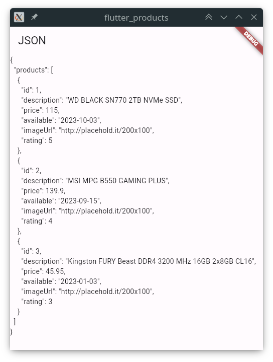
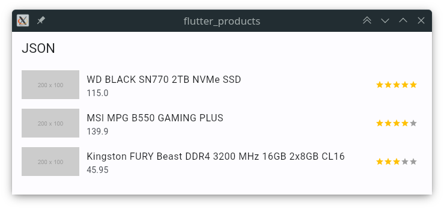
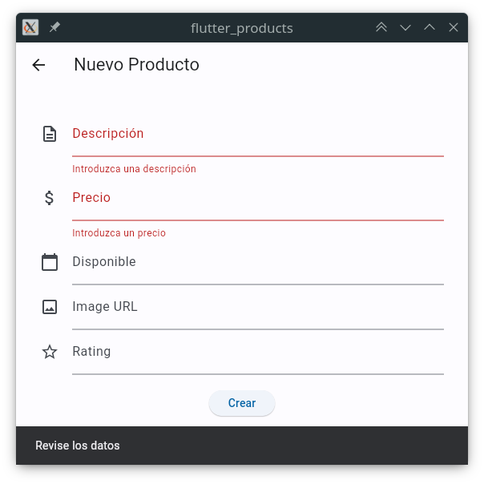
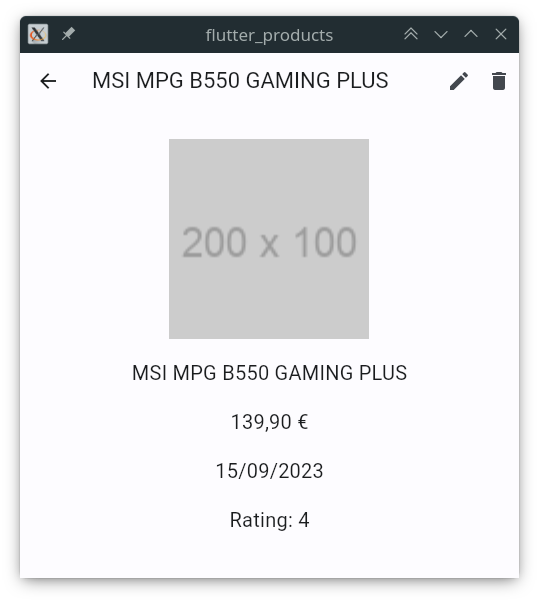

# UD5 - 5.6 Flutter: Persistencia de datos

## Introducción

En este apartado vamos a ver como guardar datos en el dispositivo. Para ello, vamos a crear una aplicación de gestión de productos, que permita añadir, editar y eliminar productos. Además, se va a usar el almacenamiento local para guardar los productos.

## Modelo de datos

JSON se ha convertido en el formato estándar para almacenar, intercambiar y consumir datos entre aplicaciones. Muchos servicios utilizan JSON para recibir y devolver información. Por lo tanto, es una buena idea utilizar JSON para almacenar los datos de nuestra aplicación.

JSON es un estándar de intercambio de datos basado en texto, donde se almacenan pares clave-valor. Como es un String, podemos convertir objetos de Dart a JSON, conocido como serializar, y viceversa, de JSON a objeto (deserializar).

Se utilizará la librería `dart:convert` que viene incluida en el SDK de Dart para serializar y deserializar objetos.

## Crear una nueva aplicación

Para el ejemplo, se crea una nueva aplicación llamada `flutter_products`, con la siguiente estructura básica.

```dart title="lib/main.dart" linenums="1"
import 'package:flutter/material.dart';

void main() {
  runApp(const ProductsApp());
}

class ProductsApp extends StatelessWidget {
  const ProductsApp({super.key});

  @override
  Widget build(BuildContext context) {
    return MaterialApp(
      title: 'Flutter Products',
      debugShowCheckedModeBanner: false,
      theme: ThemeData(
        colorScheme: ColorScheme.fromSeed(seedColor: Colors.blue),
        useMaterial3: true,
      ),
      home: const Products(),
    );
  }
}

class Products extends StatefulWidget {
  const Products({super.key});

  @override
  State<Products> createState() => _ProductsState();
}

class _ProductsState extends State<Products> {
  @override
  Widget build(BuildContext context) {
    return Scaffold(
        appBar: AppBar(title: const Text('JSON')), body: Container());
  }
}
```

Añadir un nievo directorio llamado `assets/` en la raíz del proyecto.

Dentro de `assets/` crear un fichero llamado `products.json` con el siguiente contenido:

```json title="assets/products.json"
[
  {
    "id": 1,
    "description": "WD BLACK SN770 2TB NVMe SSD",
    "price": 115,
    "available": "2023-10-03",
    "imageUrl": "http://placehold.it/200x100",
    "rating": 5
  },
  {
    "id": 2,
    "description": "MSI MPG B550 GAMING PLUS",
    "price": 139.9,
    "available": "2023-09-15",
    "imageUrl": "http://placehold.it/200x100",
    "rating": 4
  },
  {
    "id": 3,
    "description": "Kingston FURY Beast DDR4 3200 MHz 16GB 2x8GB CL16",
    "price": 45.95,
    "available": "2023-01-03",
    "imageUrl": "http://placehold.it/200x100",
    "rating": 3
  }
]
```

En el fichero de configuración `pubspec.yaml` añadir el siguiente código dentro del apartado `flutter:`:

```yaml title="pubspec.yaml" hl_lines="2-3"
...
  assets:
    - assets/
...
```

En la clase `_ProductsState` añadir el siguiente código:

```dart title="lib/main.dart" hl_lines="3"
...
class _ProductsState extends State<Products> {
  String productsJSONString = '';
  ...
```

Para leer el contenido del fichero `products.json`, al final de `_ProductsState` añadir un nuevo método asíncrono llamado `readJsonFile` que establecerá el valor de `productsJSONString` con el contenido del fichero.

```dart title="lib/main.dart" hl_lines="7-13"
...
class _ProductsState extends State<Products> {
  String productsJSONString = '';

  ...

  Future readJsonFile() async {
    String jsonString =
        await DefaultAssetBundle.of(context).loadString('assets/products.json');
    setState(() {
      productsJSONString = jsonString;
    });
  }
}
```

Sobrecargar el método `initState` para llamar al método `readJsonFile`:

```dart title="lib/main.dart" hl_lines="5-9"
...
class _ProductsState extends State<Products> {
  String productsJSONString = '';

  @override
  void initState() {
    super.initState();
    readJsonFile();
  }

  ...
```

Ahora, para mostrar el JSON en el `body` se añade un widget `Text` con el contenido de `productsJSONString`:

```dart title="lib/main.dart" hl_lines="15"
...
class _ProductsState extends State<Products> {
  String productsJSONString = '';

  @override
  void initState() {
    super.initState();
    readJsonFile();
  }

  @override
  Widget build(BuildContext context) {
    return Scaffold(
        appBar: AppBar(title: const Text('JSON')),
        body: Text(productsJSONString));
  }

  Future readJsonFile() async {
    String jsonString =
        await DefaultAssetBundle.of(context).loadString('assets/products.json');
    setState(() {
      productsJSONString = jsonString;
    });
  }
}
```

Al ejecutar la aplicación, se muestra el contenido del fichero `products.json`:



### Modelo de datos

Para convertir el JSON a objetos de Dart, se crea una clase `Product` con las propiedades del JSON y un constructor que recibe un `Map<String, dynamic>` que asigna los valores a las propiedades.

```dart title="lib/models/product.dart" linenums="1"
class Product {
  final int id;
  final String description;
  final double price;
  final DateTime available;
  final String imageUrl;
  final int rating;

  Product.fromJson(Map<String, dynamic> json)
      : id = json['id'] as int,
        description = json['description'] as String,
        price = json['price'] as double,
        available = DateTime.parse(json['available'] as String),
        imageUrl = json['imageUrl'] as String,
        rating = json['rating'] as int;
}
```

Modificar el método `readJsonFile` de la clase `_ProductsState` para convertir el JSON a objetos de Dart. El primer paso es transformar el `String` a un `Map` con el método `jsonDecode` de la librería `dart:convert`.

```dart title="lib/main.dart" hl_lines="7"
...
class _ProductsState extends State<Products> {
  ...
  Future readJsonFile() async {
    String jsonString =
        await DefaultAssetBundle.of(context).loadString('assets/products.json');
    List jsonList = jsonDecode(jsonString);
    ...
```

Debemos asegurarnos que el editor a importado de forma automática la librería `dart:convert`, además, debemos añadir la clase `Product` para poder utilizarla.

```dart title="lib/main.dart" linenums="1" hl_lines="3-4"
import 'package:flutter/material.dart';

import 'dart:convert';
import './models/product.dart';
```

El último paso es convertir el JSON a `List`. Se puede hacer con un bucle `for` y transformar cada elemento del `List` a un objeto de tipo `Product` con el constructor `fromJson`. En el método `readJsonFile` de la clase `_ProductsState` añadir el siguiente código:

```dart title="lib/main.dart" hl_lines="4-8"
...
    List jsonList = jsonDecode(jsonString);

    List<Product> products = [];
    for (var item in jsonList) {
      Product product = Product.fromJson(item);
      products.add(product);
    }
...
```

Ahora se puede eliminar (o comentar) el `setState` y devolver la lista de productos en su lugar, además de cambiar el tipo de retorno del método a `List<Product>`.

```dart title="lib/main.dart" hl_lines="2 14"
...
  Future<List<Product>> readJsonFile() async {
    String jsonString =
        await DefaultAssetBundle.of(context).loadString('assets/products.json');

    List jsonList = jsonDecode(jsonString);

    List<Product> products = [];
    for (var item in jsonList) {
      Product product = Product.fromJson(item);
      products.add(product);
    }

    return products;
  }
...
```

### Mostrar los productos

Ahora que se obtiene la lista de productos, en lugar de mostrar el texto, se pueden representar los productos en una lista. Para ello, se utiliza un `ListView` con un `ListTile` para cada producto. En la clase `_ProductsState` se añade un `List<Product>` llamado `products`:

```dart title="lib/main.dart" hl_lines="3"
...
class _ProductsState extends State<Products> {
  List<Product> products = [];
  ...
```

En el método `initState` se llama al método `readJsonFile` y se asigna el resultado a `products`:

```dart title="lib/main.dart" hl_lines="5-9"
...
  @override
  void initState() {
    super.initState();
    readJsonFile().then((value) => {
          setState(() {
            products = value;
          })
        });
  }
...
```

En el `body` del `Scaffold` se añade un `ListView` con un `ListTile` para cada producto:

```dart title="lib/main.dart" hl_lines="6-24"
...
  @override
  Widget build(BuildContext context) {
    return Scaffold(
        appBar: AppBar(title: const Text('JSON')),
        body: ListView.builder(
          itemCount: products.length,
          itemBuilder: (context, index) {
            return ListTile(
              leading: Image.network(products[index].imageUrl),
              title: Text(products[index].description),
              subtitle: Text(products[index].price.toString()),
              trailing: Row(
                mainAxisSize: MainAxisSize.min,
                children: [
                  for (var i = 0; i < products[index].rating; i++)
                    const Icon(Icons.star, color: Colors.amber, size: 14),
                  for (var i = 0; i < 5 - products[index].rating; i++)
                    const Icon(Icons.star, color: Colors.grey, size: 14),
                ],
              ),
            );
          },
        ));
  }
...
```



## Convertir objetos a JSON

La operación más común es deserializar un JSON a un objeto de Dart, pero también es posible convertir un objeto de Dart a JSON. Para ello, se utiliza el método `toJson` de la clase `Product`.

```dart title="lib/models/product.dart" hl_lines="1-2"
class Product {
  ...
  Map<String, dynamic> toJson() {
    return {
        'id': id,
        'description': description,
        'price': price,
        'available': available.toIso8601String(),
        'imageUrl': imageUrl,
        'rating': rating
    };
  }
}
```

Para convertir la lista de productos a JSON, se podría utilizar el siguiente código:

```dart
String convertToJSON(List<Product> products) {
    return jsonEncode(products);
}
```

## Solucionar problemas típicos con JSON

En el ejemplo todo funciona correctamente, pero en una aplicación real, es posible que el JSON no tenga el formato correcto o que falten propiedades.

- Una propiedad puede que no tenga el tipo correcto, por ejemplo, se espera un `int` pero se recibe un `String` o se necesita un `double` pero se recibe un `int`.

```dart title="lib/models/product.dart" hl_lines="2 4"
  Product.fromJson(Map<String, dynamic> json)
      : id = int.tryParse(json['id']) ?? 0,
        description = json['description'],
        price = double.tryParse(json['price']) ?? 0,
        available = DateTime.parse(json['available']),
        imageUrl = json['imageUrl'],
        rating = json['rating'];
}
```

- Una propiedad puede ser opcional, por lo que no siempre se va a recibir. En este caso, se puede utilizar el operador `??` para asignar un valor por defecto.

```dart title="lib/models/product.dart" hl_lines="6-7"
  Product.fromJson(Map<String, dynamic> json)
      : id = json['id'] as int,
        description = json['description'],
        price = json['price'],
        available = DateTime.parse(json['available']),
        imageUrl = json['imageUrl'] ?? '',
        rating = int.tryParse(json['rating']) ?? 0;
}
```

- Una buena práctica es añadir el método `toString` en los valores que se esperan como `String` para evitar errores.

```dart title="lib/models/product.dart" hl_lines="3 5-6"
  Product.fromJson(Map<String, dynamic> json)
      : id = json['id'],
        description = json['description'].toString(),
        price = json['price'],
        available = DateTime.parse(json['available'].toString()),
        imageUrl = json['imageUrl'].toString(),
        rating = int.tryParse(json['rating']);
}
```

- Para evitar que aparezca `null` en la vista se puede comprobar si el valor y mostrar un valor por defecto.

```dart title="lib/models/product.dart" hl_lines="3"
  Product.fromJson(Map<String, dynamic> json)
      : id = int.tryParse(json['id'].toString()) ?? 0,
        description = json['description'] != null ? json['description'].toString() : 'Sin descripción',
        price = double.tryParse(json['price']).toString() ?? 0,
        available = json['available'] != null ? DateTime.parse(json['available'].toString()) : DateTime.now(),
        imageUrl = json['imageUrl'] != null ? json['imageUrl'].toString() : '',
        rating =int.tryParse(json['rating'].toString()) ?? 0;
}
```

## Claves de las propiedades

Durante el desarrollo de una aplicación, es posible que se cambie el nombre de una propiedad o que se añadan nuevas propiedades. En este caso, el JSON no se va a poder convertir a objetos de Dart, ya que no se van a encontrar las propiedades.

Una solución es utilizar constantes para almacenar las claves de las propiedades. De esta forma, si se cambia el nombre de una propiedad, solo hay que cambiar el valor de la constante.

En la clase `Product` se añaden las constantes:

```dart title="lib/models/product.dart"
class Product {
  static const String idKey = 'id';
  static const String descriptionKey = 'description';
  static const String priceKey = 'price';
  static const String availableKey = 'available';
  static const String imageUrlKey = 'imageUrl';
  static const String ratingKey = 'rating';

  ...
```

Y en el constructor se utilizan las constantes:

```dart title="lib/models/product.dart"
  Product.fromJson(Map<String, dynamic> json)
      : id = int.tryParse(json[idKey].toString()) ?? 0,
        description = json[descriptionKey] != null
            ? json[descriptionKey].toString()
            : 'Sin descripción',
        price = double.tryParse(json[priceKey].toString()) ?? 0.0,
        available = json[availableKey] != null
            ? DateTime.parse(json[availableKey].toString())
            : DateTime.now(),
        imageUrl =
            json[imageUrlKey] != null ? json[imageUrlKey].toString() : '',
        rating = int.tryParse(json[ratingKey].toString()) ?? 0;
}
```

Después de los cambios, la clase quedaría de la siguiente forma:

```dart title="lib/models/product.dart"
class Product {
  static const String idKey = 'id';
  static const String descriptionKey = 'description';
  static const String priceKey = 'price';
  static const String availableKey = 'available';
  static const String imageUrlKey = 'imageUrl';
  static const String ratingKey = 'rating';

  final int id;
  final String description;
  final double price;
  final DateTime available;
  final String imageUrl;
  final int rating;

  const Product({
    required this.id,
    required this.description,
    required this.price,
    required this.available,
    required this.imageUrl,
    required this.rating,
  });

  Product.fromJson(Map<String, dynamic> json)
      : id = int.tryParse(json[idKey].toString()) ?? 0,
        description = json[descriptionKey] != null
            ? json[descriptionKey].toString()
            : 'Sin descripción',
        price = double.tryParse(json[priceKey].toString()) ?? 0.0,
        available = json[availableKey] != null
            ? DateTime.parse(json[availableKey].toString())
            : DateTime.now(),
        imageUrl =
            json[imageUrlKey] != null ? json[imageUrlKey].toString() : '',
        rating = int.tryParse(json[ratingKey].toString()) ?? 0;

  Map<String, dynamic> toJson() {
    return {
      idKey: id,
      descriptionKey: description,
      priceKey: price,
      availableKey: available.toIso8601String(),
      imageUrlKey: imageUrl,
      ratingKey: rating
    };
  }
}
```

## Almacenamiento local

En Flutter se puede utilizar el almacenamiento local para guardar datos en el dispositivo. Para ello, se utiliza la librería `shared_preferences` que permite guardar datos de tipo `String`, `bool`, `int`, `double` y `StringList`.

No se debe almacenar información sensible, como contraseñas o tokens de acceso, ya que no se encripta la información.

Almacena pares de datos clave-valor, donde la clave es un `String` y el valor es uno de los tipos soportados. Para guardar un valor se utiliza el método `set` y para obtener un valor se utiliza el método `get`.

### Instalar la librería

Para instalar la librería `shared_preferences`, desde el terminal ejecutar el siguiente comando:

```bash
flutter pub add shared_preferences
```

Para actualizar las dependencias del proyecto, ejecutar el siguiente comando:

```bash
flutter pub get
```

### Tipos de datos soportados

- `String`: `setString` y `getString`
- `bool`: `setBool` y `getBool`
- `int`: `setInt` y `getInt`
- `double`: `setDouble` y `getDouble`
- `StringList`: `setStringList` y `getStringList`. Se utiliza para guardar una lista de cadenas de texto.

Ejemplo de guardado:

```dart title="Ejemplos de guardado en shared_preferences"
// Obtener una instancia de SharedPreferences
final SharedPreferences prefs = await SharedPreferences.getInstance();

// Guardar un valor integer en la clave 'counter'.
await prefs.setInt('counter', 10);
// Guardar un valor boolean en la clave 'repeat'.
await prefs.setBool('repeat', true);
// Guardar un valor double en la clave 'decimal'.
await prefs.setDouble('decimal', 1.5);
// Guardar un valor String en la clave 'user_name'.
await prefs.setString('user_name', 'John Doe');
// Guardar un listado de strings en la clave 'items'.
await prefs.setStringList('items', <String>['Earth', 'Moon', 'Sun']);
```

Ejemplo de lectura:

```dart title="Ejemplos de lectura en shared_preferences"
// Obtener una instancia de SharedPreferences
final SharedPreferences prefs = await SharedPreferences.getInstance();

// Obtener un valor integer de la clave 'counter'.
final int? counter = prefs.getInt('counter');
// Obtener un valor boolean de la clave 'repeat'.
final bool? repeat = prefs.getBool('repeat');
// Obtener un valor double de la clave 'decimal'.
final double? decimal = prefs.getDouble('decimal');
// Obtener un valor String de la clave 'user_name'.
final String? userName = prefs.getString('user_name');
// Obtener un listado de strings de la clave 'items'.
final List<String>? items = prefs.getStringList('items');
```

### Guardar un valor

Para guardar un valor se utiliza el método `set` de la clase `SharedPreferences`. El método `set` recibe dos parámetros, el nombre de la clave y el valor a guardar.

Permite guardar valores de tipo `String`, `bool`, `int`, `double` y `StringList`. Para guardar un objeto de tipo `List` o `Map` se debe convertir a `String` con `jsonEncode`.

En la aplicación de ejemplo, se va a crear un método `saveProducts` en la clase `_ProductsState` para guardar la lista de productos en el almacenamiento local.

```dart title="lib/main.dart" linenums="1" hl_lines="2 55-58"
import 'package:flutter/material.dart';
import 'package:shared_preferences/shared_preferences.dart';

void main() {
  runApp(const ProductsApp());
}

class ProductsApp extends StatelessWidget {
  const ProductsApp({super.key});

  @override
  Widget build(BuildContext context) {
    return MaterialApp(
      title: 'Flutter Products',
      debugShowCheckedModeBanner: false,
      theme: ThemeData(
        colorScheme: ColorScheme.fromSeed(seedColor: Colors.blue),
        useMaterial3: true,
      ),
      home: const Products(),
    );
  }
}

class Products extends StatefulWidget {
  const Products({super.key});

  @override
  State<Products> createState() => _ProductsState();
}

class _ProductsState extends State<Products> {
  List<Product> products = [];

  @override
  Widget build(BuildContext context) {
    return Scaffold(
        appBar: AppBar(title: const Text('Productos')), body: Container());
  }

  Future readJsonFile() async {
    String jsonString =
        await DefaultAssetBundle.of(context).loadString('assets/products.json');
    List jsonList = jsonDecode(jsonString);

    List<Product> products = [];
    for (var item in jsonList) {
      Product product = Product.fromJson(item);
      products.add(product);
    }

    return products;
  }

  Future saveProducts() async {
    SharedPreferences prefs = await SharedPreferences.getInstance();
    await prefs.setString('products', convertToJSON(products));
  }
}
```

En el método `saveProducts` se obtiene una instancia de `SharedPreferences` con el método `getInstance` y se guarda el valor de del listado de productos convertido a formato JSON con el método `setString`.

### Leer un valor

A modo de ejemplo, se va a crear una pequeña base de datos en el almacenamiento local utilizando `SharedPreferences`. Para ello se va a abstraer la lógica de acceso a datos en una clase llamada `ProductsService`.

Actuará como un servicio, ofreciendo la lista de productos en un atributo estático. Además, notificará de los cambios a los widgets que estén escuchando mediante un `ChangeNotifier`.

```dart title="lib/provider/products_service.dart" linenums="1" hl_lines="8 10 14 29 35 42 50 55 78 84 101"
import 'dart:convert';
import 'package:flutter/material.dart';
import 'package:flutter/services.dart';
import 'package:shared_preferences/shared_preferences.dart';

import '../models/product.dart';

class ProductsService extends ChangeNotifier {
  // Lista estática de productos
  static List<Product> products = [];

  ProductsService() {
    // Inicializa la lista de productos
    loadProducts().then((value) {
      products = value;
      notifyListeners();
      // Si no hay productos guardados en el almacenamiento local
      // se cargan desde el archivo JSON
      if (products.isEmpty) {
        readJsonFile().then((value) {
          products = value;
          notifyListeners();
        });
      }
    });
  }

  // Carga un nuevo listado de productos
  void addProducts(List<Product> products) {
    products = products;
    notifyListeners();
  }

  // Añade un nuevo producto a la lista
  void addProduct(Product product) {
    products.add(product);
    saveProducts(products);
    notifyListeners();
  }

  // Elimina un producto de la lista
  void removeProduct(Product product) {
    Product toDelete = getProduct(product.id);
    products.remove(toDelete);
    saveProducts(products);
    notifyListeners();
  }

  // Obtiene un producto de la lista
  Product getProduct(int id) {
    return products.firstWhere((element) => element.id == id);
  }

  // Modifica un producto de la lista
  void modifyProduct(Product product) {
    int index = products.indexWhere((element) => element.id == product.id);
    products[index] = product;
    saveProducts(products);
    notifyListeners();
  }

  // Lee el archivo JSON de productos
  Future<List<Product>> readJsonFile() async {
    String jsonString = await rootBundle.loadString('assets/products.json');

    List jsonList = jsonDecode(jsonString);

    List<Product> products = [];
    for (var item in jsonList) {
      Product product = Product.fromJson(item);
      products.add(product);
    }

    return products;
  }

  // Guarda los productos en el almacenamiento local
  Future saveProducts(List<Product> products) async {
    SharedPreferences prefs = await SharedPreferences.getInstance();
    await prefs.setString('products', convertToJSON(products));
  }

  // Carga los productos del almacenamiento local
  Future<List<Product>> loadProducts() async {
    SharedPreferences prefs = await SharedPreferences.getInstance();
    String? jsonString = prefs.getString('products');
    if (jsonString != null && jsonString.isNotEmpty) {
      List jsonList = jsonDecode(jsonString);
      List<Product> products = [];
      for (var item in jsonList) {
        Product product = Product.fromJson(item);
        products.add(product);
      }
      return products;
    } else {
      return [];
    }
  }

  // Elimina todos los productos del almacenamiento local
  Future clearProducts() async {
    SharedPreferences prefs = await SharedPreferences.getInstance();
    await prefs.remove('products');
    products = [];
    notifyListeners();
  }

  String convertToJSON(List<Product> products) {
    return jsonEncode(products);
  }
}
```

En el constructor de `ProductsService` se carga la lista de productos del almacenamiento local. Si no hay productos guardados, se cargan desde el archivo JSON.

Para guardar los productos en el almacenamiento local se utiliza el método `saveProducts` y para obtener los productos se utiliza el método `loadProducts`.

Ahora se va a modificar la vista principal para que cargue los productos desde `ProductsService`. En el método `initState` se crea una instancia de `ProductsService` y se añade un `Consumer` para escuchar los cambios en la lista de productos.

```dart title="lib/main.dart" hl_lines="3 7-10 16 18"
...
class _ProductsState extends State<Products> {
  final ProductsService productsNotifier = ProductsService();

  @override
  Widget build(BuildContext context) {
    return ChangeNotifierProvider(
        create: (_) => ProductsService(),
        builder: (context, provider) {
          return Consumer<ProductsService>(builder: (context, notifier, child) {
            return Scaffold(
                appBar: AppBar(
                  title: const Text('Productos'),
                ),
                body: ListView.builder(
                  itemCount: ProductsService.products.length,
                  itemBuilder: (context, index) {
                    final product = ProductsService.products[index];
                    return ListTile(
                      onTap: () => { },
                      leading: product.imageUrl.isNotEmpty
                          ? (Uri.parse(product.imageUrl).isAbsolute
                              ? Image.network(product.imageUrl,
                                  fit: BoxFit.cover, width: 50, height: 50)
                              : Image.file(File(product.imageUrl),
                                  fit: BoxFit.cover, width: 50, height: 50))
                          : const Icon(Icons.image_outlined, size: 50),
                      title: Text(product.description),
                      subtitle: Text(product.price.toString()),
                      trailing: Row(
                        mainAxisSize: MainAxisSize.min,
                        children: [
                          for (var i = 0; i < product.rating; i++)
                            const Icon(Icons.star,
                                color: Colors.amber, size: 14),
                          for (var i = 0; i < 5 - product.rating; i++)
                            const Icon(Icons.star,
                                color: Colors.grey, size: 14),
                        ],
                      ),
                    );
                  },
                ));
          });
        });
  }
}
```

### Añadir un nuevo producto

Para añadir un nuevo producto se va a crear una nueva vista `ProductAdd` en `pages/product_add.dart`. Utiliza el paquete `image_picker` para seleccionar una imagen, por lo que deberemos importarlo previamente:

```bash
flutter pub add image_picker
flutter pub get
```

```dart title="lib/pages/product_add.dart" linenums="1" hl_lines="49 120 150 154 165 182 185"
import 'package:flutter/material.dart';
import 'dart:io';
import 'package:flutter/services.dart';
import 'package:image_picker/image_picker.dart';
import 'package:intl/intl.dart';

import '../models/product.dart';
import '../provider/products_service.dart';

class ProductAdd extends StatefulWidget {
  const ProductAdd({super.key});

  @override
  State<ProductAdd> createState() => _ProductAddState();
}

class _ProductAddState extends State<ProductAdd> {
  final ProductsService productsNotifier = ProductsService();

  final _formKey = GlobalKey<FormState>();
  final TextEditingController _descriptionController = TextEditingController();
  final TextEditingController _priceController = TextEditingController();
  final TextEditingController _availableController = TextEditingController();
  final TextEditingController _imageUrlController = TextEditingController();
  final TextEditingController _ratingController = TextEditingController();

  @override
  void dispose() {
    super.dispose();
    _descriptionController.dispose();
    _priceController.dispose();
    _availableController.dispose();
    _imageUrlController.dispose();
    _ratingController.dispose();
  }

  @override
  Widget build(BuildContext context) {
    File? image;

    return Scaffold(
      appBar: AppBar(
        title: const Text(
          'Nuevo Producto',
        ),
      ),
      body: Form(
        key: _formKey,
        child: SingleChildScrollView(
          padding: const EdgeInsets.all(30),
          child: Column(
            children: [
              TextFormField(
                controller: _descriptionController,
                decoration: const InputDecoration(
                  icon: Icon(Icons.description_outlined),
                  labelText: 'Descripción',
                ),
                validator: (value) {
                  if (value == null || value.isEmpty) {
                    return 'Introduzca una descripción';
                  }
                  if (value.length < 5) {
                    return 'La descripción debe tener al menos 5 caracteres';
                  }
                  return null;
                },
              ),
              TextFormField(
                controller: _priceController,
                decoration: const InputDecoration(
                  icon: Icon(Icons.attach_money_outlined),
                  labelText: 'Precio',
                ),
                keyboardType: TextInputType.number,
                validator: (value) {
                  if (value == null || value.isEmpty) {
                    return 'Introduzca un precio';
                  }
                  if (double.tryParse(value) == null) {
                    return 'Introduzca un valor numérico';
                  }
                  if (double.tryParse(value)! <= 0) {
                    return 'Introduzca un valor mayor que 0';
                  }
                  return null;
                },
              ),
              TextFormField(
                controller: _availableController,
                decoration: const InputDecoration(
                  icon: Icon(Icons.calendar_today),
                  labelText: 'Disponible',
                ),
                readOnly: true,
                onTap: () async {
                  final DateTime? picked = await showDatePicker(
                    context: context,
                    initialDate: DateTime.now(),
                    firstDate: DateTime(2000),
                    lastDate: DateTime(2100),
                  );
                  if (picked != null) {
                    setState(() {
                      _availableController.text =
                          DateFormat('yyyy-MM-dd').format(picked);
                    });
                  }
                },
              ),
              TextFormField(
                controller: _imageUrlController,
                decoration: const InputDecoration(
                  icon: Icon(Icons.image_outlined),
                  labelText: 'Image URL',
                ),
                keyboardType: TextInputType.url,
                readOnly: true,
                onTap: () async {
                  XFile? pickedImage = await pickImage();
                  if (pickedImage != null) {
                    image = File(pickedImage.path);
                    setState(() {
                      _imageUrlController.text = image!.path;
                    });
                  }
                },
              ),
              TextFormField(
                controller: _ratingController,
                decoration: const InputDecoration(
                  icon: Icon(Icons.star_outline),
                  labelText: 'Rating',
                ),
                keyboardType: TextInputType.number,
                validator: (value) {
                  final regex = RegExp('[0-5]');
                  if (value != null &&
                      value.isNotEmpty &&
                      !regex.hasMatch(value)) {
                    return 'El valor debe estar entre 0 y 5';
                  }
                  return null;
                },
              ),
              Container(
                padding: const EdgeInsets.only(top: 20),
                child: ElevatedButton(
                  onPressed: () {
                    if (_formKey.currentState!.validate()) {
                      ScaffoldMessenger.of(context).showSnackBar(
                        const SnackBar(content: Text('Producto añadido')),
                      );
                      productsNotifier.addProduct(Product(
                          id: _descriptionController.text.hashCode,
                          description: _descriptionController.text,
                          price: double.tryParse(_priceController.text)!,
                          available: _availableController.text.isNotEmpty
                              ? DateTime.parse(_availableController.text)
                              : DateTime.now(),
                          imageUrl: _imageUrlController.text,
                          rating: _ratingController.text.isNotEmpty
                              ? int.parse(_ratingController.text)
                              : 0));
                      Navigator.pop(context);
                    } else {
                      ScaffoldMessenger.of(context).showSnackBar(
                        const SnackBar(content: Text('Revise los datos')),
                      );
                    }
                  },
                  child: const Text('Crear'),
                ),
              ),
            ],
          ),
        ),
      ),
    );
  }

  Future pickImage() async {
    final XFile? image;
    try {
      image = await ImagePicker().pickImage(source: ImageSource.gallery);
      return image;
    } on PlatformException catch (e) {
      print('Failed to pick image: $e');
    }
  }
}
```

- Se utiliza un `SingleChildScrollView` para que el contenido se pueda desplazar si no cabe en la pantalla.

- En el método `pickImage` se utiliza el paquete `image_picker` para seleccionar una imagen de la galería. Para ello, se utiliza el método `pickImage` que devuelve un `XFile` con la ruta de la imagen seleccionada.

- Se llama al método `addProduct` de `ProductsService` para añadir un nuevo producto a la lista y se navega a la vista anterior.



### Vista detalle

Para implementar la vista de detalle de un producto, se crea `ProductDetail` en `pages/product_detail.dart`. Se añaden dos iconos en la `AppBar` para editar y eliminar el producto.

```dart title="lib/pages/product_detail.dart" linenums="1" hl_lines="11-12 19 22 32 51 52 65 82"
import 'dart:io';

import 'package:flutter/material.dart';
import 'package:flutter_products/pages/product_edit.dart';
import 'package:flutter_products/provider/products_service.dart';
import 'package:intl/intl.dart';
import 'package:provider/provider.dart';

import '../models/product.dart';

class ProductDetail extends StatefulWidget {
  final Product product;
  const ProductDetail({super.key, required this.product});

  @override
  State<ProductDetail> createState() => _ProductDetailState();
}

class _ProductDetailState extends State<ProductDetail> {
  final ProductsService productsNotifier = ProductsService();

  late Product product;

  @override
  void initState() {
    product = widget.product;
    super.initState();
  }

  @override
  Widget build(BuildContext context) {
    return ChangeNotifierProvider(
        create: (_) => ProductsService(),
        builder: (context, provider) {
          return Consumer<ProductsService>(builder: (context, notifier, child) {
            return Scaffold(
              appBar: AppBar(
                title: Text(
                  product.description,
                ),
                actions: [
                  // EDIT
                  IconButton(
                      icon: const Icon(Icons.edit),
                      tooltip: 'Editar Producto',
                      onPressed: () {
                        Navigator.push(
                          context,
                          MaterialPageRoute(
                              builder: (context) =>
                                  ProductEdit(product: product)),
                        ).then((value) => {
                              setState(() {
                                product =
                                    productsNotifier.getProduct(product.id);
                              })
                            });### Vista lista

                      }),
                  // DELETE
                  IconButton(
                      icon: const Icon(Icons.delete),
                      tooltip: 'Eliminar Producto',
                      onPressed: () {
                        // delete confirm dialog
                        showDialog(
                          context: context,
                          builder: (BuildContext context) {
                            return AlertDialog(
                              title: const Text('Confirmar'),
                              content: Text(
                                  '¿Está seguro de eliminar, "${product.description}"?'),
                              actions: [
                                TextButton(
                                  child: const Text('Cancelar'),
                                  onPressed: () {
                                    Navigator.of(context).pop();
                                  },
                                ),
                                TextButton(
                                  child: const Text('Eliminar'),
                                  onPressed: () {
                                    productsNotifier.removeProduct(product);
                                    Navigator.of(context).pop();
                                    Navigator.of(context).pop();
                                  },
                                ),
                              ],
                            );
                          },
                        );
                      }),
                ],
              ),
              body: SingleChildScrollView(
                padding: const EdgeInsets.all(30),
                child: ConstrainedBox(
                  constraints: const BoxConstraints(minWidth: double.infinity),
                  child: Column(
                    mainAxisAlignment: MainAxisAlignment.center,
                    crossAxisAlignment: CrossAxisAlignment.center,
                    children: [
                      product.imageUrl.isNotEmpty
                          ? (Uri.parse(product.imageUrl).isAbsolute
                              ? Image.network(product.imageUrl,
                                  fit: BoxFit.cover, width: 200, height: 200)
                              : Image.file(File(product.imageUrl),
                                  fit: BoxFit.cover, width: 200, height: 200))
                          : const Icon(Icons.image_outlined,
                              size: 200, color: Colors.grey),
                      const SizedBox(height: 20),
                      Text(
                        product.description,
                        style: const TextStyle(fontSize: 20),
                      ),
                      const SizedBox(height: 20),
                      Text(
                        NumberFormat.simpleCurrency(locale: 'es')
                            .format(product.price),
                        style: const TextStyle(fontSize: 20),
                      ),
                      const SizedBox(height: 20),
                      Text(
                        DateFormat('dd/MM/yyyy').format(product.available),
                        style: const TextStyle(fontSize: 20),
                      ),
                      const SizedBox(height: 20),
                      Text(
                        'Rating: ${product.rating}',
                        style: const TextStyle(fontSize: 20),
                      ),
                    ],
                  ),
                ),
              ),
            );
          });
        });
  }
}
```

- Se utiliza un `SingleChildScrollView` para que el contenido se pueda desplazar si no cabe en la pantalla.
- Se utiliza un `ConstrainedBox` para que el contenido ocupe todo el ancho disponible.
- Se utiliza `showDialog` para mostrar un diálogo de confirmación antes de eliminar un producto.
- Se utiliza `Navigator.push` con `then` para actualizar la vista cuando se vuelve de la vista de edición.

Para poder abrir la vista de detalle desde la vista principal, se debe añadir un `onTap` en el `ListTile`;

```dart title="lib/main.dart" hl_lines="3 10"
...
                    return ListTile(
                      onTap: () => {
                        Navigator.push(
                          context,
                          MaterialPageRoute(
                              builder: (context) => ProductDetail(
                                    product: product,
                                  )),
                        ).then((value) => {setState(() {})})
                      },
...
```

- Utiliza `Navigator.push` con `then` para actualizar la vista cuando se vuelve de la vista de detalle.
- Se llama a `setState` para actualizar la vista cuando se vuelve de la vista de detalle, ya que puede haberse editado o borrado el producto.



### Vista edición

Para implementar la vista de edición de un producto, se crea `ProductEdit` en `pages/product_edit.dart`. Se utiliza el mismo formulario que en la vista de creación, pero se inicializan los campos con los valores del producto.

```dart title="lib/pages/product_edit.dart" linenums="1" hl_lines="32 170 181"
import 'package:flutter/material.dart';

import 'dart:io';
import 'package:flutter/services.dart';
import 'package:image_picker/image_picker.dart';
import 'package:intl/intl.dart';

import '../models/product.dart';
import '../provider/products_service.dart';

class ProductEdit extends StatefulWidget {
  final Product product;
  const ProductEdit({super.key, required this.product});

  @override
  State<ProductEdit> createState() => _ProductEditState();
}

class _ProductEditState extends State<ProductEdit> {
  final ProductsService productsNotifier = ProductsService();

  final _formKey = GlobalKey<FormState>();
  final TextEditingController _descriptionController = TextEditingController();
  final TextEditingController _priceController = TextEditingController();
  final TextEditingController _availableController = TextEditingController();
  final TextEditingController _imageUrlController = TextEditingController();
  final TextEditingController _ratingController = TextEditingController();

  late Product product;

  @override
  void initState() {
    product = widget.product;
    _descriptionController.text = product.description;
    _priceController.text = product.price.toString();
    _availableController.text =
        DateFormat('yyyy-MM-dd').format(product.available);
    _imageUrlController.text = product.imageUrl;
    _ratingController.text = product.rating.toString();
    super.initState();
  }

  @override
  void dispose() {
    super.dispose();
    _descriptionController.dispose();
    _priceController.dispose();
    _availableController.dispose();
    _imageUrlController.dispose();
    _ratingController.dispose();
  }

  @override
  Widget build(BuildContext context) {
    File? image;

    return Scaffold(
      appBar: AppBar(
        title: Text(
          product.description,
        ),
      ),
      body: Form(
        key: _formKey,
        child: SingleChildScrollView(
          padding: const EdgeInsets.all(30),
          child: Column(
            children: [
              TextFormField(
                controller: _descriptionController,
                decoration: const InputDecoration(
                  icon: Icon(Icons.description_outlined),
                  labelText: 'Descripción',
                ),
                validator: (value) {
                  if (value == null || value.isEmpty) {
                    return 'Introduzca una descripción';
                  }
                  if (value.length < 5) {
                    return 'La descripción debe tener al menos 5 caracteres';
                  }
                  return null;
                },
              ),
              TextFormField(
                controller: _priceController,
                decoration: const InputDecoration(
                  icon: Icon(Icons.attach_money_outlined),
                  labelText: 'Precio',
                ),
                keyboardType: TextInputType.number,
                validator: (value) {
                  if (value == null || value.isEmpty) {
                    return 'Introduzca un precio';
                  }
                  if (double.tryParse(value) == null) {
                    return 'Introduzca un valor numérico';
                  }
                  if (double.tryParse(value)! <= 0) {
                    return 'Introduzca un valor mayor que 0';
                  }
                  return null;
                },
              ),
              TextFormField(
                controller: _availableController,
                decoration: const InputDecoration(
                  icon: Icon(Icons.calendar_today),
                  labelText: 'Disponible',
                ),
                readOnly: true,
                onTap: () async {
                  final DateTime? picked = await showDatePicker(
                    context: context,
                    initialDate: DateTime.now(),
                    firstDate: DateTime(2000),
                    lastDate: DateTime(2100),
                  );
                  if (picked != null) {
                    setState(() {
                      _availableController.text =
                          DateFormat('yyyy-MM-dd').format(picked);
                    });
                  }
                },
              ),
              TextFormField(
                controller: _imageUrlController,
                decoration: const InputDecoration(
                  icon: Icon(Icons.image_outlined),
                  labelText: 'Image URL',
                ),
                keyboardType: TextInputType.url,
                readOnly: true,
                onTap: () async {
                  XFile? pickedImage = await pickImage();
                  if (pickedImage != null) {
                    image = File(pickedImage.path);
                    setState(() {
                      _imageUrlController.text = image!.path;
                    });
                  }
                },
              ),
              TextFormField(
                controller: _ratingController,
                decoration: const InputDecoration(
                  icon: Icon(Icons.star_outline),
                  labelText: 'Rating',
                ),
                keyboardType: TextInputType.number,
                validator: (value) {
                  final regex = RegExp('[0-5]');
                  if (value != null &&
                      value.isNotEmpty &&
                      !regex.hasMatch(value)) {
                    return 'El valor debe estar entre 0 y 5';
                  }
                  return null;
                },
              ),
              Container(
                padding: const EdgeInsets.only(top: 20),
                child: ElevatedButton(
                  onPressed: () {
                    if (_formKey.currentState!.validate()) {
                      ScaffoldMessenger.of(context).showSnackBar(
                        const SnackBar(content: Text('Producto modificado')),
                      );
                      productsNotifier.modifyProduct(Product(
                          id: product.id,
                          description: _descriptionController.text,
                          price: double.tryParse(_priceController.text)!,
                          available: _availableController.text.isNotEmpty
                              ? DateTime.parse(_availableController.text)
                              : DateTime.now(),
                          imageUrl: _imageUrlController.text,
                          rating: _ratingController.text.isNotEmpty
                              ? int.parse(_ratingController.text)
                              : 0));
                      Navigator.pop(context);
                    } else {
                      ScaffoldMessenger.of(context).showSnackBar(
                        const SnackBar(content: Text('Revise los datos')),
                      );
                    }
                  },
                  child: const Text('Guardar cambios'),
                ),
              ),
            ],
          ),
        ),
      ),
    );
  }

  Future pickImage() async {
    final XFile? image;
    try {
      image = await ImagePicker().pickImage(source: ImageSource.gallery);
      return image;
    } on PlatformException catch (e) {
      print('Failed to pick image: $e');
    }
  }
}
```

Con esto hemos visto cómo utilizar JSON para almacenar datos en Flutter. En la siguiente unidad utilizaremos llamadas HTTP para obtener datos de un servidor.
